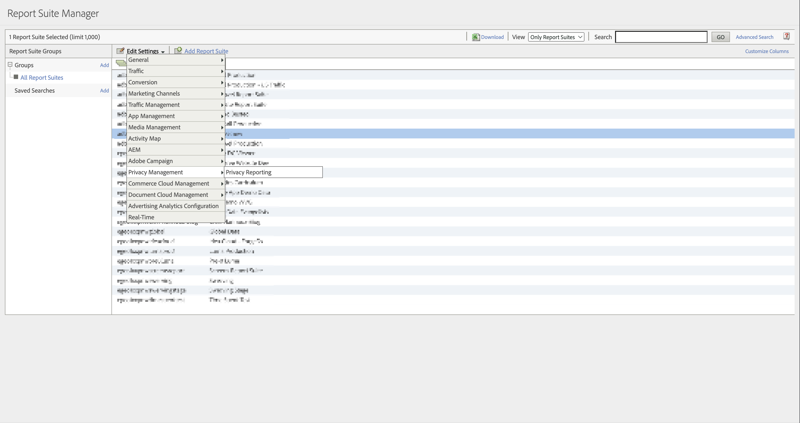

# Privacy reporting

Privacy reporting lets you enable the [Consent Management Opt-In](/help/components/dimensions/cm-opt-in.md), [Consent Management Opt-Out](/help/components/dimensions/cm-opt-out.md) and [Ad Platform Consent](/help/components//dimensions/ad-consent.md) dimensions for use in reporting.

>[!NOTE]
>
>We have added a new Ad Platform Consent flag. You need to re-enable Data Privacy Reports if you want this new variable to take effect.

To access this page:

1. Log in to Adobe Analytics and navigate to **[!UICONTROL Admin]** > **[!UICONTROL Report suites]**.
1. Select one or more desired report suites, then select **[!UICONTROL Edit settings]** > **[!UICONTROL Privacy management]** > **[!UICONTROL Privacy reporting]**.

   

1. Click **[!UICONTROL Enable Data Privacy Reports]**.

   >[!NOTE]
   >
   >Once enabled, these variables cannot be turned off.

   

1. Once enabled, a confirmation message appears. The dimensions are available in reports.

   
