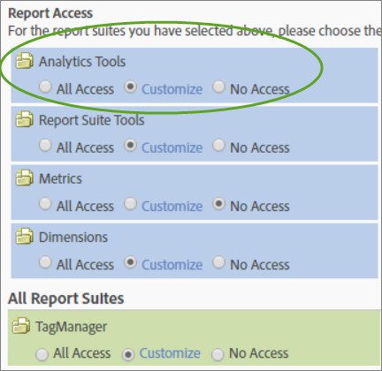

# Customize Analytics Tools permissions

>[!IMPORTANT]
>
>User and product management has moved to the [Admin Console](https://helpx.adobe.com/enterprise/using/admin-console.html). Adobe will notify you when it is your time to migrate users. After all customers have migrated, help content for **[!UICONTROL Analytics]** > **[!UICONTROL Admin]** > **[!UICONTROL All admin]** > **[!UICONTROL User management]** will be retired.

Enable user permissions for General items (billing, logs, etc.), Company Management, Tools, Web Service Access, Report Builder, and Data Connectors integration.

 **[!UICONTROL User Management]** > **[!UICONTROL Groups]** > **[!UICONTROL All Report Access]** > **[!UICONTROL Analytics Tools]** > **[!UICONTROL Customize]**

>[!NOTE]
>
>The Fall 2016 release (October 20) brought changes to group management. See [Administrative Changes - Fall 2016](/help/admin/user-management2/c-user-management/permissions-changes.md) for a summary of changes.

## Report Access - Analytics Tools

Click **[!UICONTROL Customize]** to select items to which this group will have access.

## Field Descriptions

The settings on this page pertain to the report suites selected on the [!UICONTROL Define User Groups] page.

| Element | Description |
|--- |--- |
|**General**||
|[Code Manager](/help/admin/admin/code-manager-admin.md)|Enables permission to download data collection code for web and mobile platforms.|
|Code Manager - Web Services|Allows a non-administrative user to access the Code Manager through Web Services.|
|[Logs](/help/admin/admin/logs.md)|Enables permission to log files, which help you see when users log in, their usage, access, report suites, and Admin changes.|
|Logs - Web Services|Allows a non-administrative user to access the Admin Tools logs through Web Services.|
|[Traffic Management](/help/admin/c-traffic-management/traffic-management.md)|Traffic Management page lets you specify expected traffic volume changes.|
|Permission Management|Grants non-admin users access to the User Management pages in Admin Tools. These users have Read permissions but do not have Write permissions.|
|Permissions (Write) - Web Services|Grants non-administrative users read and write permission settings under User Management in Web Services. This setting refers specifically to the indicated permissions actions in the Admin API.|
|Permissions (Read) - Web Services|Allows a non-administrative user to view permission settings under User Management in Web Services. This setting refers specifically to the indicated permissions actions in the Admin API.|
|**Company Management**||
|[Security](/help/admin/company/security-manager.md)|Grants permission to the  Security Manager page to control access to reporting data. Options include strong passwords, password expiration, IP login restrictions, and email domain restrictions.|
|Support Information|Grants permission to the  Support Information in  Company Settings.|
|[Web Services](/help/admin/company/web-services-admin.md)|Allows access to the Web Services page in the Admin Tools interface ([!UICONTROL Company Settings] > [!UICONTROL Web Services]). The Web Services API provides programmatic access to  Adobe Analytics services that let you duplicate and augment functionality available through the user interface.|
|Single Sign-On (Legacy)|Grants access to the single sign-on page in Admin Tools. **Note:** Single sign-on in the Adobe Experience Cloud is implemented using [account linking](https://experienceleague.adobe.com/docs/ core-services/interface/manage-users-and-products/organizations.html) between the Experience Cloud and solutions.|
|[Pending Actions](/help/admin/company/pending-actions-admin.md)|Grants permission to manage pending actions in [!UICONTROL Company Settings].|
|[Co-Branding](/help/admin/company/co-branding-admin.md)|Grants permission to co-brand  Analytics.|
|[Preferences](/help/admin/admin/preferences-manager.md)|Grants permission to the [!UICONTROL Preference Manager].|
|[Hide Report Suites](/help/admin/company/c-hide-report-suites.md)|Grants permission to hide report suites in the  Adobe Analytics user interface.|
|**Tools**|These settings grant access to Analytics tools (interfaces and applications) and advanced capabilities like segmentation and calculated metrics.|
|[Current Data](https://experienceleague.adobe.com/docs/ analytics/analyze/reports-analytics/current-data.html)|Grants permission to use the Current Data feature in reporting.|
|Web Service Access|Enables Web Services access for non-administrators. Generates Web Service credentials.|
|[Report Builder](https://experienceleague.adobe.com/docs/ analytics/analyze/report-builder/report-builder-setup/t-install-arb.html)|Grants members of this group access to [!UICONTROL Report Builder] licenses.|
|[Analysis Workspace](https://experienceleague.adobe.com/docs/ analytics/analyze/analysis-workspace/home.html) Access|Grants users access to Analysis Workspace, the recommended reporting interface for [!DNL Adobe Analytics].|
|[Reports & Analytics](https://experienceleague.adobe.com/docs/ analytics/landing/an-key-concepts.html)|Grants users access to  Reports & Analytics.|
|[Calculated Metric Creation](https://experienceleague.adobe.com/docs/ analytics/components/calculated-metrics/cm-overview.html)|Grants users permission to create calculated metrics.|
|[Segment Creation](https://experienceleague.adobe.com/docs/ analytics/components/segmentation/seg-home.html)|Grants users permission to create segments.|
|**Data Connectors**||
|Integrations (Create, Update, or Delete)|Grants permission to create, update, and delete  Data Connector integrations.|
