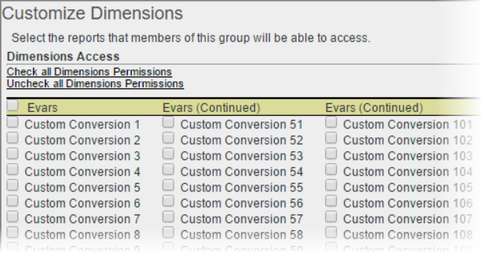

# Customize dimension permissions

>[!IMPORTANT]
>
>User and product management is moving to the [Admin Console](https://helpx.adobe.com/enterprise/using/admin-console.html). Adobe will notify you when it is your time to migrate users. After all customers have migrated, help content for **[!UICONTROL Analytics]** > **[!UICONTROL Admin]** > **[!UICONTROL All admin]** > **[!UICONTROL User management]** will be retired.

Customize user access at a granular level, including eVars, traffic reports, solution reports, and pathing reports.

 **[!UICONTROL User Management]** > **[!UICONTROL Groups]** > **[!UICONTROL Report Access]** > **[!UICONTROL Dimensions]** > **[!UICONTROL Customize]**

>[!IMPORTANT]
>
>Some dimensions are not permissionable at this time. These dimensions are: Mobile Bookmark Length; Mobile Device Number; Mobile DRM; Mobile Information Services; Mobile Java VM; Mobile Mail Decoration; Mobile Net Protocols; Mobile OS; Mobile push to talk.
>
>These dimensions are available for all users, regardless of other permissions.

The settings on this page pertain to the report suites selected on the [!UICONTROL Define User Groups] page.

Understand the following information about the Dimension category for permissions.

* eVars 1-250 are individually permissioned.
* All traffic reports are dimensions.
* Video & Mobile reports are dimensions, as well as other Analytics solutions reports (Experience Manager, Advertising Cloud, Social, and do on.) 
* Pathing reports are available if a user has access to the parent dimension.
* All current dimensions and metrics within custom groups have been automatically migrated to the new categories. If an existing group has metrics enabled, it will be given all newly permissionable dimensions (eVars and content aware) and metrics by default.
* Classifications Importer (formerly, SAINT) permissions: Access to classifications is determined by access to the [variable](https://experienceleague.adobe.com/docs/analytics/components/classifications/c-classifications.html) on which the classification is based.

For more information, see [User and Group permission changes](https://experienceleague.adobe.com/docs/analytics/admin/user-product-management/user-management/permissions-changes.html).

**Customize Dimensions**

The following items are dimensions that you can permission.

<table id="table_F37D74A1619A4560A5F5651E855DAF1C"> 
 <thead> 
  <tr> 
   <th colname="col1" class="entry"> Element </th> 
   <th colname="col2" class="entry"> Descriptions </th> 
  </tr> 
 </thead>
 <tbody> 
  <tr> 
   <td colname="col1"> 
 <a href="/help/admin/admin/conversion-var-admin/conversion-var-admin.md"> eVars </a> 
 </td> 
   <td colname="col2"> 
eVars 1-250 are individually permissioned. eVars are custom conversion variables that you use to segment conversion success metrics in custom reports. 
 </td> 
  </tr> 
  <tr> 
   <td colname="col1"> 
 <a href="https://experienceleague.adobe.com/docs/analytics/implementation/vars/page-vars/evar.html"> Props </a> 
 </td> 
   <td colname="col2"> 
Props are custom traffic variables. 
 
See <a href="https://experienceleague.adobe.com/docs/analytics/implementation/vars/page-vars/evar.html"> Traffic props and conversion eVars </a> in Analytics Implementation. 
 </td> 
  </tr> 
  <tr> 
   <td colname="col1"> 
 <a href="https://experienceleague.adobe.com/docs/analytics/implementation/vars/page-vars/page-variables.html"> Hierarchy </a> 
 </td> 
   <td colname="col2"> 
 The hierarchy (hierN) variable determines the location of a page in your site's hierarchy or page structure. 
 </td> 
  </tr> 
  <tr> 
   <td colname="col1"> 
 <a href="https://experienceleague.adobe.com/docs/analytics/implementation/vars/page-vars/page-variables.html"> Listvar </a> 
 </td> 
   <td colname="col2"> 
 Similar to how List Props function, list variables allow multiple values within the same image request. 
 </td> 
  </tr> 
  <tr> 
   <td colname="col1"> 
Standard 
 </td> 
   <td colname="col2"> 
Refers to standard (out-of-the-box) dimensions in Analytics. 
 </td> 
  </tr> 
  <tr> 
   <td colname="col1"> 
 <a href="https://helpx.adobe.com/support/experience-manager.html"> AEM </a> 
 </td> 
   <td colname="col2"> 
Adobe Experience Manager 
 </td> 
  </tr> 
  <tr> 
   <td colname="col1"> 
 <a href="https://helpx.adobe.com/support/advertising-cloud.html"> AMO </a> 
 </td> 
   <td colname="col2"> 
Adobe Advertising Cloud 
 </td> 
  </tr> 
  <tr> 
   <td colname="col1"> 
 <a href="https://experienceleague.adobe.com/docs/analytics/analyze/activity-map/activity-map.html"> Activity Map </a> 
 </td> 
   <td colname="col2"> 
 Activity Map reporting dimensions: Activity Map Page; Activity Map Link; Activity Map Region; Activity Map Link By Region; Activity Map XY 
 </td> 
  </tr> 
  <tr> 
   <td colname="col1"> 
 <a href="https://experienceleague.adobe.com/docs/media-analytics/using/media-overview.html"> Mobile </a> 
 </td> 
   <td colname="col2"> 
Adobe Mobile Services 
 </td> 
  </tr> 
  <tr> 
   <td colname="col1"> 
 Comscore 
 </td> 
   <td colname="col2"> 
This Partner integration is no longer active. 
 </td> 
  </tr> 
  <tr> 
   <td colname="col1"> 
 <a href="https://experienceleague.adobe.com/docs/media-analytics/using/media-overview.html"> Nielsen </a> 
 </td> 
   <td colname="col2"> 
This Partner integration is no longer active. 
 </td> 
  </tr> 
  <tr> 
   <td colname="col1"> 
 Social 
 </td> 
   <td colname="col2"> 
Not used. 
 </td> 
  </tr> 
 </tbody> 
</table>
