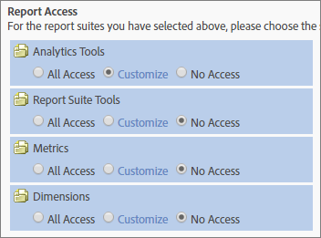

# User and Group permission changes

>[!IMPORTANT]
>
>User and product management have moved to the [Admin Console](https://helpx.adobe.com/enterprise/using/admin-console.html). Adobe will notify you when it is your time to migrate users. After all customers have migrated, help content for **[!UICONTROL Analytics]** > **[!UICONTROL Admin]** > **[!UICONTROL All admin]** > **[!UICONTROL User management]** will be retired.

## What Changed? {#section_2C205DE94155441B9E9D3E4C46CCF2EE}

**[!UICONTROL Admin]** > **[!UICONTROL User Management]** > **[!UICONTROL Groups]**

>[!NOTE]
>
>Due to the high number of possible permission combinations available, we cannot provide documentation describing all of the API methods that can be used in every permission combination. Generally, non-administrators who are granted Web Services access will have only Read access to API methods. They will not have Write access to methods.

Because the API and interface use the same permissioning system, whatever permissions a particular non-administrator has been granted by an administrator in the interface (Adobe Admin Console), will be the same permissions that user has in the API.

<table id="table_D1DB0DE37752450BBCCA44DB760BB505"> 
 <thead> 
  <tr> 
   <th colname="col1" class="entry"> Enhancement </th> 
   <th colname="col2" class="entry"> Description </th> 
  </tr> 
 </thead>
 <tbody> 
  <tr> 
   <td colname="col1"> 
Changes to the  Report Access (Customize Groups) 
 </td> 
   <td colname="col2"> 
  Add New Group &gt;  Report Access 
 
The  Report Access section on the  Define User Group page has been streamlined to four categories, which enable you to customize permissions at a granular level. 
 
 </img> 
 
Items previously in 
 
    <ul id="ul_16D5EF18D57D4608AEEDEC40D90D8828"> 
     <li id="li_F29E84C6228A464C8807F09205AEAAC6"> 
 <a href="/help/admin/user-management2/c-customize-report-access/groups-analytics-tools.md"> Analytics Tools</a>: Enable user permissions for General items (billing, logs, etc.), Company Management, Tools, Web Service Access, Report Builder, and Data Connectors integration. 
 
 <b>Note:</b> Company settings from the Customize Admin Console category have been moved to Analytics Tools. 
 </li> 
     <li id="li_A6EB788162A2455E94CE54B9279A854D"> 
 <a href="/help/admin/user-management2/c-customize-report-access/groups-report-suite-tools.md"> Report Suite Tools</a>: Enable user permissions for Web Services, Report Suite Management, Tools and Reports, and Dashboard Items. 
 </li> 
     <li id="li_EDB0255E009B4F1CAFAF53966B41363C"> 
 <a href="/help/admin/user-management2/c-customize-report-access/groups-metrics.md"> Metrics</a>: Enable permissions for traffic, conversion, custom events, solution events, content aware, and so on. 
 </li> 
     <li id="li_8DAE87D1DEF54803A9C6FE31C01F0FB0"> 
 <a href="/help/admin/user-management2/c-customize-report-access/groups-dimensions.md"> Dimensions</a>: Customize user access at a granular level, including eVars, traffic reports, solution reports, and pathing reports. 
 </li> 
    </ul> 
For example, you can create a group with access to multiple Analytics tools ( Analysis Workspace,  Reports &amp; Analytics, and  Report Builder), with permission to specific metrics and dimensions (including eVars), and capabilities like segment or calculated metrics creation. 
 </td> 
  </tr> 
  <tr> 
   <td colname="col1"> 
Changes to Predefined Groups 
 </td> 
   <td colname="col2"> 
 <b>Administrator access:</b> Predefined groups are no longer required for administrators. Administrators now have access to all items (tools, metrics, dimensions), as well as Web Service access, Report Builder, and Activity Map. 
 
Going forward, the purpose of groups is to grant or restrict access to non-administrative users. 
 
 <b>Custom groups:</b> Custom groups have replaced predefined groups. Existing predefined groups will be migrated to custom groups, using the same group name. Any custom groups that you have created, including their settings, will be preserved. However, you will notice that the location of settings will have moved. For example, Company settings (in Customize Admin Console) are now in <a href="/help/admin/user-management2/c-customize-report-access/groups-analytics-tools.md"> Customize Analytics Tools</a>. 
 
 Users belonging to  All Report Access have been migrated to a custom group with access to: 
 
    <ul id="ul_696A9243F5FD4AF187352C2F4B1CFDC2"> 
     <li id="li_683A0A3BB7214CFFBC61D5A4CD237F48">All Dimensions </li> 
     <li id="li_D8FDBF6A32224731AB706315DEA0A03E">All Metrics </li> 
     <li id="li_65ABE5C95D43444D88E63EE95C9AED05">All Report Suites </li> 
     <li id="li_7ED1505590144B38B3B9851BAA6BBB49">Channel Report Permission </li> 
     <li id="li_F718FE1FCF9A4B05AB933CA3F105F3EC">Anomaly Detection Report Permission </li> 
     <li id="li_527BD52007E846FE8B5F71AB3C12F695">Real-Time Report Permission </li> 
     <li id="li_AFFB58C7FB644AC8A85E2D76BA7D51F5">Analysis Workspace Access Permission </li> 
    </ul> 
Administrators can delete custom groups and create their own, as all settings that were previously available in predefined groups are available for customization under the  Report Access settings in <a href="/help/admin/user-management2/c-user-groups/groups.md"> Define User Groups</a>. 
 </td> 
  </tr> 
  <tr> 
   <td colname="col1"> 
Dimension-Level Permissions 
 </td> 
   <td colname="col2"> 
You can customize permissions to include or exclude access to dimensions (in addition to metrics). 
 
    <ul id="ul_DA5A54223673474E9151AF979DA50659"> 
     <li id="li_C3E82F7BC07A4F2F83A85D3D511292CC"> 
All current dimensions and metrics within custom groups have been automatically migrated to the new categories. If an existing group has metrics enabled, it will be given all newly permissionable dimensions (eVars and content aware) and metrics by default. 
 </li> 
     <li id="li_CC56F9181CC14AB59318628E72F2E8C9"> Classifications Importer (formerly, SAINT) permissions: Access to classifications is determined by access to the <a href="https://experienceleague.adobe.com/docs/analytics/components/classifications/c-classifications.html"> variable</a> on which the classification is based. </li> 
    </ul> 
See <a href="/help/admin/user-management2/c-customize-report-access/groups-dimensions.md"> Customize Dimension Permissions</a>. 
 </td> 
  </tr> 
  <tr> 
   <td colname="col1"> 
Admin Console 
 </td> 
   <td colname="col2"> 
Recommended only for new customers or customers with companies <a href="https://experienceleague.adobe.com/docs/core-services/interface/about-core-services/core-services.html"> provisioned in the Experience Cloud</a>. A migration for existing  Analytics customers to the  Experience Cloud identity management system is planned. 
 
More information is available in <a href="https://helpx.adobe.com/enterprise/using/manage-permissions-and-roles.html"> Manage product permissions in the Admin Console</a>. 
 </td> 
  </tr> 
 </tbody> 
</table>

## Frequently Asked Questions about Permission Changes {#section_02809EFC95054B40A089E6C6E4FACA13}

Here is important new information about new and planned updates and how they affect your administrative environment.

<table id="table_1E93F45C66E841E6882FB602509F30A3"> 
 <thead> 
  <tr> 
   <th colname="col1" class="entry"> Question </th> 
   <th colname="col2" class="entry"> Answer </th> 
  </tr> 
 </thead>
 <tbody> 
  <tr> 
   <td colname="col1">What permissions changes came in the <b>July 2016</b> release? </td> 
   <td colname="col2"> 
 <b>All Report Suite Access</b> 
 
When adding report suites to include in a group, you can specify  All Report Suite Access. This setting applies group permissions to all current and future report suites. 
 
To enable this feature, navigate to  User Management &gt;  Groups &gt;  Add New User Group, then select  All Report Suite Access. 
 
 
 </td> 
  </tr> 
  <tr> 
   <td colname="col1"> 
Should I use the Admin Console to manage users, or the existing Analytics User Management? 
 </td> 
   <td colname="col2"> 
Changes made in Analytics &gt; Admin &gt; User Management are not reflected in the Admin Console. Therefore, only new customers who already use the Admin Console for user and group management should continue doing so. A migration for existing Analytics group management to the Admin Console is planned. 
 </td> 
  </tr> 
  <tr> 
   <td colname="col1"> 
What Permissions changes were made in the <b>October 2016</b> release? 
 </td> 
   <td colname="col2"> 
The following enhancements to the current  Admin Tools interface are available: 
 
 
     <ul id="ul_2A31E8DC17A94B7FABDBA9C87C3947EF"> 
      <li id="li_AE2ECCA01CC64D30B109BE74379EE474">Permission changes as described in <a href="/help/admin/user-management2/c-user-management/permissions-changes.md"> Administrative Changes - Fall 2016</a>. </li> 
      <li id="li_33CB2B6A2E5F45BE97CC5E0983AF280E">Removed defunct traffic reports that were no longer in the menu. </li> 
      <li id="li_57234CF27E1D405987DE89312CD62C52">Classifications permissions: Access to classifications will be determined by access to the variable the classification is for. </li> 
     </ul> 
 </td> 
  </tr> 
  <tr> 
   <td colname="col1"> 
Is there anything I need to do to migrate users? 
 </td> 
   <td colname="col2"> 
No, all permissions migrations will happen transparently. 
 
 
     <ul id="ul_654F85286EC04416B3E0BA725EBE10AD"> 
      <li id="li_8050B8941F794103B82A0ADF0930D216">All current traffic reports in a Custom Group will automatically be migrated to the new Dimension Category. </li> 
      <li id="li_B97079DB29A346B98D066F11AB7F94AF">If a Custom Group has any metrics already enabled, it will automatically be given all newly permissionable dimensions (eVars and Solution variables). </li> 
      <li id="li_F1219EF490DA473BA15F2B215F2995AE"> A custom group with at least one metric will automatically be granted access to all eVars and other content-aware dimensions <b>except</b> the newly available traffic dimensions (formerly traffic reports). </li> 
      <li id="li_F494CE6144A04A6199CFBBA1D7BEA32B">Every predefined group will be changed into a permission. These new permissions will be added to a new  Analytics Tools category. </li> 
      <li id="li_2FCD9254FC3C4FD7871EEF9453E5CE1E">Every Custom Group with any metrics will have all Analytics Solution events added as new metrics. </li> 
      <li id="li_34C4560769B64F28A4E83BAE71065DCC">Every user that used to be in All Report Access will be added to the new custom group. All Report Access will no longer exist. </li> 
     </ul> 
 </td> 
  </tr> 
  <tr> 
   <td colname="col1"> 
What will not change? 
 </td> 
   <td colname="col2"> 
Visitor Attributes will continue to be non-permissioned. 
 </td> 
  </tr> 
 </tbody> 
</table>

## Permissioning Quick Reference {#section_A3FDD8259F524B21A5489833533D1B28}

The following table lists tasks and where they can take place (depending on a company's status).

>[!NOTE]
>
>A *`migrated user`* and *`Experience Cloud user`* refer to users who have accepted an email invitation to join the Experience Cloud. If the email invitation is not accepted, users are still Analytics users and cannot be managed in the Admin Console. (The exception is if the migration is using [enterprise or federated IDs](https://helpx.adobe.com/enterprise/using/set-up-identity.html). In this case, the user is migrated when the administrator migrates users on a user-by-user basis.)

<table id="table_B68FD00FC5D24823A86BB69558C0327C"> 
 <thead> 
  <tr> 
   <th colname="col1" class="entry"> Task </th> 
   <th colname="col2" class="entry"> Non-Migrating Login Company </th> 
   <th colname="col3" class="entry"> Currently Migrating Company </th> 
   <th colname="col4" class="entry"> Finished Migrating Login Company </th> 
  </tr> 
 </thead>
 <tbody> 
  <tr> 
   <td colname="col1"> Create a user </td> 
   <td colname="col2"> 
Admin Console (creating a user and adding him or her to an Analytics <a href="https://experienceleague.adobe.com/docs/core-services/interface/manage-users-and-products/admin-getting-started.html"> product configuration</a> also creates the user account in Analytics). 
 
 <a href="/help/admin/user-management2/c-user-management/t-add-user-account.md"> Admin Tools</a> 
 </td> 
   <td colname="col3"> 
 <a href="https://adminconsole.adobe.com/enterprise/"> Admin Console</a> 
 </td> 
   <td colname="col4"> 
 <a href="https://adminconsole.adobe.com/enterprise/"> Admin Console</a> 
 </td> 
  </tr> 
  <tr> 
   <td colname="col1"> Edit a user </td> 
   <td colname="col2"> 
 <a href="/help/admin/user-management2/c-user-management/t-add-user-account.md"> Admin Tools</a> 
 </td> 
   <td colname="col3"> 
 <a href="https://adminconsole.adobe.com/enterprise/"> Admin Console</a> 
 
 Admin Tools - Editing in the Admin Tools for migrated users is limited to API-key management, and deleting / transferring assets. 
 </td> 
   <td colname="col4"> 
 <a href="https://adminconsole.adobe.com/enterprise/"> Admin Console</a> 
 
 Admin Tools - Editing is limited to API-key management, and deleting /transferring assets. 
 </td> 
  </tr> 
  <tr> 
   <td colname="col1"> Delete a user </td> 
   <td colname="col2"> 
Admin Console - For Experience Cloud users 
 
Admin Tools - for all users, but for Experience Cloud users, only deletes the mapped Analytics user, not the Experience Cloud account. 
 </td> 
   <td colname="col3"> 
Admin Console - For Migrated Users. 
 
Admin Tools - For Analytics-only Users. 
 </td> 
   <td colname="col4"> 
Admin Console 
 
 Admin Tools - After deleting a Experience Cloud user, or un-linking their account in Admin Console, you can delete the Analytics login from Admin Tools. 
 </td> 
  </tr> 
  <tr> 
   <td colname="col1"> Log in to Analytics </td> 
   <td colname="col2"> 
 <b>Experience Cloud: </b>  marketing.adobe.com. Only available for Experience Cloud users. 
 
 <b>Analytics (legacy):</b>  sc.omniture.com. For Analytics only users, and for Experience Cloud users with their Analytics credentials 
 </td> 
   <td colname="col3"> 
  marketing.adobe.com - only available for Experience Cloud users. 
 
  sc.omniture.com - For analytics only users, and for Experience Cloud users with their Analytics credentials. 
 
During migration, admins can turn off  omniture.com login ability for specific users. 
 </td> 
   <td colname="col4"> 
Admin Console 
 </td> 
  </tr> 
  <tr> 
   <td colname="col1"> Create a group </td> 
   <td colname="col2"> 
Admin Console - When a group is created in Admin Console, a mapped group in Analytics will appear in the Admin Tools, but this mapped group cannot have its name changed from Admin Tools, or be deleted from Admin Tools. 
 
Admin Tools. 
 </td> 
   <td colname="col3"> 
Admin Console (<a href="https://experienceleague.adobe.com/docs/core-services/interface/manage-users-and-products/admin-getting-started.html"> create product configuration</a>) 
 </td> 
   <td colname="col4"> 
Admin Console (<a href="https://experienceleague.adobe.com/docs/core-services/interface/manage-users-and-products/admin-getting-started.html"> create product configuration</a>) 
 </td> 
  </tr> 
  <tr> 
   <td colname="col1"> Edit users in a group </td> 
   <td colname="col2"> 
Admin Console - Only for Experience Cloud users 
 
Admin Tools - both Analytics-only users, and Experience Cloud user membership to groups can be edited from Admin Tools. However, if a Experience Cloud user is part of a group in Admin Console, they cannot be removed from the group in Admin Tools. 
 </td> 
   <td colname="col3"> 
Admin Console - Experience Cloud users only 
 
 Admin Tools - Analytics-only logins can still be added to/removed from groups in Admin Tools. 
 </td> 
   <td colname="col4"> 
Admin Console 
 </td> 
  </tr> 
  <tr> 
   <td colname="col1"> Edit permissions for a group </td> 
   <td colname="col2"> 
Admin Console - You can edit groups created in Admin Console. 
 
Admin Tools - You can edit permissions for any group. 
 </td> 
   <td colname="col3"> 
Admin Console 
 </td> 
   <td colname="col4"> 
Admin Console 
 </td> 
  </tr> 
  <tr> 
   <td colname="col1"> Delete group </td> 
   <td colname="col2"> 
Admin Console - You can delete only groups created in Admin Console. 
 
Admin Tools - You can delete only groups created from Admin Tools. 
 </td> 
   <td colname="col3"> 
Admin Console 
 </td> 
   <td colname="col4"> 
Admin Console 
 </td> 
  </tr> 
  <tr> 
   <td colname="col1"> Change admin status for user </td> 
   <td colname="col2"> 
Admin Console - Only for Experience Cloud users. 
 
Admin Tools 
 </td> 
   <td colname="col3"> 
Admin Console - Only for Experience Cloud users. 
 
Admin Tools - Only for Analytics users. 
 </td> 
   <td colname="col4"> 
Admin Console 
 </td> 
  </tr> 
 </tbody> 
</table>
