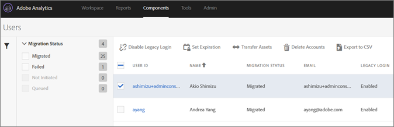

# Disable legacy logins{#disable-legacy-logins}

Learn how to disable legacy logins for Analytics users.

After your users have migrated from the legacy Analytics user management system to the Adobe Admin Console, you can disable their legacy logins. Disabling legacy logins redirects users to the Experience Cloud login if they attempt to use the legacy login.

1. Open the Migration tool in **[!UICONTROL Analytics]** > **[!UICONTROL Admin]** > **[!UICONTROL User ID Migration]**.
1. In the [!DNL User Information] section, locate the domain containing the users you want to work with, then click **[!UICONTROL Select Users]**.
1. Select the users with legacy logins that you want to disable.

   

   The users that are eligible will have a status of *`Migrated`* under the Migration Status column. You cannot disable a user's legacy login until they have been migrated.
1. Click **[!UICONTROL Disable Legacy Login]**, then click **[!UICONTROL Done]**.

   Disable Legacy Login indicates which of your users can continue to use their legacy [!DNL my.omniture.com] user name and password.

   You cannot disable legacy logins for a user that is yet to be migrated. Once disabled, the user must use their Experience Cloud ID to login and access Analytics.

