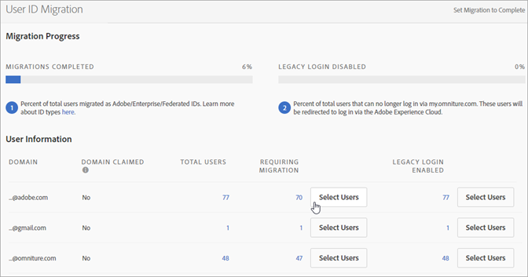

# Migrate Analytics user accounts for Adobe IDs{#migrate-analytics-user-accounts-for-adobe-ids}

Migrate users from the legacy Analytics user management system to the Admin Console.

## Migrate Analytics user accounts for Adobe IDs {#task-f3355f3b14a340feae58cfa04c0ba1c9}

Migrate users from the legacy Analytics user management system to the Admin Console.

> [!NOTE] If an Admin that is not logged in via the Experience Cloud tries to access the User ID Migration tool, they will be redirected to the Experience Cloud login page.

**To migrate Analytics users** 

1. Navigate to **[!UICONTROL Analytics]** > **[!UICONTROL Admin]** > **[!UICONTROL User ID Migration]**.

   

   The User ID Migration page has two sections: *Migration Progress* and *User Information*.

   **Migration Progress**

<table id="table_F9F1CFF762C745E198CB075A02BA2DDA"> 
 <thead> 
  <tr> 
   <th colname="col1" class="entry"> Phase </th> 
   <th colname="col2" class="entry"> Description </th> 
  </tr>
 </thead>
 <tbody> 
  <tr> 
   <td colname="col1"> 
Migrations Completed 
 </td> 
   <td colname="col2"> 
The users accepted the invitation. 
 </td> 
  </tr> 
  <tr> 
   <td colname="col1"> 
Legacy Login Disabled 
 </td> 
   <td colname="col2"> 
Legacy login using a company ID is disabled. Users will now access the Experience Cloud using their Adobe ID or Enterprise ID. When all your users have reached this phase, you have completed the migration. 
 
In the migration, the legacy login is disabled. Users are redirected to  experiencecloud.adobe.com and must log in using the Adobe ID or Enterprise ID. 
 
See <a href="/help/admin/user-management2/user-migration/c-migration-tool/t-disable-legacy-login.md" format="dita" scope="local"> Disable Legacy Logins</a> for more information. 
 </td> 
  </tr> 
 </tbody> 
</table>

   **User Information**

   User Information outlines the users in your organization, separated by domain name.

<table id="table_3822E27AF81E4A188562FEB5131548A5"> 
 <thead> 
  <tr> 
   <th colname="col1" class="entry"> Element </th> 
   <th colname="col2" class="entry"> Description </th> 
  </tr>
 </thead>
 <tbody> 
  <tr> 
   <td colname="col1"> 
Domain 
 </td> 
   <td colname="col2"> 
Domains are specific to the email IDs of the current Analytics user base. A domain can be claimed only by a single organization, and only system administrators can claim a domain. For more information, see <a href="https://helpx.adobe.com/enterprise/help/request-access-to-claimed-domain.html" format="html" scope="external"> Request access to a claimed domain</a>. 
 </td> 
  </tr> 
  <tr> 
   <td colname="col1"> 
Domain Claimed 
 </td> 
   <td colname="col2"> 
If you want to migrate users as Enterprise or Federated IDs, you must be a System Administrator and claim an available domain via the Admin Console before migrating users. Learn more <a href="https://helpx.adobe.com/enterprise/help/identity.html" format="html" scope="external"> here</a>. 
 
If you do not want to claim domains for Enterprise or Federated IDs, skip this step and migrate users as Adobe IDs. Learn more about ID types <a href="https://helpx.adobe.com/enterprise/help/identity.html" format="html" scope="external"> here</a>. 
 </td> 
  </tr> 
 </tbody> 
</table>

1. Locate the domain containing the user IDs you want to migrate, then, under **[!UICONTROL Requiring Migration]**, click **[!UICONTROL Select Users]**.
1. On the [!DNL Users] page, select the users you want to migrate, then click **[!UICONTROL Migrate]**.

   When you click **[!UICONTROL Migrate]**, users receive an invitation (Migration Initiated) and must accept it. This action moves the user ID to Migration Completed. You can then turn off their legacy access to [!DNL my.omniture.com].

   

1. Specify the type of ID you want to migrate the users ([Adobe ID or Enterprise ID](https://helpx.adobe.com/enterprise/help/identity.html)).

   After migrating users, the status under the column Migration Status changes from *`Not Initiated`* to *`Migrated`*.

   If *`Failed`* displays, hover over the icon for a description about why the migration failed.
