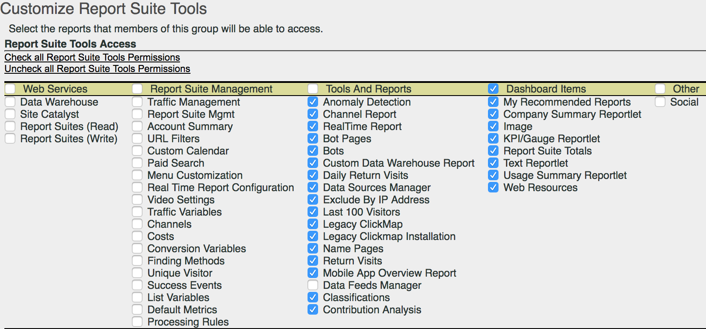

# Customize Report Suite Tools permissions

Enable user permissions for API Access, Report Suite Management, Tools and Reports, and Dashboard Items.

 **[!UICONTROL User Management]** > **[!UICONTROL Groups]** > **[!UICONTROL Report Access]** > **[!UICONTROL Report Suite Tools]** > **[!UICONTROL Customize]**

The [!UICONTROL Customize Report Suite Tools] page grants members of a group access to the following items.

**Field Descriptions**

The settings on this page pertain to the report suites selected on the [!UICONTROL Define User Groups] page. 

<table id="table_08F8ADA81D7E42ACB92481408434D158"> 
 <thead> 
  <tr> 
   <th colname="col1" class="entry"> Element </th> 
   <th colname="col2" class="entry"> Description </th> 
  </tr> 
 </thead>
 <tbody> 
  <tr> 
   <td colspan="2"> 
 <b>Web Services</b> 
 </td> 
  </tr> 
  <tr> 
   <td colspan="2"> 
These settings enable users to make calls to the Data Warehouse method and pull report suite settings. 
 </td> 
  </tr> 
  <tr> 
   <td colname="col1"> 
Data Warehouse 
 </td> 
   <td colname="col2"> 
 Allows a non-admin user to make calls using the  Data Warehouse methods via the Web Aervices API. 
 
 <a href="https://marketing.adobe.com/developer/documentation/data-warehouse/c-data-warehouse-api" format="https" scope="external"> Data Warehouse - Developer Documentation</a> 
 
 <a href="data_warehouse.md#concept_8EDD61F459204364AD214125ED160EC6" format="dita" scope="local"> Data Warehouse - Product Documentation</a> 
 </td> 
  </tr> 
  <tr> 
   <td colname="col1"> 
Site Catalyst 
 </td> 
   <td colname="col2"> </td> 
  </tr> 
  <tr> 
   <td colname="col1"> 
Report Suites (Read) 
 </td> 
   <td colname="col2"> 
 Allows a non-admin user to use the report suite methods in the API. 
 </td> 
  </tr> 
  <tr> 
   <td colname="col1"> 
Report Suites (Write) 
 </td> 
   <td colname="col2"> 
 Allows a non-admin user to use the report suite methods in the API. 
 </td> 
  </tr> 
  <tr> 
   <td colspan="2"> 
 <b>Report Suite Management</b> 
 </td> 
  </tr> 
  <tr> 
   <td colspan="2"> 
These settings grant access to the menu items in  Admin &gt;  Report Suites  &gt;  Edit Settings (<a href="../../c_manage_report_suites/report_suites_admin.md#concept_BAC65EBE7FB2457E95ECC9215C3E9B94" format="dita" scope="local"> Report Suite Manager</a>). 
 </td> 
  </tr> 
  <tr> 
   <td colname="col1"> 
 <a href="../../c_traffic_management/traffic_management.md#concept_8BD651EE8B84434CB4D6308BC6C01B79" format="dita" scope="local"> Traffic Management</a> 
 </td> 
   <td colname="col2"> 
Grants permission to Traffic Management. 
 </td> 
  </tr> 
  <tr> 
   <td colname="col1"> 
 <a href="../../c_manage_report_suites/report_suites_admin.md#concept_BAC65EBE7FB2457E95ECC9215C3E9B94" format="dita" scope="local"> Report Suite Management</a> 
 </td> 
   <td colname="col2"> 
Grants permission to manage report suites. 
 </td> 
  </tr> 
  <tr> 
   <td colname="col1"> 
 <a href="../../admin/general_acct_settings_admin.md#concept_93177040A38F4881B80D7A02B5D2FB24" format="dita" scope="local"> Account Summary</a> 
 </td> 
   <td colname="col2"> 
Grants permission to edit account settings for a report suite. 
 </td> 
  </tr> 
  <tr> 
   <td colname="col1"> 
 <a href="../../admin/internal_URL_filter_admin.md#concept_D6BB8358DB7643F0B13E5DC9B7607998" format="dita" scope="local"> URL Filters</a> 
 </td> 
   <td colname="col2"> 
Grants permission to Internal URL Filters in report suites. Internal URL Filters are used to determine which referrers, or referring pages, are internal to your site. 
 </td> 
  </tr> 
  <tr> 
   <td colname="col1"> 
 <a href="../../admin/custom_calendar.md#concept_4342A844600048759EEDABD164AC3F5A" format="dita" scope="local"> Custom Calendar</a> 
 </td> 
   <td colname="col2"> 
Grants permission to edit custom calendar. 
 </td> 
  </tr> 
  <tr> 
   <td colname="col1"> 
 <a href="https://marketing.adobe.com/resources/help/en_US/reference/paid_search_detection.html" format="html" scope="external"> Paid Search</a> 
 </td> 
   <td colname="col2"> 
Paid Search Detection differentiates paid from natural searches in the  Search Engines  and  Search Keywords reports. 
 </td> 
  </tr> 
  <tr> 
   <td colname="col1"> 
 <a href="../../admin/customize_menus.md#concept_26EBD206909D4E4EB0F4C14D77C52562" format="dita" scope="local"> Menu Customization</a> 
 </td> 
   <td colname="col2"> 
 Customize the report menus that a user sees in Reports &amp; Analytics. 
 </td> 
  </tr> 
  <tr> 
   <td colname="col1"> 
 <a href="../../admin/t_realtime_admin.md#task_1CD03E9B6BDB48B08E9E612183557F40" format="dita" scope="local"> Real-Time Report Configuration</a> 
 </td> 
   <td colname="col2"> 
 Permissions to set up real-time reports Analytics. 
 </td> 
  </tr> 
  <tr> 
   <td colname="col1"> 
 <a href="../../admin/video_management.md#concept_D946AFFFDFCC4F1186F2F2E7D6907F99" format="dita" scope="local"> Video Settings</a> 
 </td> 
   <td colname="col2"> 
Permissions to designate a set of Custom Conversion Variables (eVars) and Custom Events for use in tracking and reporting on video. 
 </td> 
  </tr> 
  <tr> 
   <td colname="col1"> 
 <a href="https://marketing.adobe.com/resources/help/en_US/sc/appmeasurement/video/video_config.html" format="html" scope="external"> Video Classifications</a> 
 </td> 
   <td colname="col2"> 
 Permission to designate a set of Custom Conversion Variables (eVars) and Custom Events for use in tracking and reporting on video. 
 </td> 
  </tr> 
  <tr> 
   <td colname="col1"> 
 <a href="../../admin/c_traffic_variables/traffic_var.md#concept_E3D0FEC81E1F4987B39CC467F19FFCFF" format="dita" scope="local"> Traffic Variables</a> 
 </td> 
   <td colname="col2"> 
 Permission to correlate custom data with specific traffic-related events. 
 </td> 
  </tr> 
  <tr> 
   <td colname="col1"> 
 <a href="traffic_classifications.md#concept_028079B29A9C412AA68910A87E11176F" format="dita" scope="local"> Traffic Classifications</a> 
 </td> 
   <td colname="col2"> 
Consolidated into Classifications (under Tools and Reports). 
 </td> 
  </tr> 
  <tr> 
   <td colname="col1"> 
 <a href="https://marketing.adobe.com/resources/help/en_US/mchannel/index.html" format="html" scope="external"> Channels</a> 
 </td> 
   <td colname="col2"> 
Grants permission to  Marketing Channel settings in  Report Suite Manager &gt;  Edit Settings &gt;  Marketing Channels. 
 </td> 
  </tr> 
  <tr> 
   <td colname="col1"> 
 <a href="https://marketing.adobe.com/resources/help/en_US/mchannel/c_overview_budget.html" format="html" scope="external"> Costs</a> 
 </td> 
   <td colname="col2"> 
 Enables permission to  Marketing Channels &gt;  Marketing Channel Costs in the  Report Suite Manager. 
 </td> 
  </tr> 
  <tr> 
   <td colname="col1"> 
 <a href="../../admin/conversion_var_admin.md#concept_C02F7AA01DE242F1AA1A4E74022BE9DE" format="dita" scope="local"> Conversion Variables</a> 
 </td> 
   <td colname="col2"> 
 The Custom Insight Conversion Variable (or eVar) is placed in the Adobe code on selected web pages of your site. Its primary purpose is to segment conversion success metrics in custom marketing reports. 
 </td> 
  </tr> 
  <tr> 
   <td colname="col1"> 
 <a href="../../admin/finding_methods.md#concept_97B9C67BBAF1453EA7585451A40DB361" format="dita" scope="local"> Finding Methods</a> 
 </td> 
   <td colname="col2"> 
Lets you identify how various finding methods reports receive credit for conversion success events on your site. 
 </td> 
  </tr> 
  <tr> 
   <td colname="col1"> 
 <a href="conversion_classifications.md#concept_B4B1478A8CB540599AC9D4A58CA4B6FE" format="dita" scope="local"> Conversion Classifications</a> 
 </td> 
   <td colname="col2"> 
 Consolidated into Classifications (under Tools and Reports). 
 </td> 
  </tr> 
  <tr> 
   <td colname="col1"> 
 <a href="https://marketing.adobe.com/resources/help/en_US/reference/t_unique_visitor_variable.html" format="html" scope="external"> Unique Visitor</a> 
 </td> 
   <td colname="col2"> 
Grants permission to specify the Unique Visitor variable. 
 </td> 
  </tr> 
  <tr> 
   <td colname="col1"> 
 <a href="https://marketing.adobe.com/resources/help/en_US/reference/success_event.html" format="html" scope="external"> Success Events</a> 
 </td> 
   <td colname="col2"> 
Actions that can be tracked, such as product view, checkout, and purchase. 
 </td> 
  </tr> 
  <tr> 
   <td colname="col1"> 
 <a href="classification_hierarchies.md#concept_10A956342D7D4C3E9114CCFCE1364741" format="dita" scope="local"> Classification Hierarchies</a> 
 </td> 
   <td colname="col2"> 
 Consolidated into Classifications (under Tools and Reports). 
 </td> 
  </tr> 
  <tr> 
   <td colname="col1"> 
 <a href="https://marketing.adobe.com/resources/help/en_US/sc/implement/listN.html" format="html" scope="external"> List Variables</a> 
 </td> 
   <td colname="col2"> 
 Also known as List Var. Similar to how List Props function, List Vars allow multiple values within the same image request. 
 </td> 
  </tr> 
  <tr> 
   <td colname="col1"> 
 <a href="../../admin/default_metrics.md#concept_0B294C4FA2A84A19B421B58019FFC285" format="dita" scope="local"> Default Metrics</a> 
 </td> 
   <td colname="col2"> 
 Reports &amp; Analytics displays a default set of metrics in all conversion reports, unless a user selects a custom set of metrics. The selected metrics display for all users of the associated report suite. 
 </td> 
  </tr> 
  <tr> 
   <td colname="col1"> 
<a href="https://marketing.adobe.com/resources/help/en_US/sc/implement/ref-processing-rules.html" format="html" scope="external"> Processing Rules</a> 
 </td> 
   <td colname="col2"> 
Grants access to Processing Rules, which simplify data collection and manage content as it is sent to reports. 
 </td> 
  </tr> 
  <tr> 
   <td colspan="2"> 
 <b>Tools and Reports</b> 
 </td> 
  </tr> 
  <tr> 
   <td colname="col1"> 
 <a href="https://marketing.adobe.com/resources/help/en_US/analytics/analysis-workspace/anomaly_detection.html" format="html" scope="external"> Anomaly Detection </a> 
 </td> 
   <td colname="col2"> 
 Grants permission to  Anomaly Detection, which provides a statistical method to determine how a given metric has changed in relation to previous data. 
 </td> 
  </tr> 
  <tr> 
   <td colname="col1"> 
 <a href="https://marketing.adobe.com/resources/help/en_US/mchannel/index.html" format="html" scope="external"> Channel Report</a> 
 </td> 
   <td colname="col2"> 
Grants permission to  Marketing Channel reports, found in  Reports &gt;  Marketing Channel Reports. 
 </td> 
  </tr> 
  <tr> 
   <td colname="col1"> 
<a href="realtime.md#concept_6E8756BDDAE843F88B6563C09C48B0B6" format="dita" scope="local"> Real-Time Report </a> 
 </td> 
   <td colname="col2"> 
Grants access to the  Real-Time Report. 
 </td> 
  </tr> 
  <tr> 
   <td colname="col1"> 
 <a href="../../admin/bot_rules.md#concept_A306689C65EB4D0F9AE65E3FD48ED5F7" format="dita" scope="local"> Bot Pages</a> 
 </td> 
   <td colname="col2"> 
 Bot Rules let you remove traffic that is generated by known spiders and bots from your report suite. Removing bot traffic can provide a more accurate measurement of user activity on your website. 
 </td> 
  </tr> 
  <tr> 
   <td colname="col1"> 
 <a href="../../admin/bot_rules.md#concept_A306689C65EB4D0F9AE65E3FD48ED5F7" format="dita" scope="local"> Bots</a> 
 </td> 
   <td colname="col2"> 
 Bot Rules let you remove traffic that is generated by known spiders and bots from your report suite. Removing bot traffic can provide a more accurate measurement of user activity on your website. 
 </td> 
  </tr> 
  <tr> 
   <td colname="col1"> 
 <a href="classifications.md#concept_C4136B4E61734D2BB8D4A74D3A792259" format="dita" scope="local"> Classifications Manager</a> 
 </td> 
   <td colname="col2"> 
(Legacy, for version 13.) Classifications are created by grouping (classifying) granular data from a source report. 
 </td> 
  </tr> 
  <tr> 
   <td colname="col1"> 
 <a href="data_warehouse.md#concept_8EDD61F459204364AD214125ED160EC6" format="dita" scope="local"> Custom Data Warehouse Report</a> 
 </td> 
   <td colname="col2"> 
 Data warehouse refers to the copy of raw, unprocessed data for storage and custom reports, which you can run by filtering the data. You can request reports to display advanced data relationships from raw data based on your unique questions. 
 </td> 
  </tr> 
  <tr> 
   <td colname="col1"> 
 <a href="reports_daily_return_visits.md#concept_D17071E0F6174E039C70A20CB5E3D438" format="dita" scope="local"> Daily Return Visits</a> 
 </td> 
   <td colname="col2"> 
 (Legacy) Report that displays the number of visitors to your website more than once on a given day. A day is defined as the last 24-hour period. 
 </td> 
  </tr> 
  <tr> 
   <td colname="col1"> 
 <a href="../../admin/data_sources.md#concept_D7EEE4097DF04856AF6D94A5C98C9E9D" format="dita" scope="local"> Data Sources Manager</a> 
 </td> 
   <td colname="col2"> 
The Data Sources feature allows you to import data to Analytics from offline sources. 
 </td> 
  </tr> 
  <tr> 
   <td colname="col1"> 
 <a href="../../admin/exclude_IP.md#concept_265A95A803F740629CAAAA7EB8BE81A4" format="dita" scope="local"> Exclude By IP Address</a> 
 </td> 
   <td colname="col2"> 
You can exclude data from specific IP addresses, such as internal website activities, site testing and employee usage, from your reports. 
 </td> 
  </tr> 
  <tr> 
   <td colname="col1"> 
 <a href="reports_last_100_visitors.md#concept_E3D0FEC81E1F4987B39CC467F19FFCFF" format="dita" scope="local"> Last 100 Visitors </a> 
 </td> 
   <td colname="col2"> 
(Legacy) Displays the IP address and domain of the last 100 visitors to your site. 
 </td> 
  </tr> 
  <tr> 
   <td colname="col1"> 
Legacy ClickMap 
 </td> 
   <td colname="col2"> 
Grants access to the menu for the legacy ClickMap overlay tool. 
 </td> 
  </tr> 
  <tr> 
   <td colname="col1"> 
Legacy Clickmap Installation 
 </td> 
   <td colname="col2"> 
Grants installation rights to the legacy ClickMap tool. 
 </td> 
  </tr> 
  <tr> 
   <td colname="col1"> 
 <a href="name_pages_admin.md#concept_859358835D424EA9B4B6FCC23AD4BDF2" format="dita" scope="local"> Name Pages</a> 
 </td> 
   <td colname="col2"> 
 Allows you to give friendlier page names for use in all page and path reports. 
 </td> 
  </tr> 
  <tr> 
   <td colname="col1"> 
 <a href="reports_return_visits.md#concept_E3D0FEC81E1F4987B39CC467F19FFCFF" format="dita" scope="local"> Return Visits</a> 
 </td> 
   <td colname="col2"> 
 A report showing the number of visits where visit number is greater than 1. The Return Visits Report includes non-cookied visitors. 
 </td> 
  </tr> 
  <tr> 
   <td colname="col1"> 
 <a href="https://marketing.adobe.com/resources/help/en_US/reference/c_working_with_saint.html" format="html" scope="external"> Classifications Importer</a> / Exporter and <a href="https://marketing.adobe.com/resources/help/en_US/reference/classification_rule_builder.html" format="html" scope="external"> Rule Builder</a> 
 </td> 
   <td colname="col2"> 
 Consolidated into Classifications (see below). 
 </td> 
  </tr> 
  <tr> 
   <td colname="col1"> 
Data Feeds Manager 
 </td> 
   <td colname="col2"> 
Grants rights to the <a href="analytics-data-feed.md#concept_AE12935B7121490DB919B22468721C87" format="dita" scope="local"> Analytics Data Feed</a>. 
 </td> 
  </tr> 
  <tr> 
   <td colname="col1"> 
<a href="graphics/classifications.png" format="dita" scope="local"> Classifications</a> 
 </td> 
   <td colname="col2"> 
Combines the following permissions that existed prior to September 2017: 'Traffic Classifications', 'Video Classifications', 'Conversion Classifications', 'Classification Hierarchies', 'Classifications Manager' and 'Classifications Importer/Exporter &amp; Rule Builder'. 
 
Note:  With this permission, users edit classifications for all report suites, not just the selected one/s. 
 </td> 
  </tr> 
  <tr> 
   <td colname="col1"> 
<a href="https://marketing.adobe.com/resources/help/en_US/analytics/analysis-workspace/contribution-analysis.html" format="html" scope="external"> Contribution Analysis</a> 
 </td> 
   <td colname="col2"> 
Grants rights to use Contribution Analysis in Analysis Workspace. 
 </td> 
  </tr> 
  <tr> 
   <td colspan="2"> 
 <b>Dashboard Items</b> 
 </td> 
  </tr> 
  <tr> 
   <td colspan="2"> 
The settings in Dashboard Items enables access to the following <a href="https://marketing.adobe.com/resources/help/en_US/sc/user/dashboard.html" format="html" scope="external"> reportlets</a> in Reports &amp; Analytics: 
 
    <ul id="ul_63079DFF826C485B8CD33ED71D5318D6"> 
     <li id="li_A4D99CD8BA3D45DAB825A598C5276E93">My Recommended Reports </li> 
     <li id="li_43AEF91A57D6477A848BAA58FF0360E4">Company Summary Reportlet </li> 
     <li id="li_03B05F39DDDF48958D25C0BE1BBC5AB2">Image </li> 
     <li id="li_2726A87987B0413A88FDFD651BA209CA">KPI/Gauge Reportlet </li> 
     <li id="li_FDA0FCD93D4D4C50A1CCDD53E94899DA">Report Suite Totals </li> 
     <li id="li_20FF1CCC168740D2B4CDF058302DDFF5">Text Reportlet </li> 
     <li id="li_158A08D7B7F24B8EA7ACE18407173192">Usage Summary Reportlet </li> 
     <li id="li_D19CC328DFF0440ABF3B97B3A65F3F30">Web Resources </li> 
    </ul> </td> 
  </tr> 
  <tr> 
   <td colspan="2"> 
 <b>Other</b> 
 </td> 
  </tr> 
  <tr> 
   <td colname="col1"> 
  Social 
 </td> 
   <td colname="col2"> 
Controls access to the  Social Management menu in the  Report Suite Manager. 
 </td> 
  </tr> 
 </tbody> 
</table>

