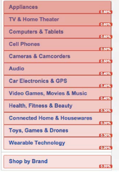
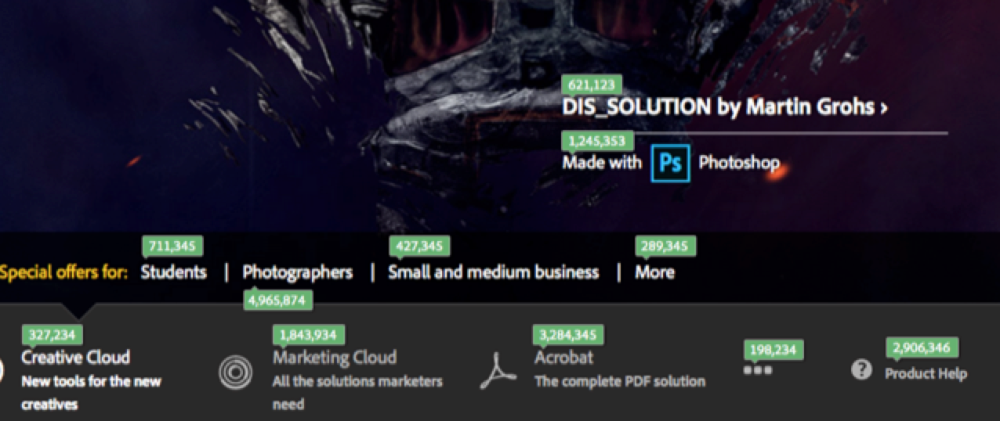
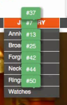

# Customizable overlays

Overlays give you multiple ways of configuring data visualization so that you can easily see and understand the popularity of links on a page.

Overlays let you visualize click data directly on the page. This is what separates a visual analysis tool like Activity Map from mostly tabular and graphical tools like Reports & Analytics.

Activity Map offers three types of overlays:

* Gradient Overlay (Heatmap) 
* Bubble Overlay 
* Gainers and Losers Overlay

You can also configure [overlay rendering for dynamic content](/help/analyze/activity-map/activitymap-link-tracking/activitymap-stl-track-custom-elements.md).

To make changes to overlays, open the [Overlay Settings Panel](/help/analyze/activity-map/activitymap-overlay-settings.md) and edit available options.

Hovering over an overlay will display its [details](/help/analyze/activity-map/activitymap-overlay-details.md).

## Gradient overlay (Heatmap) {#section_06AF13DE05A1454D960176CD0DA921A6}

With the gradient overlay, the color intensity is based on the popularity of the link. This intensity can be normalized for the top 30 rankings, or a function of the absolute metric value.

These metrics are overlaid on top of the page's links as a kind of 'heat map' to answer critical questions, including the following:

* What is the value of an individual page? 
* What is the value of an individual element on a page? 
* What is the most valuable 'digital real estate' on a page?

## Bubble overlay {#section_A657AB3F64CB47F881BBFFD72B37D9D4}

The Bubble overlay shows the overlay content (metric, percentage, or rank) in a small callout bubble.

Bubble overlays are shown when you select this overlay in the Overlay Type in the toolbar. . Bubble overlays show for all links that match the selection in [Activity Map Settings](/help/analyze/activity-map/activitymap-overlay-settings.md) (top 30, top 50, all...). Gradient overlays will be shown if this option not selected.

>[!NOTE]
>
>Bubble overlays for submenus show only when you display the submenu: 
>
>>

## Gainers and losers overlays {#section_EE80278E20C14824869BF5A27A4634C8}

**[!UICONTROL Gainers and losers overlays]** are available only in Live mode. They report real-time changes in link activity by comparing the metrics from the current period with metrics from the last period. They give you a visually compelling way to view trending in real-time.

This real-time overlay ranks clicks based on changes in the metric value between the previous and current periods.

