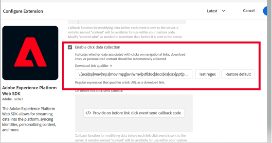
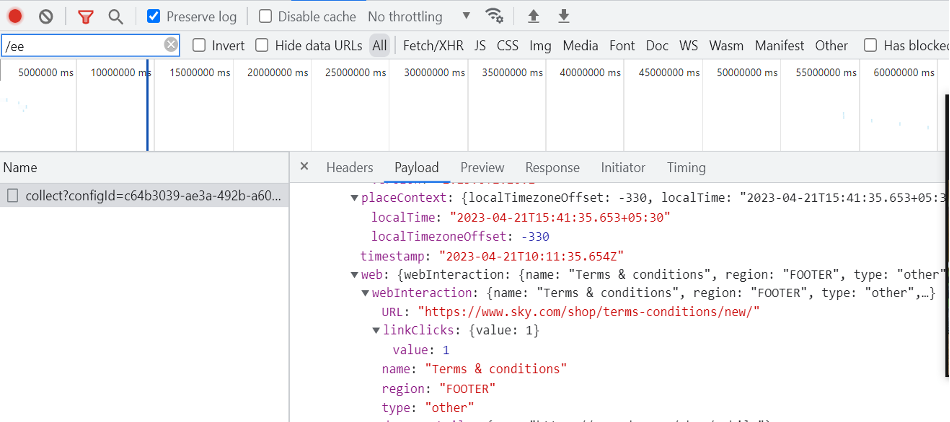
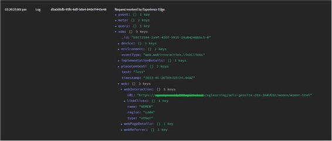
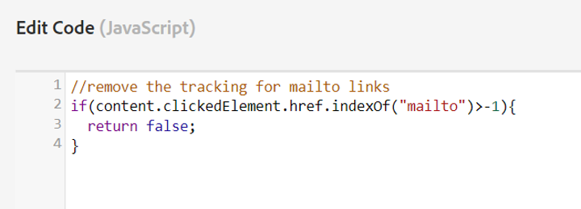
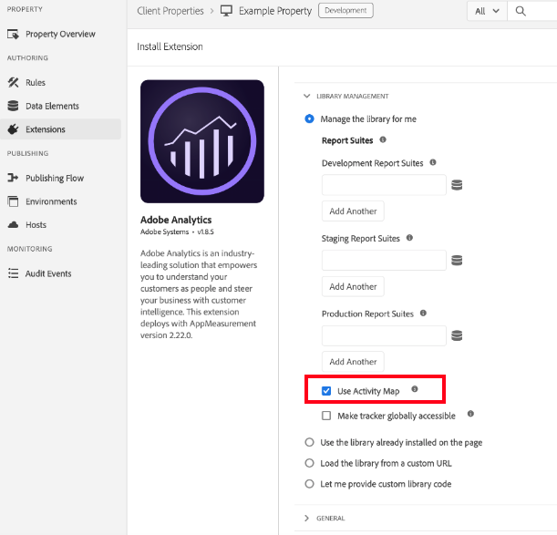
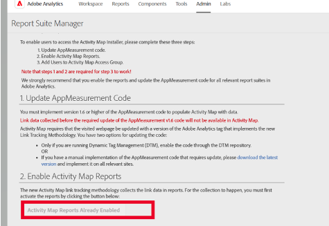

# Activate and Enable Activity Map

Explains the steps the Analytics Admin needs to complete to enable Activity Map link collection and user download.

## Step 1. Activate Activity Map {#update_code}

The Activity Map module is part of the AppMeasurement.js, Adobe Experience Platform tags, and the Web SDK (alloy.js). Activity Map data cannot be collected unless you update to **Web SDK version 2.15.0** or higher, or **Adobe Analytics tags extension v1.90** or higher, or **AppMeasurement version 1.6** or higher. 

+++Web SDK (Adobe Experience Platform tags extension)

NOTE: Web SDK currently collects Activity Map information by recording separate link click events. This differs from AppMeasurement which records Activity Map information for internal links by including that information in the subsequent page load. Because of this, Web SDK collection results in additional server calls. A future release of Web SDK will make it possible to configure Web SDK to package Activity Map information on subsequent hits, essentially matching the behavior of AppMeasurement.

1. In Adobe Experience Platform tags, navigate to the property for which you are implementing Analytics. 
1. Under [!UICONTROL Extensions] > [!UICONTROL Adobe Experience Platform Web SDK], select **[!UICONTROL Enable click data collection]** as highlighted below. 
1. Build the Library with the changes.
1. Publish the Library to production.

**Validation**

Interact calls using Developer Console Network Tab:

1. Load the Development Launch script on the site.
1. On Click of Elements, search for '/ee' in the Network Tab

   

Adobe Experience Platform Debugger:

1. Download and install the [Adobe Experience Platform debugger](https://chromewebstore.google.com/detail/adobe-experience-platform/bfnnokhpnncpkdmbokanobigaccjkpob).
1. Go to [!UICONTROL Logs] > [!UICONTROL Edge] > [!UICONTROL Connect to Edge]. 

   

**FAQs**

* **The interact call is not firing in the Network tab.**
   The click data collection in a collect call, we need to filter with either "/ee" or "collect?"

* **There is no Payload Display for the collect call.**
   The collect call is designed in such a way that the tracking should not affect  navigation to other sites, so the document unload feature is applicable for the collect calls. This won't impact your data collection but if you need to validate on page, add target = "_blank" to the respective element. Then the link opens in a new tab.

* **How do I ignore the collection of PII?**
   Add the respective conditions in<< on before link click send callback>> and return false to ignore those values. [Learn more](https://experienceleague.adobe.com/docs/experience-platform/edge/fundamentals/configuring-the-sdk.html)  
   
   Sample code:

   

+++

+++Manual Web SDK implementation

See [Track links](https://experienceleague.adobe.com/docs/experience-platform/edge/data-collection/track-links.html) for information on how to implement link tracking and how to enable Activity Map by capturing the `region` of the clicked HTML element.

>[!NOTE]
>
>Enabling link tracking with the Web SDK currently sends link events when a customer navigates from one page to the next. This is different from how AppMeasurement works and can potentially result in extra billable hits sent to Adobe.

+++

+++Analytics extension (Adobe Experience Platform tags)

In Adobe Experience Platform tags, navigate to the property for which you are implementing Analytics. In the [!UICONTROL Install Extension] dialog, select **[!UICONTROL Use Activity Map]**.

+++

+++AppMeasurement

1. Download the latest Javascript library for AppMeasurement.
   Go to **[!UICONTROL Analytics]** > **[!UICONTROL Admin]** > **[!UICONTROL All admin]** > **[!UICONTROL Code manager]**.
1. Implement it by following [these instructions](https://experienceleague.adobe.com/docs/analytics/implementation/js/overview.html).

+++

## Step 2. Enable Activity Map reports {#enable}

You need to enable Activity Map reports at the report-suite level.

1. Log in to Adobe Analytics and navigate to  **[!UICONTROL Analytics]** > **[!UICONTROL Admin]** > **[!UICONTROL Report Suites]** > Select report suite > **[!UICONTROL Edit Settings]** > **[!UICONTROL Activity Map]** > **[!UICONTROL Activity Map Reporting]** .

1. Activity Map collects the link data in Activity Map reports. For the activation to happen, you must first activate the variables by clicking **[!UICONTROL Enable Activity Map Reports]**.

   This step adds all the Analytics dimensions that you need to collect data.

   

1. After about an hour, check the [Activity Map Page report](/help/analyze/activity-map/activitymap-reporting-analytics.md), which shows all the pages where users clicked on a link.

## Step 3. Add users to [!UICONTROL Activity Map Access] product profile {#add_users}

1. Click **[!UICONTROL Add Users to Group]**.

   This will take you to the product profile page in the [Adobe Admin Console](https://adminconsole.adobe.com/E2F05B3B52F54D2E0A490D44@AdobeOrg/overview).

1. If you have not created an [!UICONTROL Activity Map Access] product profile, do so now. The permission items required for this profile are [!UICONTROL Analytics Tools] > [!UICONTROL Activity Map] and [!UICONTROL Analytics Tools] > [!UICONTROL Segment Publishing].

1. Add users to that product profile. This allows your users to download Activity Map from  **[!UICONTROL Adobe Analytics]** > **[!UICONTROL Tools]** > **[!UICONTROL ActivityMap]** .

