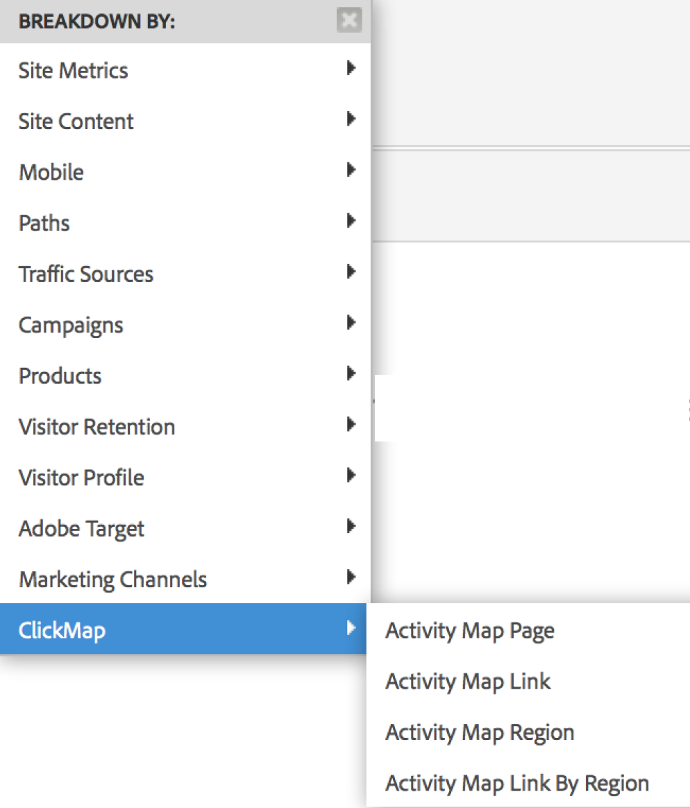

# Enable Activity Map{#enable-activity-map}

Explains the steps the Analytics Admin needs to complete to enable Activity Map link collection and user download.

## Step 1 – Update Your AppMeasurement (Javascript) Code to v1.6 (or higher) {#section_5D1586289DF2489289B1B6C1C80C300D}

The Activity Map module is part of the AppMeasurement.js file (located at the top of the file). The AppMeasurement library will load the Activity Map module when instantiated.

Activity Map data cannot be collected unless you update to this version (or higher) of AppMeasurement.

1. Download the latest AppMeasurement code (AppMeasurement_Javascript-1.6.zip) by going to  **[!UICONTROL Analytics]** > **[!UICONTROL Admin]** > **[!UICONTROL Code Manager]** and [implement it](https://marketing.adobe.com/resources/help/en_US/sc/implement/js_implementation.html).

   We have included some [sample implementation code](../../../../analyze/activity-map/activitymap-getting-started/activitymap-getting-started-admins/activitymap-sample-implementation-code.md#concept_EC27DA8A62F5411EBED51284CB7E1734) to help you visualize the changes that have been made to the code by including the Activity Map module. 

1. Validate the implementation:

    1. When a clickable element is clicked, data will be stored in a cookie named s_sq. 
    1. The Activity Map data can be seen in the query-string on the tracking call. For example:

       ```    
       …&c.&a.&Activity Map.&link=My%20Link&region=My%20Region&page=My%20Page&.Activity Map&.a&.c&...
       ```

1. Break this report down by **[!UICONTROL Activity Map Link by Region]** to see the link/region for that page:  {width="400px"}

<!-- 
Using 
<b>Dynamic Tag Management (DTM)</b>. To do so, enable the code through the DTM repository.
-->

## Step 2 - Enable Activity Map reports {#section_D14F15D2FC0346FCAD8B3B87E6DD33D4}

First, you need to enable Activity Map reports at a report-suite level.

1. Log in to Adobe Analytics and navigate to  **[!UICONTROL Analytics]** > **[!UICONTROL Admin > Report Suites > [select report suite] > Edit Settings > Activity Map]** > **[!UICONTROL Activity Map Reporting]** . 
1. Activity Map collects the link data in Activity Map reports. For the activation to happen, you must first activate the variables by clicking **[!UICONTROL Enable Activity Map Reports]**.

   This step adds all the Analytics dimensions that you need to collect data. 

1. After about an hour, check the [Activity Map Page report](cm_reporting_analytics.md#concept_81460823B3EE43DD8152999F0C96DAF3), which shows all the pages where users clicked on a link.

## Step 3 - Add users to Activity Map access group {#section_4C7A47BB7DEF4AFFBC276392467F9675}

1. Click **[!UICONTROL Add Users to Group]**.

   This will take you to the group management page in the Admin Console. 

1. [Add users to this group](https://marketing.adobe.com/resources/help/en_US/reference/groups.html) and **[!UICONTROL Save Group]**. 

1. This allow your Admin users to download Activity Map from  **[!UICONTROL Adobe Analytics]** > **[!UICONTROL Tools]** > **[!UICONTROL ActivityMap]** . 

    <!-- 
    <note>
    If you want Non-Admin users to download Activity Map, you need to create a new user group that provides permission to 
    <span class="uicontrol"> Tools </span> > 
    <span class="uicontrol"> Legacy ClickMap Installation </span>. You can then add Non-Admin users to this group. This level of permission combined with the Activity Map Access will provide comprehensive permissions to download and use the tool. 
    </note>
    -->

1. Verify That You are Collecting Activity Map Link Data 

   1.  Check in your browser's Developer section whether you are collecting link data.
   1.  Go to one of your web pages that has Analytics tags implemented.
   1.  Navigate to the developer console: [!UICONTROL Open menu > Developer > Web console] .
   1.  Select the Network tab.
   1.  Search on `/b/ss` to capture the tag requests.
   1.  Click a link in your web page.
   1.  Click the top link in the dev console: 
   1.  To verify that the link parameters are being sent, click the Params tab and scroll down to find the Activity Map parameters: 
   1.  Verify that they reflect the link you clicked on and the region on the correct page.
