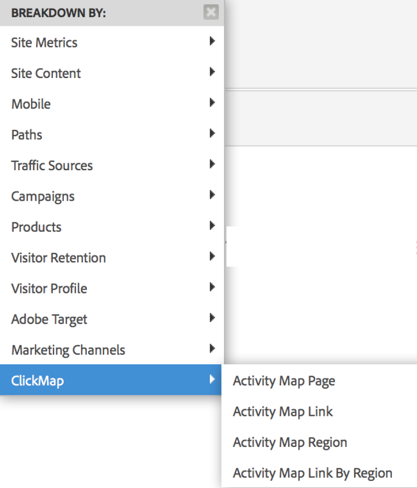

# Enable Activity Map{#enable-activity-map}

Explains the steps the Analytics Admin needs to complete to enable Activity Map link collection and user download.

## Step 1. Update Your AppMeasurement (Javascript) Code to v1.6 (or higher) {#section_5D1586289DF2489289B1B6C1C80C300D}

The Activity Map module is part of the AppMeasurement.js file (located at the top of the file). The AppMeasurement library will load the Activity Map module when instantiated.

Activity Map data cannot be collected unless you update to this version (or higher) of AppMeasurement.

1. Download the latest AppMeasurement code (AppMeasurement_Javascript-1.6.zip) by going to  **[!UICONTROL Analytics]** > **[!UICONTROL Admin]** > **[!UICONTROL All admin]** > **[!UICONTROL Code manager]** and [implement it](https://experienceleague.adobe.com/docs/ analytics/implementation/js/overview.html).

   We have included some [sample implementation code](/help/analyze/activity-map/activitymap-getting-started/activitymap-getting-started-admins/activitymap-sample-implementation-code.md) to help you visualize the changes that have been made to the code by including the Activity Map module.

1. Validate the implementation:

    1. When a clickable element is clicked, data will be stored in a cookie named s_sq.
    1. The Activity Map data can be seen in the query-string on the tracking call. For example:

       ```    
       …&c.&a.&Activity Map.&link=My%20Link&region=My%20Region&page=My%20Page&.Activity Map&.a&.c&...
       ```

1. Break this report down by **[!UICONTROL Activity Map Link by Region]** to see the link/region for that page:  {width="400px"}

## Step 2. Enable Activity Map reports {#section_D14F15D2FC0346FCAD8B3B87E6DD33D4}

First, you need to enable Activity Map reports at a report-suite level.

1. Log in to Adobe Analytics and navigate to  **[!UICONTROL Analytics]** > **[!UICONTROL Admin]** > **[!UICONTROL Report Suites]** > Select report suite > **[!UICONTROL Edit Settings]** > **[!UICONTROL Activity Map]** > **[!UICONTROL Activity Map Reporting]** .
1. Activity Map collects the link data in Activity Map reports. For the activation to happen, you must first activate the variables by clicking **[!UICONTROL Enable Activity Map Reports]**.

   This step adds all the Analytics dimensions that you need to collect data.

1. After about an hour, check the [Activity Map Page report](/help/analyze/activity-map/activitymap-reporting-analytics.md), which shows all the pages where users clicked on a link.

## Step 3. Add users to Activity Map access group {#section_4C7A47BB7DEF4AFFBC276392467F9675}

1. Click **[!UICONTROL Add Users to Group]**.

   This will take you to the group management page in the Admin Console.

1. [Add users to this group](https://experienceleague.adobe.com/docs/ analytics/admin/user-product-management/user-groups/groups.html) and **[!UICONTROL Save Group]**.

1. This allow your Admin users to download Activity Map from  **[!UICONTROL Adobe Analytics]** > **[!UICONTROL Tools]** > **[!UICONTROL ActivityMap]** .

>[!NOTE]
>
>If you want non-admin users to download Activity Map, create a new user group that provides permission to 'Tools' and 'Legacy ClickMap Installation'. This level of permission combined with the Activity Map Access provides permissions to download and use the tool.
