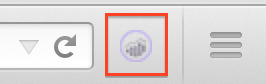
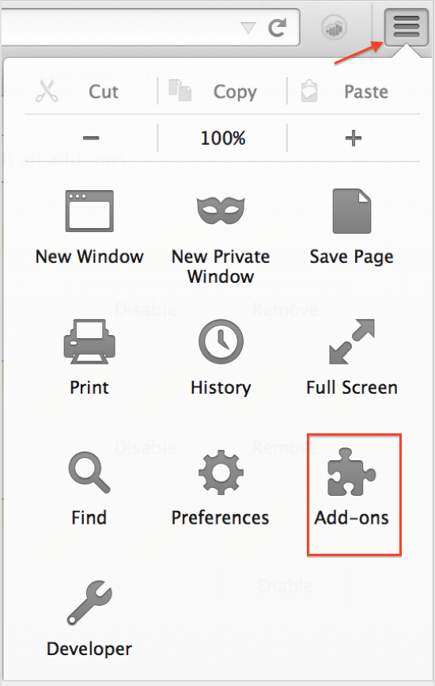

# Install Activity Map browser plug-ins{#install-activity-map-browser-plug-ins}

The installation process varies depending on which browser you are using.

Activity Map browser plug-ins:

* Are injected manually as an Analytics page tag.
* Are launched by a button or menu item in the browser toolbar.
* Are compatible only with the latest versions of these desktop browsers: Internet Explorer, Firefox, and Chrome.
* Support the **[!UICONTROL Remember my login]** feature.
* **Can inject** the Activity Map toolbar on web pages that do not contain Analytics page code. Will show an error message if the page does not contain the Analytics page code.
* Require you to go through a browser plug-in installation process.

## Install Activity Map plug-in on Chrome {#section_6907253D5D5E4422967E6439207A013F}

1. Go to **[!UICONTROL Adobe Analytics]** > **[!UICONTROL Tools]** > **[!UICONTROL Activity Map]**.  
1. Click **[!UICONTROL Download Activity Map]**.
1. Click **[!UICONTROL Install the Activity Map Plug-in]**.
1. Answer **[!UICONTROL Yes]** when the security warning asks you whether you want to download the Activity Map Browser Plug-in.
1. Once the download has completed, find the location of the .zip file and unzip its contents.
1. Return to Chrome's address bar and enter `chrome://extensions`.
1. Check the Developer mode box.
1. Click Load unpacked extensions and select the unzipped folder from the popup.
1. If you see an Adobe Analytics icon added to your tool bar, your download was successful.   You can now [launch Activity Map](/help/analyze/activity-map/activitymap-getting-started/activitymap-getting-started-users/activitymap-launch.md) from your page.

## Install Activity Map plug-in on Firefox {#section_1F69D3D22DB34D6992747B1A62C1D2DA}

1. Go to **[!UICONTROL Analytics]** > **[!UICONTROL Activity Map]**.

1. Click **[!UICONTROL Download Activity Map]**.
1. Click **[!UICONTROL Install the Activity Map Plug-in]**.
1. Click **[!UICONTROL Allow]** when this message appears: 
1. Click **[!UICONTROL Install Now]**.
1. Click the **[!UICONTROL Open Menu]** icon at the top right and select **[!UICONTROL Add-Ons]**. {width="250px"}
1. Activity Map should be listed as one of the Firefox Add-ons.
1. If you see an Adobe Analytics icon added to your tool bar, your download was successful.   You can now [launch Activity Map](/help/analyze/activity-map/activitymap-getting-started/activitymap-getting-started-users/activitymap-launch.md) from your page.

## Install Activity Map plug-in on Internet Explorer {#section_1A33705D7F784C4A88C9026ADC860FB8}

1. Go to **[!UICONTROL Analytics]** > **[!UICONTROL Activity Map]**.
1. Click **[!UICONTROL Download Activity Map]**.
1. Click **[!UICONTROL Install the Activity Map Plug-in]**.
1. Click **[!UICONTROL Run]** to initiate the Activity Map installation.
1. Click **[!UICONTROL Yes]** on the popup to allow the program to make changes to the computer.
1. Follow the instructions in the installation wizard.
1. If Activity Map was successfully installed, you will see a notification in Internet Explorer saying that the Activity Map Toolbar is ready for use. Enable it to begin using the application. You can now [launch Activity Map](/help/analyze/activity-map/activitymap-getting-started/activitymap-getting-started-users/activitymap-launch.md) from your page.
