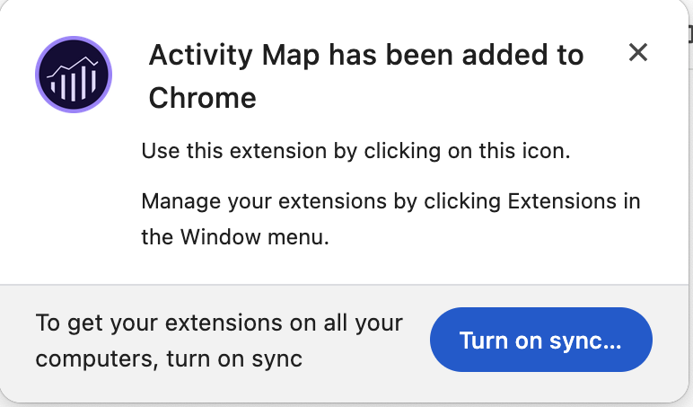
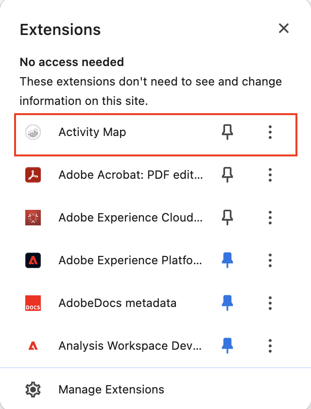
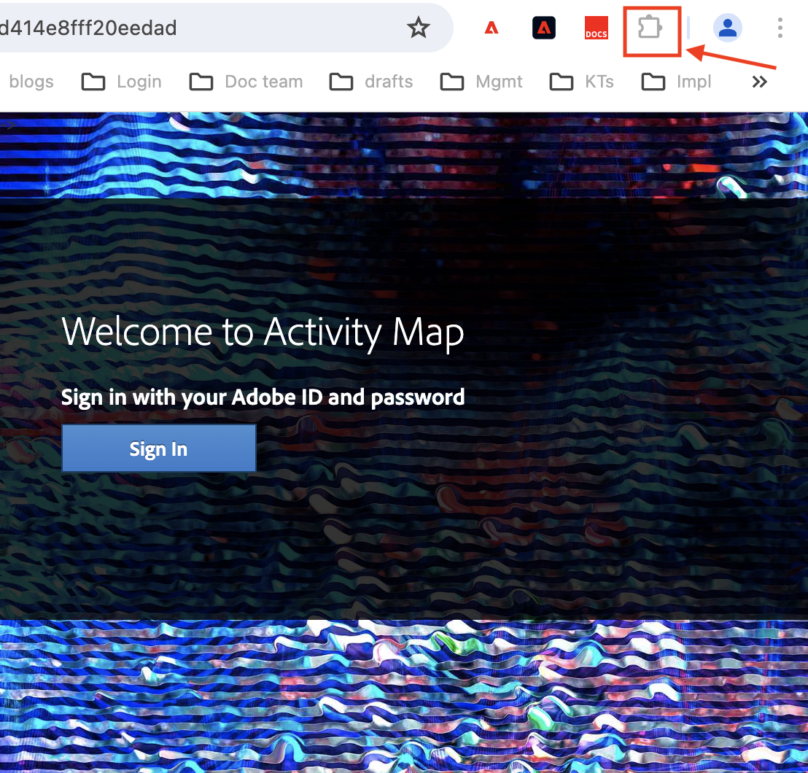
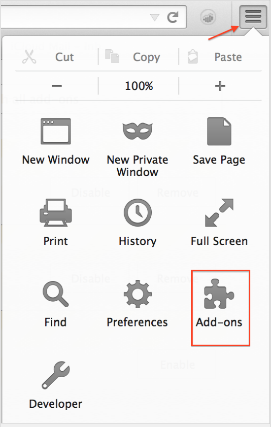

# Install Activity Map browser extensions

The installation process varies depending on which browser you are using.

Activity Map browser extensions:

* Are injected manually as an Analytics page tag.
* Are launched by a button or menu item in the browser toolbar.
* Are compatible only with the latest versions of these desktop browsers: Firefox and Chrome.
* Support the **[!UICONTROL Remember my login]** feature.
* **Can inject** the Activity Map toolbar on web pages that do not contain Analytics page code. Will show an error message if the page does not contain the Analytics page code.
* Require you to go through a browser extension installation process.

## Install Activity Map extension on Chrome {#chrome}

1. Go to **[!UICONTROL Adobe Analytics]** > **[!UICONTROL Tools]** > **[!UICONTROL Activity Map]**.  
1. Click **[!UICONTROL Download Activity Map]**.
1. Click **[!UICONTROL Install Activity Map]**.
1. Click **[!UICONTROL Add to Chrome]**. 
1. Click **[!UICONTROL Add Extension]**.
   
1. Click the Chrome Extensions icon at the top right.
   
1. Click Activity Map.
   

## Install Activity Map plug-in on Firefox {#firefox}

1. Go to **[!UICONTROL Analytics]** > **[!UICONTROL Activity Map]**.
1. Click **[!UICONTROL Download Activity Map]**.
1. Click **[!UICONTROL Install Activity Map]**.
1. Click **[!UICONTROL Allow]** when this message appears: 
1. Click **[!UICONTROL Install Now]**.
1. Click the **[!UICONTROL Open Menu]** icon at the top right and select **[!UICONTROL Add-Ons]**. {width="250px"}
1. Activity Map should be listed as one of the Firefox Add-ons.
1. If you see an Adobe Analytics icon added to your tool bar, your download was successful.   You can now [launch Activity Map](/help/analyze/activity-map/activitymap-getting-started/activitymap-launch.md) from your page.

