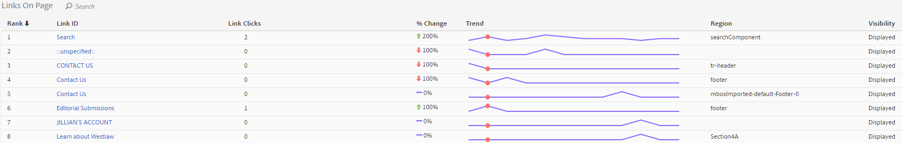

# Links report

The Links report reports on the links that were found on the current page. It does not report on all the links that were collected for that page.

The Links On Page report offers a tabular view of the links. Sometimes you might want to see link clicks (or other metrics) ranked in a single view. This allows you to better compare one link to another. Create the Links On Page Report including a ranked list of all the links the page (by link ID), the click information (# and %) and the region in the page. Click the Links in Page report button in the Activity Map toolbar.

The **[!UICONTROL Links On Page]** report opens below the browser frame in the Activity Map dashboard.

## Standard mode {#section_C8D2A1C07A2A4E3A8F84AC9240603FA7}

In Standard Mode, the "Links on Page" Report shows link data ranging from single day to multi-day, aggregated over the full date range. The following information will be shown for each link:

<table id="table_3DE41B2CFA644B70AF802A3123CE51D9"> 
 <thead> 
  <tr> 
   <th colname="col1" class="entry"> Column </th> 
   <th colname="col2" class="entry"> Description </th> 
  </tr> 
 </thead>
 <tbody> 
  <tr> 
   <td colname="col1"> Rank </td> 
   <td colname="col2"> Rank in page. In Standard Mode, the rank value stays the same, regardless of which column you click. </td> 
  </tr> 
  <tr> 
   <td colname="col1"> Link ID </td> 
   <td colname="col2">The link's primary ID (for more information on how primary ID is defined by the <a href="/help/analyze/activity-map/activitymap-link-tracking/activitymap-link-tracking-methodology.md">New Link Tracking Methodology</a>) </td> 
  </tr> 
  <tr> 
   <td colname="col1"> Clicks </td> 
   <td colname="col2"> The number of raw clicks for a specified link and its percentage of the total clicks on the page. If the user chooses a different metric in the toolbar, the Link report will report on that metric instead. </td> 
  </tr> 
  <tr> 
   <td colname="col1"> Region </td> 
   <td colname="col2"> Represents the region in the page where the link is located. </td> 
  </tr> 
  <tr> 
   <td colname="col1"> Visibility </td> 
   <td colname="col2">Relates to the visibility status of the link. Two values are possible: 
    <ul id="ul_BABCC0F64145407C9D439150A6898E6D">
     <li id="li_9AF0479BDCEB4A44A37292FAABFA83A5"><b>Hidden</b>: the link is currently in the page but not visible to the end user (like a sub menu in a Navigation Menu that becomes visible only if the user hovers on top of the Parent Menu) </li>
     <li id="li_C6FA4EC27EDD4341AB9821E2B4BC9E60"><b>Displayed</b>: the link is currently displayed on the page. However, it might be displayed below the fold: the user would have to scroll the page to see it. </li>
    </ul>
Note:  If a link is set to "Hidden", no overlays will be displayed for it. 
</td> 
  </tr> 
 </tbody> 
</table>

**Filter Data**

When you want to zero in on a specific link, you can search for a related term in the **[!UICONTROL Filter Data]** field. Only the links that match the search will have overlays. Without a filter, the overlays specified in the [Activity Map Settings](/help/analyze/activity-map/activitymap-overlay-settings.md) will be shown.

## Live mode {#section_AC1967217B5A4532ACB01D33636F6770}

In Live mode, the Links on Page report shows trended data spanning several minutes.

<table id="table_61D1FB0F02894055A1AB394DE4FE4742"> 
 <thead> 
  <tr> 
   <th colname="col1" class="entry"> Column </th> 
   <th colname="col2" class="entry"> Description </th> 
  </tr> 
 </thead>
 <tbody> 
  <tr> 
   <td colname="col1"> Rank </td> 
   <td colname="col2"> Rank in page. In case of a gradient or bubble overlay, the rank value stays the same, regardless of which column you click. In case of a gainers/losers overlay, that rank value changes based on which links gained/lost the most. </td> 
  </tr> 
  <tr> 
   <td colname="col1"> Link ID </td> 
   <td colname="col2">The link's primary ID. For more information on how the primary ID is defined by the New <a href="/help/analyze/activity-map/activitymap-link-tracking/activitymap-link-tracking-methodology.md"> Link Tracking Methodology</a>. </td>
  </tr> 
  <tr> 
   <td colname="col1"> Link Clicks </td> 
   <td colname="col2"> Total clicks for the selected time period. </td> 
  </tr> 
  <tr> 
   <td colname="col1"> % Change </td> 
   <td colname="col2"> % change between current period link metrics and previous period link metrics. Negative % change are shown in red, positive in green. </td> 
  </tr> 
  <tr> 
   <td colname="col1"> Trend </td> 
   <td colname="col2"> A line chart for all collected periods. The currently selected period is indicated by a green marker. The currently hovered period is indicated by a red marker. </td> 
  </tr> 
  <tr> 
   <td colname="col1"> Region </td> 
   <td colname="col2"> Represents the region in the page where the link is located. </td> 
  </tr> 
  <tr> 
   <td colname="col1"> Visibility </td> 
   <td colname="col2">Relates to the visibility status of the link. Two values are possible: 
    <ul id="ul_B10C55ED4D3C4CF99506DC467E2E7CFB">
     <li id="li_EA646722A51041CC9E62C56DEF92C81F">Hidden: link is currently in the page but not visible to you (for example, any link that appears after the page is loaded.) </li>
     <li id="li_F9543614C2894003AC9984A7404E2785">Displayed: link is currently displayed on the page. However, it might be displayed below the fold: you would have to scroll the page to see it. </li>
    </ul></td> 
  </tr> 
 </tbody> 
</table>

## Sorting and filtering {#section_4B8E8233C21247CAA70DAEC2156548AD}

Sometimes you need to analyze only the results of a specific page region (e.g. left panel) to decide how to organize the content of that specific region of the web page.

For this purpose, we have created a sorting and filtering functionality for links in the Links on Page report. Filtering is available through the filter field and the search term will be applied to the Link ID column and Link Region column. Sorting is available through clicking on the call-ons (Rank, Link ID, Clicks, Change over time, Region, Visibility) and it can be both ascending and descending. Overlays disappear from the web site when links are filtered out from the Links on Page report.
