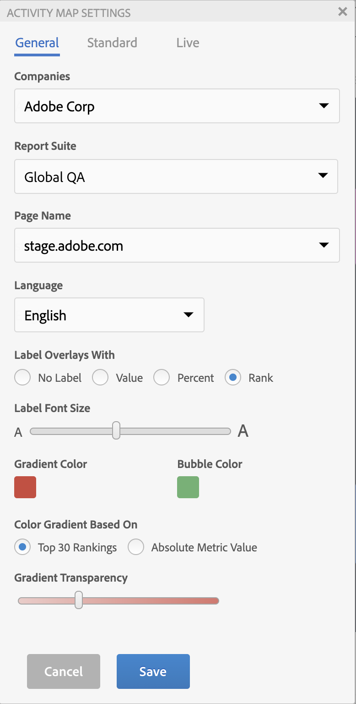
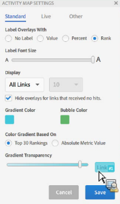
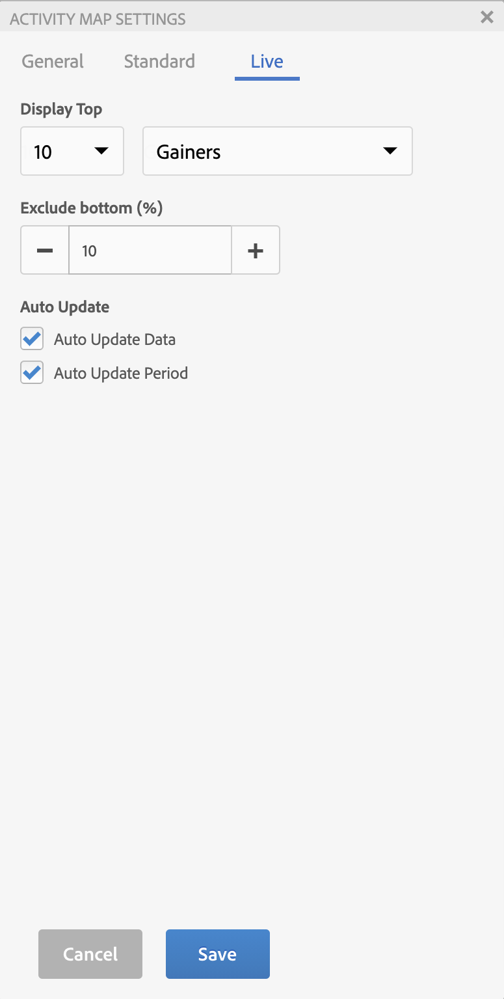

# Configure Activity Map settings

The Activity Map Setting Panel lets you modify the settings and properties for all types of overlay visualizations.

Access the Activity Map Settings panel accessed by clicking the gear icon on the Activity Map toolbar.

## General settings {#section_697A12F099494D699A4BF498598178C5}

| Setting | Description |
| --- | --- |
| **[!UICONTROL Companies]** | Select the applicable login company. |
| **[!UICONTROL Report Suite]** | The list of report suites that are accessible to you is no longer limited to the report suites defined in the web page tag. You can now substitute the selected report suite (corresponding to one of the tags on the page) with another report suite. This new report suite does not need to be linked to a tag on the page. If you change the selected report suite in the Activity Map Settings, the  Save process causes all affected Analytics reports to be refreshed. **Important**: [!UICONTROL Virtual Report Suites] are not compatible with [!UICONTROL Live Mode], only with [!UICONTROL Standard Mode]. If you are in [!UICONTROL Live Mode] for a Standard Report Suite, but select a [!UICONTROL Virtual Report Suite] in this dialog, once you click **[!UICONTROL OK]** here, the Standard Mode will be displayed. In addition, the Calendar control is reinitialized to match the report suite's calendar type (Gregorian, retail, custom...). |
| **[!UICONTROL Page Name]** | The page to which these settings apply. |
| **[!UICONTROL Language]** | The selection corresponds to the languages offered for Adobe Analytics. |
| **[!UICONTROL Label Overlays With]** |<ul><li>**[!UICONTROL No Label]**: only applicable for the Gradient overlay. In this case, the color of the overlay conveys a sense for the ranking of the link</li><li>**[!UICONTROL Value]**: the raw metric total for that link</li><li>**[!UICONTROL Percent]**: percentage of the metric for this link on the total metric for the page.</li><li>**[!UICONTROL Rank]**: rank of this link across all links present in the rendered page</li></ul> |
| **[!UICONTROL Label Font Size]** | Lets you increase/decrease the overlay label font size, using a slider, for better readability. |
| **[!UICONTROL Gradient/Bubble Color]** | To display overlay link rankings for Gradient or Bubble overlay visualizations, select among a range of colors . |
| **[!UICONTROL Color Gradient Based On]** | <ul><li>**[!UICONTROL Top 30 Rankings]**: Color intensity is normalized for the top 30 values.</li><li>**[!UICONTROL Absolute Metric Value]**: Color intensity is a function of the absolute metric value.</li></ul> |
| **[!UICONTROL Gradient Transparency]** | Select the level of transparency for the Gradient overlays. This setting does not affect the [!UICONTROL Bubble] overlays. |

## Standard settings {#section_24DB95376E1A448494ECF3F57743FC19}

These settings apply to the standard mode overlay.

| Setting | Description |
| --- | --- |
| **[!UICONTROL Dynamic Data Filtering]** |  |
| **[!UICONTROL Hide overlays for links that received no hits]**. | This checkbox lets you hide overlays for links that received no hits, to reduce clutter in the interface. |

## Live settings {#section_D30F6E62FB5D404090B588F396A460AF}

These settings apply to the live mode overlay.

|  Setting  | Description  |
|---|---|
| **[!UICONTROL Display Top]** | To display the **[!UICONTROL Gainers]** or **[!UICONTROL Losers]** (or both) as overlays, select the number of links.  |
|  **[!UICONTROL Exclude bottom (%)]** | Select to eliminate Gainers-Losers links with sparse data. Filter out the bottom percentage of link changes to view only the links with enough data to show relevant gains or losses. The percentage is computed based on the number of links on that page. For example, filtering out the bottom 10% of a list of 200 links would filter out the bottom 20 links.  |
|  **[!UICONTROL Auto Update Data]** | Lets you decide whether or not the Analytics data shown in the interface automatically updates when a new period is computed.  |
|  **[!UICONTROL Auto Update Period]** | When checked, refreshes the web page with each new data retrieval so the links in the page can be more closely synced with the collected data.  |
