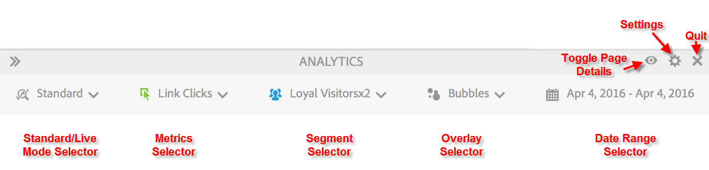
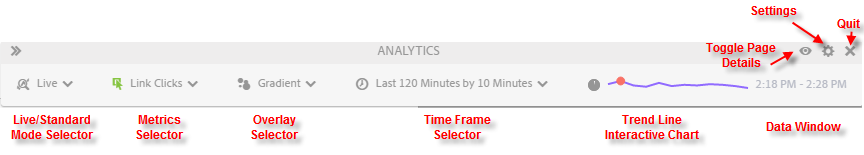

# Standard Mode vs. Live Mode

Activity Map provides two basic modes to provide complementary reporting of page activity.

* Standard mode, in which the [Links on Page Report](/help/analyze/activity-map/activitymap-links-report.md)shows link data ranging from single day to multi-day, aggregated over the full date range.
* Live mode displays activity trends in real time.

The two modes can be toggled by clicking the Mode button on the toolbar.

## Standard Mode {#section_0C755F30B7EC4A13A62AB9A391AF51E6}

In **Standard Mode**, you can select the date range in the toolbar as shown below.

In this mode, Commerce metrics that do not have "Participation" enabled are linearly allocated. For example, let's say a user clicks on a link "IPod mini" on the home page, then navigates through 3 more pages. On the 4th page, the user purchases an IPod mini for $200. The "IPod mini" link will receive $200 of participation revenue and $50 ($200/4) of revenue (linearly allocated revenue).

Q: What if a page has links with the same link name in separate regions? Do the two links receive credit separately since they have different regions but the same link name on a page?

A: It depends on how you aggregate the link data. In Activity Map, we look at Link ID|Region for a given page, so the allocated data would be for the "Link ID|Region" combination. In this case, because the region differs, the link|region would be distinct, and therefore any allocated revenue for the first link|region will be different from all allocated revenue for the second link. But in the Adobe Analytics UI, you can look at just the link ID report (instead of Link|Region report) for a given page (page broken down by Link). In that case, the revenue would be aggregated across both regions.

## Live Mode {#section_D619B77D89A840F0B1C2DEA2715A516A}

In **Live Mode**, Analytics data is shown in 1-minute to 15-minute increments, in a trended fashion. This mode is all about analyzing and monitoring short-term trends on the web page.

Live mode responds to the needs of publishing organizations. These organizations need to monitor micro-trends on link popularity within a few key pages. The ability to quickly discern what links are under-performing or are getting hot is critical for your publishing business.

>[!IMPORTANT]
>
>Virtual Report Suites are not compatible with Live Mode, only with Standard Mode.

