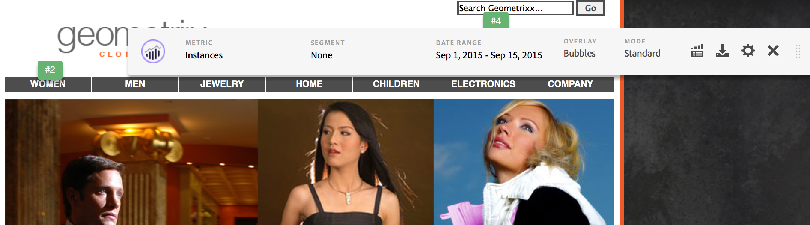
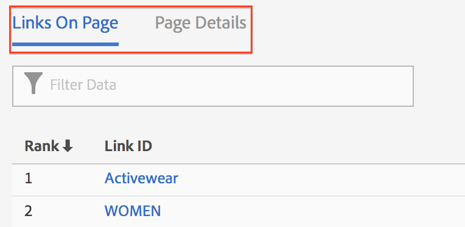

# Activity Map user interface

The Activity Map UI is comprised of two parts:

* The top window with the web page, and the injected overlays and toolbar.
* A bottom panel for reports.

## Top panel {#section_2DA8ACD35D4C4ACBA32C13EFB5317E7C}

At the top, you can see your web page with the [injected tool bar](/help/analyze/activity-map/activitymap-standard-live.md) and [link overlays](/help/analyze/activity-map/activitymap-gainerslosers.md). Bubble rankings display over links to let you identify the total number of clicks.

Additional link details can be accessed by hovering over each link overlay:

## Bottom reports panel {#section_21B129D69B7A4F918E975E8E66DB02EE}

At the bottom of the page, you can see the [Links on Page](/help/analyze/activity-map/activitymap-links-report.md) Report and the [Page Details](/help/analyze/activity-map/activitymap-page-flow.md) Report that let you view a summary of your current web page statistics as well as page flow information.

The Links on Page Report gives you a spreadsheet view of the links in the current page, including additional click information. The Page Details Report presents analytics data related to the pages that were visited before and after navigating to the currently displayed page.

