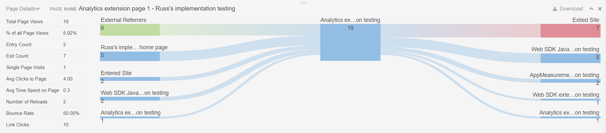

# Activity Map extension interface

The Activity Map extension interface is comprised of two parts:

* A top panel that lets you configure the extension and reports
* An overlay that displays the most popular links
* A bottom panel that shows metrics for the most popular links

## Top panel

The top panel contains your basic controls for the Activity Map overlay.

It offers the following settings:

* **Standard/Live view**: Toggles between standard view and live view.
  * Standard view: Shows the overlay based on historical data.
  * Live view: Shows the overlay based on live data. The date selector changes to a dropdown that lets you change the granularity of live data.
* **Metric selector**: Allows you to change the metric that the overlay reports. Only [!UICONTROL Link Clicks] are available if you have Live view selected.
* **Segment selector**: Allows you to select a [segment](/help/components/segmentation/seg-overview.md), viewing a subset of data within your overlay. Segments are not available in Live view.
* **Overlay visualization type**: Allows you to change how the overlay visualizes the ranking of links.
  * **[!UICONTROL Bubble]**: Top links receive a green bubble showing its numeric rank during the reporting period. You can change the bubble color in [Settings](settings.md).
  * **[!UICONTROL Gradient]**: Top links appear shaded in transparent red. The most popular links are the darkest red. You can change the gradient color in [Settings](settings.md).
  * **[!UICONTROL Off]**: Disable link overlays.
* **Date selector**: Allows you to change the reporting period.

The header of this panel contains the following settings:

* **Expand/collapse top panel**: Toggles the top panel to show settings horizontally or vertically (double arrow icon).
* **[!UICONTROL Toggle page details]**: Show or hide the bottom panel (eye icon).
* **[!UICONTROL Show settings]**: Opens a menu for settings that you can change (gear icon):
  * **[!UICONTROL Settings]**: Opens the extension's [Settings](settings.md).
  * **[!UICONTROL Help]**: Opens the documentation to Experience League (this page).
  * **[!UICONTROL Adobe community]**: Opens the [Experience League community](https://experienceleaguecommunities.adobe.com/).
  * **[!UICONTROL About]**: Displays the extension version.
  * **[!UICONTROL Logout]**: Logs you out of the extension, requiring you to sign in again.
* **[!UICONTROL Quit Activity Map]**: Closes all overlays for the extension (X icon).

## Page overlay

The page overlay contains your site content with an overlay that shows you the location of the most popular links clicked during the reporting period. You can configure these link overlays to appear as bubbles or gradients in the top panel's **[!UICONTROL Overlay visualization type]**.

If you click on a bubble or gradient, you can view details for that particular link.

## Bottom panel

The bottom panel shows an aggregated view of the links displayed on the overlay.

* **Report type**: Toggle the bottom panel to show the **[!UICONTROL Links on page]** report or the **[!UICONTROL Page details]** report.
* **[!UICONTROL Page name]**: The current [Page](/help/components/dimensions/page.md) dimension name.
* **[!UICONTROL Search]**: Filter the report to display only link names matching the entered text.
* **[!UICONTROL Download]**: Exports the report to CSV. You can include the [!UICONTROL Links on page] report, the [!UICONTROL Page] report, and the [!UICONTROL Page flow] report in the same download file.
* **[!UICONTROL Change report docking position]**: Toggles the position of this panel to appear on the bottom part or top part of your browser window.
* **[!UICONTROL Close the report]**: Closes this panel. You can open the panel again using the **[!UICONTROL Toggle page details]** button in the top panel (the eye icon).

The **[!UICONTROL Links on page]** report shows a basic workspace report with the following settings:

* The [Activity Map link](/help/components/dimensions/activity-map-link.md) dimension
* The [Occurrences](/help/components/metrics/occurrences.md) metric (labeled as **[!UICONTROL Link clicks]**)
* The current [Page](/help/components/dimensions/page.md) value applied as a segment

The **[!UICONTROL Page details]** report shows a [Flow](/help/analyze/analysis-workspace/visualizations/c-flow/flow.md) visualization using the [Page](/help/components/dimensions/page.md) dimension, focusing on the current page. The following metrics for the current page are displayed on the left:

* Total [page views](/help/components/metrics/page-views.md)
* [!UICONTROL % of all page views]
* [Entry](/help/components/metrics/entries.md) count
* [Exit](/help/components/metrics/exits.md) count
* [Single page visits](/help/components/metrics/single-page-visits.md)
* [!UICONTROL Avg clicks to page]
* Avg [Time spent on page](/help/components/metrics/time-spent.md)
* Number of [Reloads](/help/components/metrics/reloads.md)
* [Bounce rate](/help/components/metrics/bounce-rate.md)
* [!UICONTROL Link clicks]

