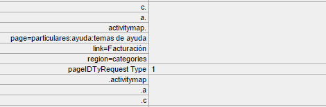

# Troubleshoot Activity Map data collection

If you don't see data for Activity Map dimensions, use this page to help determine why.

## Confirm data collection using the debugger

First, make sure that AppMeasurement correctly collects Activity Map data.

1. Download and install the [Adobe Experience Cloud Debugger Chrome Extension](https://experienceleague.adobe.com/docs/debugger/using/experience-cloud-debugger.html).
2. Navigate to your web page, then click on a link.
3. When the subsequent page loads, open the debugger. Validate that you see Activity Map context data variables sandwiched between `activitymap.` and `.activitymap`:

  

## Possible reasons why Activity Map data is not present

Check each of the following to make sure Activity Map components are present:

* **AppMeasurement version**: Activity Map is supported on v1.6 and above. Many edge case issues are resolved when you upgrade to the latest stable version of AppMeasurement.
* **Activity Map module**: Check if the `AppMeasurement_Module_Activity_Map` module is present in your `AppMeasurement.js` file. If your implementation uses Adobe Experience Platform to collect data, make sure that **[!UICONTROL Enable ClickMap]** is checked when configuring the Analytics extension under **[!UICONTROL Link tracking]**.
* **The `s_sq` cookie**: Activity Map depends on the `s_sq` cookie for data collection.
  * Make sure that the `cookieDomainPeriods` variable is correctly set, especially for regional domains such as `*.co.uk` or `*.co.jp`.
  * Make sure that the `linkInternalFilters` variable is set to desired values. If a clicked link does not match internal filters, Activity Map considers it an exit link and does not collect data.
* **Activity Map overlay running**: AppMeasurement does not track click data for your web page when the Activity Map overlay is enabled.
