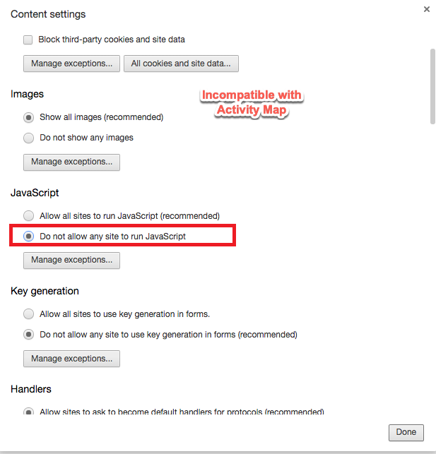
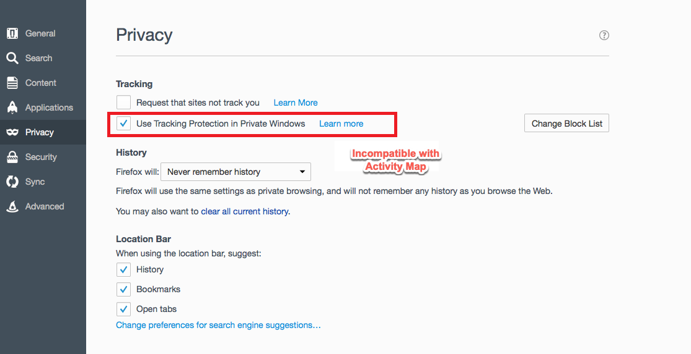
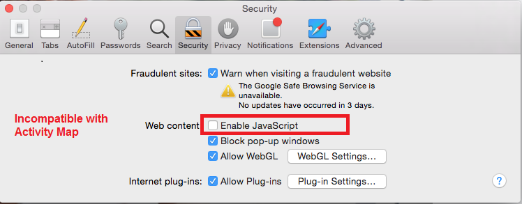
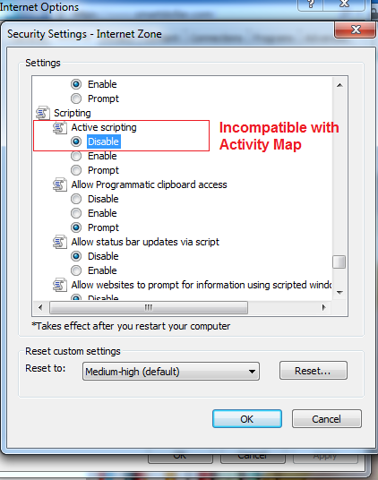

# Troubleshoot browser extensions

Shows the browser parameters that are not compatible with the use of Activity Map. You should disable these settings.

## Chrome

 

 

## Firefox

 

## Safari

 

## Internet Explorer

