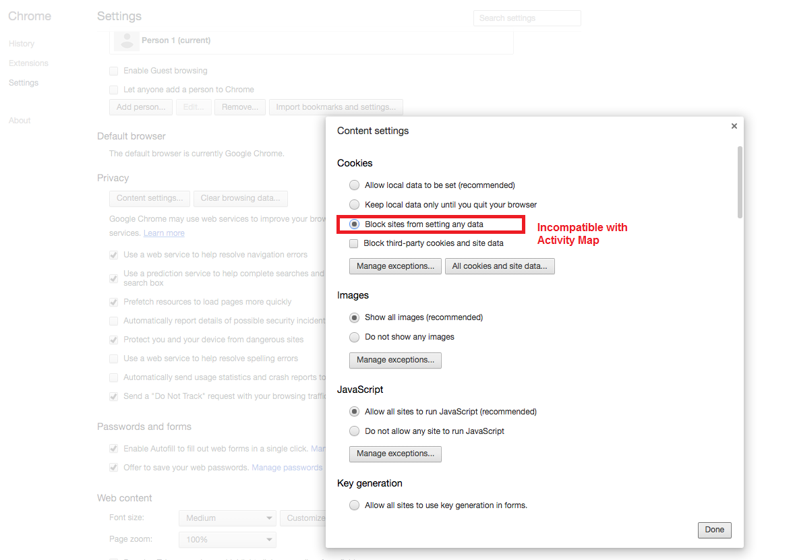

# Troubleshooting browser extensions

Lists the browser parameters that are not compatible with the use of Activity Map. You should disable these settings.

|  Browser Type  | Incompatible Setting  |
|---|---|
|  Chrome  |      

|
|  Internet Explorer  |  

|
|  Safari  |    

|
|  Firefox  |  

|

