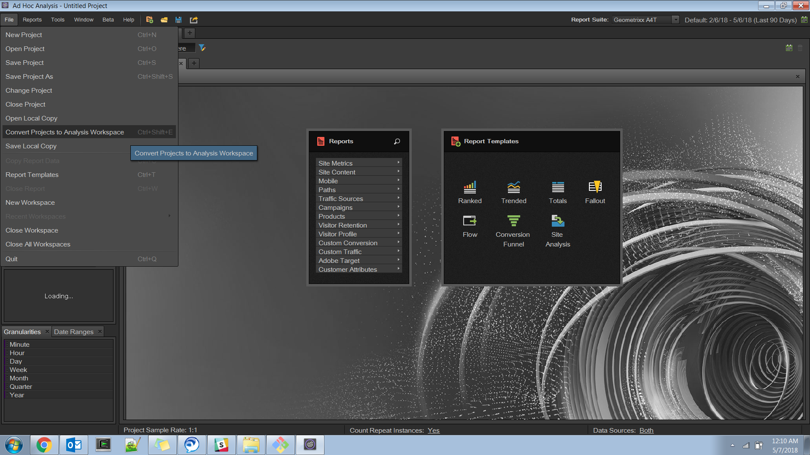
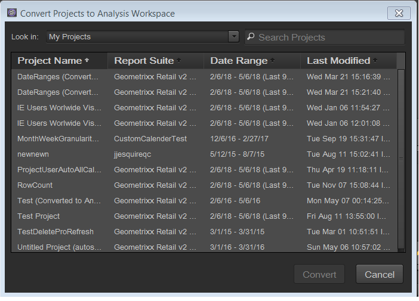

# Convert your projects in Ad Hoc Analysis

>[!IMPORTANT]
>
>Adobe is moving Ad Hoc Analysis to end of life on March 1, 2021. [Learn more](https://adobe.ly/discoverworkspace)

## Convert your projects {#topic_5A55F73488704C5D8E42CDD04B5984DE}

Before you convert your projects, note the following:

* To convert projects, you must be logged in to Ad Hoc Analysis as an administrator, or as a non-administrator with permission to use Analysis Workspace.
* Since this is a one-time conversion, any further changes you make to the Ad Hoc Project/s you converted will not be reflected in Analysis Workspace. You do have the option, however, to re-convert a project.
* Any converted Ad Hoc Analysis project will continue to exist in Ad Hoc, with a parenthesis in the title that indicates that it has been converted, and how many times. Example:

  

You have 2 options with respect to converting Ad Hoc Analysis projects:

* Select projects to convert from a list.
* Convert only the currently opened project.

### Select Projects from a List

1. In Ad Hoc Analysis, click **[!UICONTROL File]** > **[!UICONTROL Convert Projects to Analysis Workspace]**.

   

1. In the **[!UICONTROL Convert Projects to Analysis Workspace]** dialog, select the project to convert or press  +  to select the entire list.

   

1. Click **[!UICONTROL Convert]**.
1. A [!UICONTROL Conversion Summary] now lists all the projects that have been converted, along with a status columns that indicates Success or Failure to convert, along with the error code. Contact Adobe Client Care for further diagnosis with the "`Error-Id: <Error-Code>`".

   

### Convert Current Project

1. In Ad Hoc Analysis, open a project that you want to convert.
1. Click **[!UICONTROL Convert current project to Analysis Workspace.]** 

1. A [!UICONTROL Conversion Summary] now lists all the projects that have been converted, along with a status columns that indicates Success or Failure to convert, along with the error code. Contact Adobe Client Care for further diagnosis with the "`Error-Id: <Error-Code>`".
