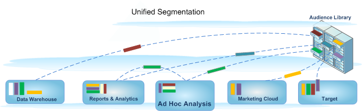

# Build segments 

>[!IMPORTANT]
>
>Adobe is moving Ad Hoc Analysis to end of life on March 1, 2021. [Learn more](https://adobe.ly/discoverworkspace)

Ad Hoc Analysis integrates with the Analytics Segmentation environment, allowing you to build, share, manage, and apply visitor segments across Adobe products. Ad Hoc Analysis provides a Java-based user interface for its Segment Builder and Segment Manager identical to the web-based tools used by other Analytics tools, matching server calls and providing the same features and functionality from a Java-based console.

Ad Hoc Analysis includes familiar features for building segments, plus new feature upgrades like the [Segment Manager](https://docs.adobe.com/content/help/en/analytics/components/segmentation/segmentation-workflow/seg-manage.html) used to set up a segment management [workflow](https://docs.adobe.com/content/help/en/analytics/components/segmentation/segmentation-workflow/seg-workflow.html). As always, you can build and save segments in the [Segment Builder](/help/components/segmentation/segmentation-workflow/seg-build.md) or [generate segments from a Fallout report](https://docs.adobe.com/content/help/en/analytics/analyze/analysis-workspace/visualizations/fallout/compare-segments-fallout.html) from the ad hoc analysis console, and then save the new or extended segments to the audience library for general access and application. 

## Unified Segmentation in Ad Hoc Analysis {#section_5FA03A06DE054448AD519CE30C39E294}

For information and instructions on building and managing segments in the Unified Segmentation environment including ad hoc analysis features, see the [Unified Segmentation](/help/components/segmentation/segmentation-workflow/seg-build.md) documentation.

* [New Features](/help/analyze/ad-hoc-analysis/c-content-ref.md#section_BD58629D1A9346BF879E229FA6BEC7A2) 
* [What happened to my existing segments?](/help/analyze/ad-hoc-analysis/c-content-ref.md#section_76CF47142D1A4FB6A0718AD9073049FE) 
* [What happened to my existing segment folders?](/help/analyze/ad-hoc-analysis/c-content-ref.md#section_FB04DCF775694E69B761DCA53F301C30) 
* [Can I manage all Analytics' segments in the Segment Manager?](/help/analyze/ad-hoc-analysis/c-content-ref.md#section_AF5EDD72C74A4739BD40C4AF125CE489) 
* [What is a Hit Container? Is it different from a Page View Container?](/help/analyze/ad-hoc-analysis/c-content-ref.md#section_65BBE60A836C4001938830DDA15DC256) 
* [What rights and privileges do I need to use, create, and manage segments?](/help/analyze/ad-hoc-analysis/c-content-ref.md#section_648DFA3A882146C485A84ED014EEC707) 
* [What should I do with duplicate segments that have the...](/help/analyze/ad-hoc-analysis/c-content-ref.md#section_E2C3A1B4B4274D1B86CAA9C0359D049C) 
* [How does Adobe recommend that I clean up segments?](/help/analyze/ad-hoc-analysis/c-content-ref.md#section_3AC2D265F9084557A24C6FB39DC6EE49) 
* [Why can't I delete this segment?](/help/analyze/ad-hoc-analysis/c-content-ref.md#section_0FEB6711031A4ABCA915CDA745ECF38D) 
* [More on what happens to your existing segments](/help/analyze/ad-hoc-analysis/c-content-ref.md#section_83ACAB256F394DCD8B424D8920BDD853)

## Features {#section_BD58629D1A9346BF879E229FA6BEC7A2}

* [Segments](https://docs.adobe.com/content/help/en/analytics/components/segmentation/seg-home.html) are universal to all report suites. Previously, segments were report-suite specific.
* The [Segment Manager](https://docs.adobe.com/content/help/en/analytics/components/segmentation/segmentation-workflow/seg-manage.html) lets you set up [workflows](https://docs.adobe.com/content/help/en/analytics/components/segmentation/segmentation-workflow/seg-workflow.html) with segment sharing, tagging, verification, and approval features.
* The [Segment Builder](/help/components/segmentation/segmentation-workflow/seg-build.md) has been updated to simplify segment creation.
* You can [tag segments](https://docs.adobe.com/content/help/en/analytics/components/segmentation/segmentation-workflow/seg-tag.html) to organize and search later instead of using folders. Previously, you used folders (in [!DNL ad hoc analysis]) to organize your segments.
* You can create [Sequential Segments](https://docs.adobe.com/content/help/en/analytics/components/segmentation/segmentation-workflow/seg-sequential-build.html) outside of Ad Hoc Analysis.

  >[!NOTE]
  >
  >In Ad Hoc Analysis, you cannot add date ranges to segments. This feature is available in Analysis Workspace. You can also not use Only Before/Only After sequencing in Ad Hoc Analysis.

## What happened to my existing segments? {#section_76CF47142D1A4FB6A0718AD9073049FE}

Your existing segments will continue to work as they did before the introduction of Analytics Segmentation. Any reports that have these segments applied will continue to work correctly.

Most former pre-defined and suite segments will be migrated over as segment templates into the segment builder. Segment templates are used to quickly build custom segments with common audiences. Segment templates can't be applied to a report directly, but they can be easily saved to a custom segment.

## What happened to my existing segment folders? {#section_FB04DCF775694E69B761DCA53F301C30}

Instead of (Ad Hoc Analysis) folders, the Segment Manager uses [tags](https://docs.adobe.com/content/help/en/analytics/components/segmentation/segmentation-workflow/seg-tag.html). Your folder names are automatically converted to tags and those tags are applied to the respective segments.

## Can I manage all Analytics segments in the Segment Manager? {#section_AF5EDD72C74A4739BD40C4AF125CE489}

Within the Ad Hoc Analysis Segment Manager, you can only see the segments that belong to you (the segments you created) and the segments that are specifically shared with you.

## What is a Hit Container? Is it different from a Page View Container? {#section_65BBE60A836C4001938830DDA15DC256}

The Page View container was renamed to the Hit container to indicate that this container segments all types of data and not just page views. For example, link tracking calls, and [!DNL trackAction] calls from the mobile SDKs are all included or excluded by the hit container.

Note that there wasn't a change to the way this container functions, it was simply renamed.

## What rights and privileges do I need to use, create, and manage segments? {#section_648DFA3A882146C485A84ED014EEC707}

All users can create and edit personal segments. These segments can be shared directly with any other Analytics user.

Admins can edit any segment, and [share segments](https://docs.adobe.com/content/help/en/analytics/components/segmentation/segmentation-workflow/t-seg-share.html) with groups and [set rights](https://docs.adobe.com/content/help/en/analytics/components/segmentation/segment-reference/seg-rights.html) to access segments for the organization.

## What should I do with duplicate segments that have the same name but may have different definitions? {#section_E2C3A1B4B4274D1B86CAA9C0359D049C}

Since segments work in multiple report suites, you might find that you have multiple segments with the same name. We recommend that you either

* Rename segments that have the same name, but different definitions, or 
* Delete segments that are no longer necessary.

## How does Adobe recommend that I clean up segments? {#section_3AC2D265F9084557A24C6FB39DC6EE49}

* Tag all segments with legacy tag.
* Review the segments that you have.
* Add them to the segment library where applicable.
* Approve segments that are canonical.
* Tag segments according to best practices.

## Why can't I delete this segment? {#section_0FEB6711031A4ABCA915CDA745ECF38D}

If the segment was [published to the Experience Cloud](https://docs.adobe.com/content/help/en/core-services/interface/audiences/t-publish-audience-segment.html), you cannot delete it or edit it. However, you can copy it and edit the copied version.

## More on what happens to your existing segments {#section_83ACAB256F394DCD8B424D8920BDD853}

<table id="table_0AE814A64D2A48ABB28402C4303F420E"> 
 <thead> 
  <tr> 
   <th colname="col1" class="entry"> Segment Category </th> 
   <th colname="col2" class="entry"> What happens to these segments? </th> 
  </tr> 
 </thead>
 <tbody> 
  <tr> 
   <td colname="col1"> Favorites Segments (Ad Hoc Analysis) </td> 
   <td colname="col2">These Ad Hoc Analysis segments are displayed as regular segments in Adobe Analytics. 
They should not be confused with the Favorites feature in the Segment Manager that lets you mark segments as favorites. 
 </td> 
  </tr> 
  <tr> 
   <td colname="col1">Pre-Configured Segments: 
    <ul id="ul_BBF3C3F4D41A40AF98DA9DA6D299AD03"> 
     <li id="li_B65A004BDF8743FDABCD3332AEB8A010">Single Page Visits </li> 
     <li id="li_908CF5F964154C9D9EBBAC2A900DCB49">Visits from Mobile Devices </li> 
     <li id="li_4A715F49AA374463B501D731261A3A4C">Visits from Natural Search </li> 
     <li id="li_67CE51237EC34FD4B33942BA14584EBF">Visits from Paid Search </li> 
     <li id="li_C3820743178A4E9F9E5E5B5C47401DF2">Visits with Visitor ID Cookie </li> 
    </ul> </td> 
   <td colname="col2"> 
These segments will be migrated over as segment templates into the segment builder. 
 
Existing reports that have these segments applied will continue to work correctly. 
 </td> 
  </tr> 
  <tr> 
   <td colname="col1">Experience Cloud (Suite) segments: 
    <ul id="ul_6968AFF6DEDA4BC8A7885B07CC1F57DF"> 
     <li id="li_073D9496F0C64AEB855855D01E65C1BA">Non-Purchasers </li> 
     <li id="li_8958FD4272A14E16A9AA08216E8BC573">Purchasers </li> 
     <li id="li_1436D7C9651D4AC38E10662DEDDD2B95">First Time Visits </li> 
     <li id="li_69F42B4F6107407792B0014804A8AF7B">Visits from Social Sites </li> 
     <li id="li_29CA111186BE475C943E9F8450BDE8C8">Visits of More than 10 Minutes* </li> 
     <li id="li_1FEF207959DC4D2E9FC925DD43177AA0">Visits with 5+ Previous Visits* </li> 
     <li id="li_219AB1D4FD7E469C9076A23D2CCC7C2C">Visits from Facebook* </li> 
    </ul> </td> 
   <td colname="col2"> 
 Most of these segments (except the ones marked with an asterisk *) will be migrated over as segment templates into the segment builder. Additionally, several new segment templates have been added. 
 
Existing reports that have these segments applied will continue to work correctly. 
 </td> 
  </tr> 
  <tr> 
   <td colname="col1">Admin segments 
(also known as "Global" segments) 
 </td> 
   <td colname="col2"> 
 <b>Admin</b> segments will be migrated into the new segment interface and will show up as segments shared with everyone. 
 
The owner of these segments is set to the admin with the oldest account in the login company's list of admin users, however, all Admins can delete, edit and share these segments. 
 
The segment management interface in the Admin Console where Admins created and managed these global segments is no longer available. Admins should now use the new segment builder to create segments and share them with appropriate groups or individuals or with everyone. 
 </td> 
  </tr> 
 </tbody> 
</table>

