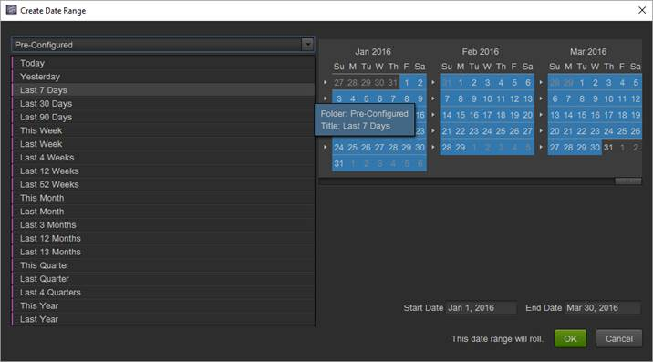

# Dates and date ranges

In the calendar, you can specify dates and date ranges, or select a preset. You can make calendar selections at the project, workspace, and report levels. A project's date range is the default date. However, a workspace date range overrides the project's date range. Similarly, a report's date range overrides the date settings of a workspace and project. You cannot select a date range outside your data availability range.

## Dates and date ranges {#concept_AB32765013F449908B5964AB622C75FF}

In the calendar, you can specify dates and date ranges, or select a preset. You can make calendar selections at the project, workspace, and report levels. A project's date range is the default date. However, a workspace date range overrides the project's date range. Similarly, a report's date range overrides the date settings of a workspace and project. You cannot select a date range outside your data availability range.

 An enabled **[!UICONTROL Clear Date]** option indicates that a date range is specified at the report level.

You can also drag dates (and Time dimensions) into the report or the [!UICONTROL Table Builder]. You can select specific days, weeks, months, years, or a rolling date. If you use the custom calendar in marketing reports and analytics, a report suite inherits those settings and updates the report accordingly.

When selecting a date range while creating a project, using Pre-Configured on the left will set a rolling date while using the calendar on the right will not. An easy way to tell whether your date range is rolling is the statement "This date range will roll" next to the **[!UICONTROL OK]** button.

> [!NOTE] If you need help running legacy reports, contact your Account Manager.

## Legacy Date Slices {#concept_53AA34DB3CE647608CAF4B41D6EAF45E}

In the second half of 2010, Adobe began the migration of report suites to a unified data platform for improved processing and storing. Data existing prior to the migration is considered legacy (or historical) data that is constrained by a calendar quarter or year boundary.

<!-- 

c_legacy_data.xml

 -->

**To access historical date slices**

1. [Create](/help/analyze/ad-hoc-analysis/c-getting-started.md) or open a project.
1. Open the [calendar](/help/analyze/ad-hoc-analysis/c-dates.md), then select **[!UICONTROL Quarter]** or **[!UICONTROL Year]**.

> [!NOTE] Historical date slices lie within quarter and year constraints. You cannot view data crossing the boundary between legacy slices and the new processing platform. Date ranges that span both results in an error. Additionally, the date ranges apply only to the Gregorian calendar, not to the Custom Calendar.

