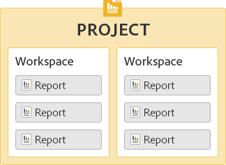

# Get Started with Ad Hoc Analysis{#concept_48936BA28FAE42DB81F1B2CD4726EB17}

>[!Important]
>On August 6, 2018, Adobe announced the intention to end-of-life Ad Hoc Analysis. An end-of-life date will be shared once available. For more information, including which versions of Java will be compatible during this period, visit [https://adobe.ly/discoverworkspace](https://adobe.ly/discoverworkspace).

You can perform instantaneous, advanced analysis on website activity. You can view multiple reports simultaneously and apply segments across multiple dimensions. You can analyze the data from both micro and macro perspectives to view their impact on your important business metrics.

These features enable you to answer questions about site traffic, visitor demographics, revenue, and product movement. You can then filter, sort, and segment your data to find the answers to precise questions. The results are returned almost instantaneously, enabling you to quickly analyze the effects of a combination of factors.

<table id="table_C9C0444687FC418580F996E1D2ADB61A"> 
 <thead> 
  <tr> 
   <th colname="col1" class="entry"> Getting Started Tasks </th> 
   <th colname="col2" class="entry"> Description </th> 
  </tr> 
 </thead>
 <tbody> 
  <tr> 
   <td colname="col1"> 
1. Log in to Adobe  Analytics. 
 </td> 
   <td colname="col2"> 
Go to <a href="https://marketing.adobe.com"  > marketing.adobe.com </a>and log in using your Adobe Analytics credentials. 
 </td> 
  </tr> 
  <tr> 
   <td colname="col1"> 
2. Launch Ad Hoc Analysis. 
 </td> 
   <td colname="col2">Click  Adobe Analytics &gt;  Tools &gt;  Ad Hoc Analysis, and then click the  Launch Ad Hoc Analysis button. 
 
Note: If you do not see the <b>Launch Ad Hoc Analysis</b> button on this page, make sure the administrator added you to the <i>Ad Hoc Analysis License User</i> group in the Admin Tools. 
 
 </td> 
  </tr> 
  <tr> 
   <td colname="col1"> 
3. Create a project. 
 </td> 
   <td colname="col2"> 
On the start-up page, select a report suite, then click  Create Project. 
 
See <a href="/help/analyze/ad-hoc-analysis/c-getting-started.md"   > Projects and Workspaces</a>. 
 </td> 
  </tr> 
  <tr> 
   <td colname="col1"> 
4. Open a report. 
 </td> 
   <td colname="col2"> 
Search for a report using the standard Cloud report menu. You can also choose a template. 
 
See <a href="/help/analyze/ad-hoc-analysis/c-getting-started.md"   > Report Templates</a>. 
 </td> 
  </tr> 
  <tr> 
   <td colname="col1"> 
5. Configure the report. 
 </td> 
   <td colname="col2"> 
Configure reports by performing tasks, such as: 
 
    <ul id="ul_0D2E8C614F2A4899A376BCEECEA374C6"> 
     <li id="li_FA925D52A8FD4DFAB0C88B797B24E72B"> Create segments to dig deeper into data </li> 
     <li id="li_5E91632551D2473BA8BD0637CDC1A9F6"> Adding metrics, dimensions, and segments to the <a href="/help/analyze/ad-hoc-analysis/c-tablebuilder.md"   > Table Builder</a> </li> 
     <li id="li_019316C9A94B4A8C8A77D07C04E50278">Configuring <a href="/help/analyze/ad-hoc-analysis/c-dates.md"   > date ranges</a> </li> 
     <li id="li_2B33B325D5EE420AB412B73AD1D231C5"> <a href="/help/analyze/ad-hoc-analysis/c-schedule.md"   > Scheduling</a> report delivery </li> 
    </ul> 
Search this help system to locate the help you need. 
 </td> 
  </tr> 
 </tbody> 
</table>

## System Recommendations {#concept_6691331B45174290BD9B839806A9B52D}

Though reports should function appropriately with most popular Web browsers, reports look and function best on systems that meet certain recommendations.

<!-- 

c_sys_reqs.xml

 -->

>[!NOTE]
>
>As of July 2018, Ad Hoc Analysis will support only Java 8 or higher. If you choose to run Ad Hoc Analysis on Java 7 after the July 2018 Maintenance Release, Adobe will no longer support your Ad Hoc Analysis implementation.

* Video card supporting OpenGL 2.0 
* Cookies: Required 
* Operating System: Windows and Mac OS.
* Macromedia Flash Player: version 6 or later 
* Monitor Resolution: 800x600 (1024x768 recommended) 
* Color Depth: 16-bit or greater 
* JavaScript: Enabled 
* Java version: Java 1.7 or later (See Note above)

  If you do not have the correct version of Java installed, it is installed for you. If you have a non-compatible version of Java installed, Ad Hoc Analysis downloads and prompts you to install the updates.

## Java Upgrade Instructions {#section_E4C0C6492FF24636A0FF71A59331111D}

As of July 2018, Ad Hoc Analysis will support only Java 8 or higher. If you choose to run Ad Hoc Analysis on Java 7 after the July 2018 Maintenance Release, Adobe will no longer support your Ad Hoc Analysis implementation.

Our .jar files are signed with a secure 256-bit encryption that is not supported by Java versions less than 1.7.0_76. This 256-bit certificate allows us to serve you with enhanced security.

If you still have Java 7 installed, you must upgrade before the July 2018 Maintenance release. Here's how:

* If you are allowed to install programs on your machine:

  1. Go to https://www.java.com.
  1. Click **[!UICONTROL Free Java Download]**.
  1. Click **[!UICONTROL Agree and Start Free Download]**.
  1. Install the latest Java version specific to your Operating System.

* If you are **not** allowed to install programs on your machine:

  1. Work with your IT department to get the latest version of Java installed.

## Launch Ad Hoc Analysis {#concept_B1CE3C1E6D1A4311B9835BEB69812E55}

<!-- 

c_login.xml

 -->

You can log in from the [!DNL Experience Cloud] or from a URL. If you log in from Reports and Analytics, you are automatically logged in. Logging in using a URL is necessary only if you access the ad hoc analysis URL from another location, such as a link or from a favorites menu.

## Log In from the Experience Cloud {#task_128ED319F3AE49ED886EA3DFA8D0987F}

Steps that describe how to log in from the [!DNL Experience Cloud].

<!-- 

t_login_suite.xml

 -->

1. In a browser, navigate to [!DNL marketing.adobe.com].
1. Type your company name, your username, and your password. Then click **[!UICONTROL Sign In]**.
1. Click **[!UICONTROL Adobe Analytics]** > **[!UICONTROL Tools]** > **[!UICONTROL Ad Hoc Analysis]**.

   If you do not see the **Launch Ad Hoc Analysis** button on this page, make sure the administrator added you to the *Ad Hoc Analysis License User* group in the Admin Tools.
1. Click **[!UICONTROL Launch Ad Hoc Analysis]**.
1. Save the [!DNL discover.jnlp] file locally.

   You can run this saved file whenever you want to launch Ad Hoc Analysis.

## Projects and Workspaces {#concept_FAE346335B0347A192C6C806C775D72B}

A project defines the set of data that is imported, including a report suite and a date range. A project consists of any number of reports with all of their metrics, settings, dimensions, and segments. You can begin a new project, load a saved project, or load the project that automatically saves.

<!-- 

c_projects.xml

 -->

You group reports into a *workspace*. A project can contain multiple workspaces, and a workspace can contain multiple reports. The relationship among these items is best understood as a nested one:

You can open only one project at a time. However, you can open multiple workspaces in a project. In each workspace you can have several reports open.

The default date range for a new project is [!UICONTROL Last 90 Days].

## Start a Project {#task_918A4539134E4E62B00486DCB8D3D403}

Steps that describe how to start a project.

<!-- 

t_project_start.xml

 -->

1. Log in.
1. Open a saved project or click **[!UICONTROL Create Project]**.
1. Search for a report, or choose a template.

## Open a Recently Saved Workspace {#task_DE4A54180BC24E9DAEC98E2171DC6B40}

Steps that describe how to open recently saved workspaces.

<!-- 

t_recent_workspace.xml

 -->

1. Click **[!UICONTROL File]** > **[!UICONTROL Recent Workspace]**.

   You can open up to five recent workspaces. Recent workspaces are not available after exiting your session.

## Share Projects {#task_5911780D90164F3A8A677C8BC719750D}

Shared projects will be available to all Ad Hoc Analysis users in the company.

<!-- 

t_share_projects.xml

 -->

1. Go to **[!UICONTROL File]** > **[!UICONTROL Save As]**.
1. Select **[!UICONTROL Shared Projects]** from the **[!UICONTROL Save in:]** drop-down.

   

1. Click **[!UICONTROL Save]** to save the project.

   Shared projects can be opened via **[!UICONTROL File]** > **[!UICONTROL Open]** > **[!UICONTROL Shared Projects]**.

   >[!NOTE]
   >
   >You can delete your own shared projects in the same dialog box for sharing projects by selecting one or more projects.

## Rename a Workspace {#task_0DB177DD6DB54B7F9FE60A0B3FC7CFC3}

Steps that describe how to rename a workspace.

<!-- 

t_rename_workspace.xml

 -->

1. Right click the workspace name.
1. Choose **[!UICONTROL Rename Workspace]**.
1. Type a name, then click **[!UICONTROL OK]**.

## Open Local Project {#task_1B3EF63A80C74776B24B99D80EAC74AC}

Steps that describe how to open a local copy of a project.

<!-- 

t_open_local_project.xml

 -->

1. Click **[!UICONTROL File]** > **[!UICONTROL Open Local Copy]**.
1. Navigate to the local [!DNL .dproj] file, then click **[!UICONTROL Open]**.

## Report Templates {#concept_370F674C5B4C45368731AA801C5A45F8}

Templates are starting points for the type of analysis you want to perform. A template can be a blank canvas, such as a Ranked or Fallout report. Or, the template is a report that starts with default metrics and dimensions.

<!-- 

c_templates.xml

 -->

You can access templates when creating a project ( **[!UICONTROL File]** > **[!UICONTROL New Project]**), or by adding a workspace or report.

|Template|Description|
|--- |--- |
|Ranked|Provides a blank canvas where you can construct a table. For example, a  Pages report ranks the pages on your site based on traffic. The detail table shows percentages and numbers for metrics like Page Views and Revenue.|
|Trended|Lets you examine how conversions and events trend over a selected time granularity (Hour, Day, Week, Month, Quarter, or Year) during a reporting period.|
|Totals|An executive-level report that shows bottom-line figures. It contains data for Total Revenue, Page Views, and Orders.|
|Fallout|Lets you construct a funnel that displays conversion and fallout rates between checkpoints. For example, you can track a visitor's fallout points during a buying process.|
|Flow|Shows the most common paths users take across pages, site sections, and servers.|
|Conversion Funnel|Shows conversion percentages between specific metric events. You can use this report to understand the number of click-throughs that generate sales, and the number of units sold.|
|Site Analysis|A three dimensional site pathing tool that displays how visitors move through specified pages and events.|
|Virtual Focus Group|Takes a visit at random from your visits and shows you an extensive amount of data about the visit. You can use the report to create focus groups from your visitor population.|

## Open a Report {#task_0AC455CDA198497AA546622FB05F300D}

You can open a report or a template when you create a project, or from within an existing project. Use a template to configure a report from scratch.

<!-- 

t_reports_opening.xml

 -->

Several ways are available to open a report:

* On the [!UICONTROL New Report] page, search for a report or choose a template.
* Click **[!UICONTROL Reports]** from the menu, then select a report or report template.
* Launch a report from a dimension: right-click a dimension name, then select **[!UICONTROL Run Report]** > **`report name`**.
