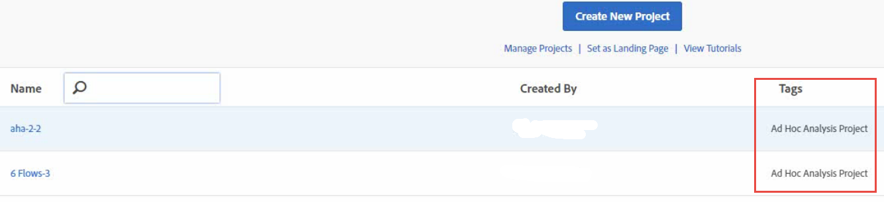

# View Converted Projects in Analysis Workspace

Before you view your projects in Workspace, please refer to the [ FAQ](../../ad_hoc_analysis_bucket/aha2aw-overview/aha2aw_converter_faq.md#topic_8231595303AD403E9322645A63632D57) and review the [ differences in terminology](../../ad_hoc_analysis_bucket/aha2aw-overview/aha2aw_converter_faq.md#topic_8231595303AD403E9322645A63632D57) between Ad Hoc Analysis and Workspace. 

1. Navigate to ** [!UICONTROL  Analytics] ** > ** [!UICONTROL  Workspace] **. Notice that projects converted from Ad Hoc Analysis are tagged "Ad Hoc Analysis Project".  

1. Click the project name to view the project.
1. Make further changes to the project, if desired. Note that these changes will not be reflected in Ad Hoc Analysis.

