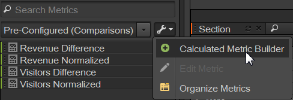

# Metrics

## Metrics {#concept_46A67930CFDB4A078225C5B189688AF3}
>Metrics are quantitative information about visitor activity, such as views, click-throughs, reloads, average time spent, dates, units, orders, revenue, and so on. Metrics and associated data are displayed in the columns of reports.Standard metrics include: 

* **Traffic**: Shows data about the volume of visitors.
* **Conversion**: Show data about success events on your website. Success events can include purchases, downloads, or any other action that you want users to take on your website. 

* **Calculated**: Customizable metrics created by combining other metrics. For example, you could create a metric that subtracts the keyword cost and the cost of goods from the revenue to get net revenue. You could then divide this amount by the total number of orders to get average net revenue per order. 

See [ Metric Definitions](http://marketing.adobe.com/resources/help/en_US/reference/index.html?f=metrics) in the *Analytics Reference* for information about how metrics are used in the [!DNL  Experience Cloud]. 

You can use the [!UICONTROL  Organize Metrics] tool to create new folders for your metrics. You can then group metrics any way you want. The organizer lets you copy existing metrics into your custom folders using drag-and-drop. 

While you can create folders, name them, and organize the metrics into them however you want, you cannot change the default folders, except for the Favorites and Calculated Metrics folders. 
>## Organize Metrics {#task_17C844A9387042EAA9983E1E554846B1}
>Steps that describe how to organize metrics and create metric folders.
<!-- t_organize_metrics.xml -->

>1. In the [!UICONTROL  Metrics] tool pane, click ** [!UICONTROL  More Actions] **. (  )
>1. Click ** [!UICONTROL  Organize Metrics] **.
>1. Click ** [!UICONTROL  New] ** to create a folder.
>1. Select metrics in other folders, then drag the selection to the new folder.
>1. Click ** [!UICONTROL  OK] **.

>   >[!NOTE]
>   >
>   >When you delete a folder, all of the metrics in the folder are deleted from your currently selected project.
>
>## Add Metrics to a Report {#task_747DD1718B3F4776B83A115D0BE8754C}
>Steps that describe how to add metrics to a report.
<!-- t_add_metrics_dsc.xml -->

>1. In the [!UICONTROL  Metrics] tool pane, locate the metric.
>   You can locate metrics in the search field or by drilling into metric folders. 
>
>1. Drag the metric to the report table or [!UICONTROL  Table Builder].
>   You may want to specify default metrics in [!UICONTROL  Settings] in advance, if you want to reduce the need to repeatedly add metrics to a report. 

>   See [ Ranked Tab - Definitions](../ad_hoc_analysis_bucket/c_global_settings.md#reference_FB9BADD7E3DA42C1BB2A02A6E9D5C1CF). 
>
>## Calculated Metric Builder {#concept_F8E213CE786A43FB93847C5BA883A29C}
>The Calculated Metric Builder in Ad Hoc Analysis is now tied in with Analytics Unified Calculated Metrics. Its user interface is similar to the Calculated Metric Builder in Analytics.
<!-- c_calc_metric_builder.xml -->
For more information on how Calculated Metrics are built and managed, see the [ Calculated Metric Guide](https://marketing.adobe.com/resources/help/en_US/analytics/calcmetrics/). 

Here is how you access the Calculated Metric Builder in Ad Hoc Analysis: 

1. In the [!UICONTROL  Metrics] pane, click ** [!UICONTROL  More Options] **, then ** [!UICONTROL  Calculated Metrics Builder] **.  

1. The Calculated Metric Builder interface lets you drag and drop metrics, segments, and functions to build your custom metrics:  

