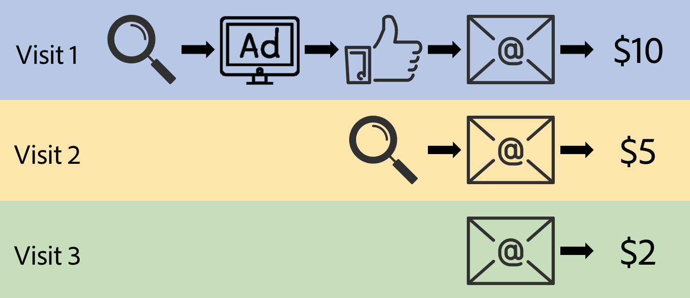

# Attribution IQ overview

>[!IMPORTANT]
>
>Attribution IQ is available for all customers on the Adobe Analytics Ultimate, Prime, Select, and Foundation SKUs.

## Business Value of Attribution IQ {#section_E82B97114E1641A8AE911F57AEB3240A}

The “Customer Journey” isn’t linear and is only partially predictable. It’s more organic, flexible, and often unpredictable. Each customer proceeds at their own pace, often doubling back, stalling, restarting, etc. This makes it difficult to know the impact of marketing efforts across the customer journey. It also hampers efforts to tie multiple channels of data together to answer business questions and leads to incomplete customer insights.

Adobe Analytics Attribution IQ enables modern intelligence teams to understand how meaningful engagement takes place across the customer journey, intelligently identifying inflection points that lead customers to target outcomes, effectively optimizing marketing initiatives.

Adobe Analytics enhances attribution by letting you:

* Define attribution beyond paid media: Any dimension, metric, channel or event can be applied to models (e.g. internal search), not just marketing campaigns. 
* Utilize unlimited attribution model comparison: dynamically compare as many models as you want. 
* Avoid implementation changes: With report time processing and context-aware sessions, customer journey context can be built in and applied at run time. 
* Construct the session that best matches your attribution scenario. 
* Break down attribution by segments: Easily compare the performance of your marketing channels across any important segment (e.g. New vs. Repeat customers, Product X vs. Product Y, Loyalty level or CLV). 
* Inspect channel cross-over and multi-touch analysis: Using Venn Diagrams and Histograms, and trend attribution results. 
* Analyze key marketing sequences visually: explore paths that led to conversion visually with multi-nodal flow and fallout visualizations. 
* Build calculated metrics: Use any number of attribution allocation methods.

## What Does Attribution IQ Do? {#section_63B421E9E75B4CCEBA96726CAA37D73E}

Attribution IQ in Analysis Workspace lets you add many new types of attribution models to Freeform Tables, Visualizations, and Calculated metrics. All attribution models have two components:

* An **attribution model** (i.e., First Touch, Last Touch, Linear, etc.). The model describes the distribution of conversions to the hits in a group. 
* An **attribution lookback window** (i.e., visit or visitor). The lookback window describes which groupings of hits are considered for each model.

The following customer journey example represents the marketing touchpoints of a single visitor spanning three visits, three conversions, and four marketing channels (search, display, social, and email):

## Instance-Based Attribution {#section_A81DBC3B19014CE3894131F1CF72736F}

Attribution in Analysis Workspace utilizes the “instance” of any dimension, meaning that attribution models get applied to the values that were passed into Analytics (after processing rules, VISTA, and Marketing Channels Processing Rules). Effectively, this means there is no difference between a prop or eVar (or any other dimension) for the sake of attribution modeling. Props can be set to persist using any of the lookback windows or models below, and allocation and expiration settings for eVars are not used (as specified in Admin settings) when the attribution lookback windows or models are applied.

## Attribution Lookback Window {#section_A2782BB64171431EB370CDCD4AD8030D}

The attribution lookback window is a grouping of hits that an attribution model will be applied to. There are two attribution lookback window settings in Analysis Workspace: visit and visitor.

**Visit Lookback Window**

The visit lookback window is any sequence of activity separated by 30 minutes of inactivity by default. However, [Context-Aware Sessions](https://marketing.adobe.com/resources/help/en_US/reference/vrs-mobile-visit-processing.html) are also supported via [Report Time Processing](https://marketing.adobe.com/resources/help/en_US/reference/vrs-report-time-processing.html) if you prefer to change that default. If using the visit attribution lookback window within a Virtual Report Suite (VRS) using a custom session, the attribution lookback window will use the custom visit definition as the basis of its calculation. In the example above, each visit would be considered an independent attribution lookback.

**Visitor Lookback Window**

The visitor lookback window will consider the totality of a visitor’s hits within the reporting window of your Workspace Panel, plus the full months that encompass the reporting window. For example, if the reporting window date range is September 15 - September 30, the visitor lookback date range would be September 1 - September 30. For more information regarding the visitor lookback window, please refer to [Data appearing outside the reporting window](https://helpx.adobe.com/analytics/kb/data-appearing-outside-reporting-window.html).

**Attribution Lookback Window Example**

To illustrate the impact of attribution lookback windows, we’ll apply a Linear model (which gives equal credit to all touch points) to our above example:

When using the **visit attribution lookback window**, each visit has its conversion distributed independently:

* The $10 from the first visit would be split equally among Search, Display, Social, and Email, each receiving $2.50. 
* On the second visit, Search and Email would each receive half of the $5 conversion, so Email and Search would each receive another $2.50. 
* Finally, on the final visit, Email would receive all of the credit for the $2 conversion.

In the **visitor lookback window**, all of the conversions are considered together, however the calculation is slightly more complex due to fact that there are multiple conversions.

* The first $10 conversion would be split equally among Search, Display, Social, and Email. 
* The second $5 conversion would then be split among the channels present in that visit as well as the previous channels from the previous visit: Search = (2/6) &#42; $5 = $1.67, Display = (1/6) &#42; $5 = $0.83, Social = (1/6) &#42; $5 = $0.83, Email = (2/6) &#42; $5 = $1.67. 
* Finally, the last conversion would be split across all the channels for the visitor: Search = (2/7) &#42; $2 = $0.57, Display = (1/7) &#42; $2 = $0.29, Social = (1/7) &#42; $2 = $0.29, Email = (3/7) &#42; $2 = $0.86.

Here is a summary of the results in table form:  

|  Channel  | Revenue (Linear | Visit)  | Revenue (Linear | Visitor)  |
|---|---|---|
|  Search  | $5.00  | $4.74  |
|  Display  | $2.50  | $3.62  |
|  Social  | $2.50  | $3.62  |
|  Email  | $7.00  | $5.02  |
|  Total  | $17.00  | $17.00  |

This difference in the attribution lookback window works similarly with all attribution models described below.

## Attribution Models {#section_4B9E7F83AE0B451A992397E55C3F5871}

Analysis Workspace supports ten different attribution models: First Touch, Last Touch, Same Touch, Linear, U Shaped, J Curve, Inverse J, Time Decay, Participation, and Custom. Details of each with accompanying examples are shown below: 

<table id="table_A3EB34CD52314F0393FF0D12E5F9779D"> 
 <thead> 
  <tr> 
   <th colname="col1" class="entry"> UI Icon </th> 
   <th colname="col2" class="entry"> Attribution Model </th> 
   <th colname="col3" class="entry"> Definition </th> 
   <th colname="col4" class="entry"> When to Use </th> 
  </tr>
 </thead>
 <tbody> 
  <tr> 
   <td colname="col1"> 
 
 </td> 
   <td colname="col2"> 
Last Touch 
 </td> 
   <td colname="col3"> 
The Last Touch model gives 100% credit to the touchpoint occurring immediately before conversion. From the case above, the Email channel would get credit for all $17 in either a visit or visitor lookback because Email occurred just before all three conversions. 
 </td> 
   <td colname="col4"> 
This is the most basic and common attribution model and is frequently used for conversions with a short consideration cycle. 
 
Last Touch is commonly used by teams managing search marketing or analyzing internal search keywords. 
 </td> 
  </tr> 
  <tr> 
   <td colname="col1"> 
 
 </td> 
   <td colname="col2"> 
First Touch 
 </td> 
   <td colname="col3"> 
The First Touch model gives 100% credit to the touch point occurring first in the attribution lookback window. 
 
From the example above using the visit lookback, $10 + $5 = $15 would be given to the Search channel, and $2 would be given to the Email channel. With a visitor lookback, all $17 would be given to the Search channel because it occurred first across all hits in the reporting window. 
 </td> 
   <td colname="col4"> 
This is another common attribution model useful for analyzing marketing channels intended to drive brand awareness or drive customer acquisition. 
 
First Touch is frequently used by Display or Social marketing teams but is also great for assessing onsite product recommendation effectiveness. 
 </td> 
  </tr> 
  <tr> 
   <td colname="col1"> 
 
 </td> 
   <td colname="col2"> 
Same Touch 
 </td> 
   <td colname="col3"> 
The Same Touch model gives 100% credit to the very hit where the conversion occurred. 
 
In our example above, each conversion happened on a subsequent hit from the previous marketing touchpoint, therefore all $17 would be given to the “None” line item in the report. 
 </td> 
   <td colname="col4"> 
This is a helpful model when evaluating the content or user experience that was presented immediately at the time of conversion. Product or design teams will often use this to assess the effectiveness of a page where conversion occurs. 
 </td> 
  </tr> 
  <tr> 
   <td colname="col1"> 
 
 </td> 
   <td colname="col2"> 
Linear 
 </td> 
   <td colname="col3"> 
The Linear model is a multi-touch model that gives equal credit to every hit that occurred leading up to a conversion. 
 
In scenarios where multiple orders arise within the same visit or visitor lookback, equal credit is distributed among all channels that happened before conversion. 
 </td> 
   <td colname="col4"> 
This model is useful for conversions with longer consideration cycles or user experiences that need more frequent/consistent customer engagement. 
 
Linear attribution is often used by teams measuring mobile app notification effectiveness or with subscription-based products. 
 </td> 
  </tr> 
  <tr> 
   <td colname="col1"> 
 
 </td> 
   <td colname="col2"> 
U-Shaped 
 </td> 
   <td colname="col3"> 
The U-Shaped model gives 40% credit to the first interaction, 40% credit to the last interaction, and shares the remaining 20% among any interactions in between. 
 
In attribution lookbacks with only one touchpoint, 100% of the credit is given to the single touchpoint, and in cases with only two, 50% credit is given to each. 
 </td> 
   <td colname="col4"> 
This is a great model for those who value interactions that occurred first or last (introduced or closed) in a conversion, but still wish to recognize the assisting interactions. 
 
U-Shaped attribution is often used by teams who take a more balanced approach but want to give more credit to channels that found or closed a conversion. 
 </td> 
  </tr> 
  <tr> 
   <td colname="col1"> 
 
 </td> 
   <td colname="col2"> 
J-Shaped 
 </td> 
   <td colname="col3"> 
The J Shaped model gives 60% credit to the last interaction, 20% credit to the first interaction, and shares the remaining 20% among any interactions in between. 
 
In attribution lookbacks with only one touchpoint, 100% credit is given to the single touchpoint, and in cases with only two, 75% is given to the last touchpoint, and 25% is given to the first. 
 </td> 
   <td colname="col4"> 
Similar to U-shaped, this is a great model for those who value interactions that occurred first or last (introduced or closed) in a conversion, but which to emphasize the interaction that closed on the conversion. 
 
J-Shaped attribution is often used by teams who take a more balanced approach and want to give more credit to channels that closed a conversion 
 </td> 
  </tr> 
  <tr> 
   <td colname="col1"> 
 
 </td> 
   <td colname="col2"> 
Inverse J 
 </td> 
   <td colname="col3"> 
The Inverse J model gives 60% credit to the first interaction, 20% credit to the last interaction, and shares the remaining 20% among any interactions in between. 
 
In attribution lookbacks with only one touchpoint, 100% credit is given to the single touchpoint, and in cases with only two, 75% is given to the first touchpoint, and 25% is given to the last. 
 </td> 
   <td colname="col4"> 
Similar to U-shaped, this is a great model for those who value interactions that occurred first or last (introduced or closed) in a conversion, but wish to emphasize the interaction that initiated the conversion. 
 
Inverse J attribution is often used by teams who take a more balanced approach and want to give more credit to channels that initiated a conversion. 
 </td> 
  </tr> 
  <tr> 
   <td colname="col1"> 
 
 </td> 
   <td colname="col2"> 
Custom 
 </td> 
   <td colname="col3"> 
The custom model is a position-based model that allows you to specify the weights you want to give to the first (starter), last (closer), and middle (player) interactions. 
 
The values specified are normalized to 100% even if the numbers entered do not add to 100. In attribution lookbacks with only one touchpoint, 100% credit is given to the single touchpoint, and in cases with only two, the “player” parameter is ignored, and the first and last interactions are weighted by the “starter” and “closer” model parameter weightings, normalized to 100%. 
 </td> 
   <td colname="col4"> 
If your organization is uncomfortable with the defaults provided by Adobe Analytics, a custom model allows you to specify the weights that make the most sense to your organization. 
 </td> 
  </tr> 
  <tr> 
   <td colname="col1"> 
 
 </td> 
   <td colname="col2"> 
Time Decay 
 </td> 
   <td colname="col3"> 
The Time Decay model follows an exponential decay with a custom half-life parameter (default is seven days). 
 
The weight of each channel depends on the amount of time that passed between the touchpoint and the eventual conversion and is determined by the formula 2^(-t/halflife) where t is the amount of time between a touchpoint and conversion. For lookbacks with a single touchpoint, 100% credit is given to the one touchpoint, and for lookbacks with two touchpoints, credit is proportional to the time from conversion. 
 </td> 
   <td colname="col4"> 
This is a good model for teams that run promotions across a predetermined number of days who wish to emphasize channels that occurred more recently. 
 
Time Decay attribution is often used by teams running video advertising or teams scheduling their marketing around a significant event with a predetermined date (such as a conference or sporting event). 
 </td> 
  </tr> 
  <tr> 
   <td colname="col1"> 
 
 </td> 
   <td colname="col2"> 
Participation 
 </td> 
   <td colname="col3"> 
Participation gives 100% credit to all unique touchpoints or channels within an attribution lookback window. With Participation, the total number of conversions will be inflated in your report compared to other attribution models. Note that participation deduplicates channels that occur multiple times within a single attribution lookback window before giving credit. 
 
From our example above, and provided a visitor lookback window, Search, Display, Social, and Email would each receive $17. Using the same example with a visit lookback window, Search would receive $15, Display would receive $10, Social would receive $10, and Email would receive $17. 
 </td> 
   <td colname="col4"> 
This model is excellent for analysis and discovery to understand how often your end users or customers are exposed to any particular channel, page, or interaction. 
 
Media teams will often use this model to calculate content velocity, and retail organizations will often use this model to understand which parts of their app or website are on the critical path of conversion. 
 </td> 
  </tr> 
 </tbody> 
</table>

## Marketing Channels & Marketing Channels Processing Rules {#section_FCBF08A9D7C94B67B7AD76E8633E7916}

The First Touch Channel and Last Touch Channel, as well as the First Touch Channel Detail and Last Touch Channel Detail, can be used with the new attribution models. To avoid confusion for your team in the future, however, we recommend using two new dimensions instead: **Marketing Channels** and **Marketing Channels Detail**. They act precisely the same but don’t carry the confusing “First Touch” and “Last Touch” distinction in the name. If no attribution model is applied, Marketing Channels and Marketing Channels Detail will give the same results as Last Touch Channel and Last Touch Channel Detail, respectively.

When applying attribution models to either First Touch Channel or Last Touch Channel, any attribution settings will be overridden by whatever attribution model you’ve selected. So while the name of the dimension may be “First Touch Channel,” if you selected the Linear model (for example), the results would reflect linear attribution, not “First Touch.”

Additionally, since Marketing Channels variables are dependent on the traditional visit (as defined by Marketing Channels Processing Rules which are applied during the data collection process), they are ineligible for use with Context-Aware Sessions.

## Attribution on Classification Breakdowns {#section_F9DE21758C4643879BE05EEAE9A34E5A}

Attribution models can be applied to any value and its classification. In circumstances where a classified value is broken down by its key, Analytics will include only the keys that are associated with that particular classified value. For example, a linear attribution model applied to a given an eVar with the values “apple”, “banana”, and “carrot” classified to the values “Fruits” and “Vegetables”, where the value “Vegetables” is broken down by the base eVar, only “carrot” would appear in the breakdown. Similarly, “Fruits” broken down by the base eVar would only show “apple” and “banana” in the breakdown results even if the attribution credit was spread across all three base eVar values.

This behavior also applies to reports where the Marketing Channels dimensions are broken down by the Marketing Channels Detail dimensions.

## Attribution for Breakdowns {#section_B2E87C768B6B4DBFA8EB7DB5E2DF881E}

Analysis Workspace allows you to breakdown any value by any other dimension and specify the same or different attribution settings on the breakdown. For example, a Channel dimension may have linear attribution applied, but breaking down Channel by Campaign allows you to specify a different attribution model at the campaign level.

This is useful for teams who have one attribution model at the Channel level (to split fairly across channels), but have individual teams that wish to use a separate attribution model on their individual campaigns and need the totals for their campaigns to match what was allocated at the Channel level.

## “None” in Attribution {#section_BC71DA030E45487AA3C3F6ED247A3C4A}

The “none” line item is a catch-all line item that represents all conversions that occurred where no dimension value was present. Traditionally, the “none” line item has only existed on eVar reports or other dimensions that have persistence. When attribution models are applied, a “none” line item may appear where it may not have existed previously. This most commonly occurs when applying attribution models to props that introduce a “none” line item that was not present previously. 
