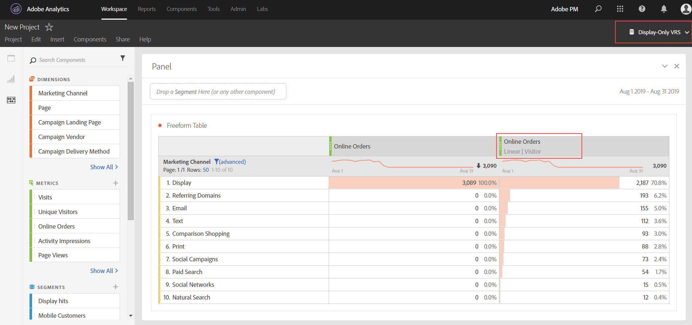

# Attribution FAQ

+++## What is the "None" line item when using attribution?

The 'None' line item is a catch-all item that represents all conversions that happened without any touch points within the lookback window. To reduce the number of conversions attributed to the 'None' line item, try using a a Custom Lookback Window with a longer lookback period.

+++

+++## Why do I sometimes see dates outside of my reporting window when using attribution models?

Some visit-based metrics, such as [Entries](/help/components/metrics/entries.md) or [Bounce Rate](/help/components/metrics/bounce-rate.md), can attribute data to a period before the reporting window start date range. This situation is due to attribution models using a lookback window, which determines how far back attribution should look to give credit for metrics. The most common scenario is when visits span midnight. For example:

1. A user visits your home page at 11:55 PM on September 7.
1. They visit several pages, the last of which occurred at 12:05 AM September 8.
1. A week later, you run a daily trended report with the date range September 8 - September 14.

Hit-based metrics, like [Page views](/help/components/metrics/page-views.md), would produce expected output; data trended each day from September 8 - September 14. However, visit-based metrics would also show the above visit on September 7. The visit's attributed entry occurred on September 7, and the lookback window by default is September 1 - September 31.

Bounce rate always shows 0% on September 7 in this example. This metric is defined as `Bounces divided by Entries`, a hit-based metric divided by a visit-based metric. Bounces consist of a single image request, so they cannot span multiple days, Any bounces on September 7 happened outside the reporting window, causing the guaranteed 0% bounce rate for that day. Other hit-based metrics would also show 0 for September 7 in this report, since those hits are not within the reporting window either.

Consider another similar example. The only difference between the following example and the above example are the dates:

1. A user visits your home page at 11:55 PM on August 31.
1. They visit several pages, the last of which occurred at 12:05 AM September 1.
1. A week later, you run a daily trended report with the date range September 1 - September 7.

In this example, Entries and Bounce rate would not show data from August 31. The lookback window and reporting window both start on September 1, so data cannot be attributed from August 31.

+++

+++## When should I use a visit, visitor, or custom attribution lookback?

The choice of attribution lookback depends on your use case. If conversions typically take longer than a single visit, a visitor or custom lookback is recommended. For longer conversion cycles, custom lookback windows are best as they are the only type that can pull in data from prior to the reporting window.

+++

+++## How do props and eVars compare when using attribution?

Attribution is recalculated at report runtime, so there is no difference between a prop or eVar (or any other dimension) for the sake of attribution modeling. Props can persist using any lookback window or attribution model, and eVar allocation/expiration settings are ignored.

+++

+++## Are attribution models available in other Analytics capabilities, such as Data Feeds or Data Warehouse?

No. Attribution models use report time processing, which is only available in Analysis Workspace. See [Report time processing](/help/components/vrs/vrs-report-time-processing.md) for more information.

+++

+++## Are attribution models only available if I'm using a virtual report suite with report time processing enabled?

Attribution models are available outside of virtual report suites. While they use report time processing on the backend, attribution models are available to both standard report suites and virtual report suites.

+++

+++## What dimensions and metrics are not supported?

The attribution panel supports all dimensions. Unsupported metrics include:

* All calculated metrics
* Unique Visitors
* Visits
* Occurrences
* Page Views
* A4T metrics
* Time Spent metrics
* Bounces
* Bounce rate
* Entries
* Exits
* Pages Not Found
* Searches
* Single Page Visits
* Single Access

+++

+++## Does attribution work with classifications?

Yes, classifications are fully supported.

+++

+++## Does attribution work with data sources?

Yes, most data sources are supported. Attribution is not possible with summary-level data sources because they do not tie to an Analytics visitor identifier.

Transaction ID data sources are treated like any other hit; they don't use the special processing that they normally use in traditional reporting. In other words, when using report time processing, Transaction ID hits will have eVar values propagated from hits which occur near the timestamp of the Transaction ID hit. The values will not be propagated from hits that occurred near the time of the original transaction.

When possible, attribution IQ relies on the MID column value sent within an event in the data source, rather than a persisted value. The attribution model is applied to the MID column values in the data source, on-the-fly. For example, when you use "Last Touch" attribution, the model starts from each instance of a metric and walks backward sequentially in the hits until it reaches the last value observed in the MID column.

When not possible, attribution IQ will use the MID value in the 'prior record' in the data source for evaluation. This prior record might not be ordered sequentially by timestamp, given that AA does not support out-of-order data.

+++

+++## Does attribution work with the Advertising Analytics integration?

Metadata dimensions, such as match type and keyword, work with attribution. However, metrics (including impressions, cost, clicks, average position, and average quality score) use summary-level data sources, and are therefore incompatible.

+++

+++## How does attribution work with marketing channels?

When marketing channels were first introduced, they came with only first and last touch dimensions. Explicit first/last touch dimensions are no longer needed with the current version of attribution. Adobe provides generic [!UICONTROL Marketing Channel] and [!UICONTROL Marketing Channel Detail] dimensions so you can use them with your desired attribution model. These generic dimensions behave identically to [!UICONTROL Last Touch Channel] dimensions, but are labeled differently to prevent confusion when using marketing channels with a different attribution model.

Since marketing channel dimensions depend on a traditional visit definition (as defined by their processing rules), their visit definition cannot be changed using virtual report suites.

+++

+++## How does attribution work with multi-value variables, such as list vars?

Some dimensions in Analytics can contain multiple values on a single hit. Common examples include list vars and the products variable.

When attribution is applied to multi-value hits, all values in the same hit get the same credit. Since many values can receive this credit, the report total can be different than if you summed each individual line item. The report total is deduplicated, while each individual dimension item gets proper credit.

+++

+++## How does attribution work with segmentation?

Attribution always runs before segmentation, and segmentation runs before report filters are applied. This concept also applies to virtual report suites using segments.

For example, if you create a VRS with a "Display Hits" segment applied, you could see other channels in a table using some attribution models.

>[!NOTE]
>
>If a segment suppresses hits containing your metric, those metric instances are not attributed to any dimension. However, a similar report filter simply hides some dimension items, without any impact on metrics processed per the attribution model. As a result, a segment can return lower values than a filter with a comparable definition.

+++
