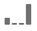
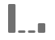
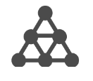

# Attribution models and lookback windows

The concept of attribution in Adobe Analytics requires two components:

* **Attribution model:** The model describes the distribution of conversions to the hits in a group. For example, first touch or last touch.
* **Attribution lookback window:** The lookback window describes which groupings of hits are considered for each model. For example, visit or visitor.

## Attribution models

| UI icon | Attribution model | Definition | When to use |
| --- | --- | --- | --- |
|  | Last Touch | Gives 100% credit to the touch point occurring most recently before conversion. | The most basic and common attribution model. It is frequently used for conversions with a short consideration cycle. Last Touch is commonly used by teams managing search marketing or analyzing internal search keywords. |
|  | First Touch | Gives 100% credit to the touch point first seen in the attribution lookback window. | Another common attribution model useful for analyzing marketing channels intended to drive brand awareness or customer acquisition. It is frequently used by display or social marketing teams, but is also great for assessing onsite product recommendation effectiveness. |
|  | Same Touch | Gives 100% credit to the very hit where the conversion occurred. If a touch point does not happen on the same hit as a conversion, It is bucketed under "None". | A helpful model when evaluating the content or user experience that was presented immediately at the time of conversion. Product or design teams often use this model to assess the effectiveness of a page where conversion happens. |
|  | Linear | Gives equal credit to every touch point seen leading up to a conversion. | Useful for conversions with longer consideration cycles or user experiences that need more frequent customer engagement. It is often used by teams measuring mobile app notification effectiveness or with subscription-based products. |
|  | U-Shaped | Gives 40% credit to the first interaction, 40% credit to the last interaction, and divides the remaining 20% to any touch points in between. For conversions with a single touch point, 100% credit is given. For conversions with two touch points, 50% credit is given to both. | A great model for those who value interactions that introduced or closed a conversion, but still want to recognize assisting interactions. U-Shaped attribution is commonly used by teams who take a more balanced approach but want to give more credit to channels that found or closed a conversion. |
|  | J-Shaped | Gives 60% credit to the last interaction, 20% credit to the first interaction, and divides the remaining 20% to any touch points in between. For conversions with a single touch point, 100% credit is given. For conversions with two touch points, 75% credit is given to the last interaction, and 25% credit is given to the first. | This model is great for those who prioritize finders and closers, but want to focus on closing interactions. J-Shaped attribution is frequently used by teams who take a more balanced approach and want to give more credit to channels that closed a conversion. |
|  | Inverse J | Gives 60% credit to the first touch point, 20% credit to the last touch point, and divides the remaining 20% to any touch points in between. For conversions with a single touch point, 100% credit is given. For conversions with two touch points, 75% credit is given to the first interaction, and 25% credit is given to the last. | This model is ideal for those who prioritize finders and closers, but want to focus on finding interactions. Inverse J attribution is used by teams who take a more balanced approach and want to give more credit to channels that initiated a conversion. |
|  | Custom | Allows you to specify the weights you want to give to first touch points, last touch points, and any touch points in between. Values specified are normalized to 100% even if the custom numbers entered do not add to 100. For conversions with a single touch point, 100% credit is given. For interactions with two touch points, the middle parameter is ignored. The first and last touch points are then normalized to 100%, and credit is assigned accordingly. | This model is perfect for those who want full control over their attribution model and have specific needs that other attribution models do not fulfill. |
|  | Time-Decay | Follows an exponential decay with a custom half-life parameter, where the default is 7 days. The weight of each channel depends on the amount of time that passed between the touch point initiation and the eventual conversion. The formula used to determine credit is `2^(-t/halflife)`, where `t` is the amount of time between a touch point and a conversion. All touch points are then normalized to 100%. | Great for teams who regularly run video advertising or who market against events with a predetermined date. The longer a conversion happens after a marketing event, the less credit is given. |
|  | Participation | Gives 100% credit to all unique touch points. The total number of conversions is inflated compared to other attribution models. Participation deduplicates channels that are seen multiple times. | Excellent for understanding how often customers are exposed to a given interaction. Media organizations frequently use this model to calculate content velocity. Retail organizations often use this model to understand which parts of their site are critical to conversion. |
|  | [Algorithmic](algorithmic.md) |  Uses statistical techniques to dynamically determine the optimal allocation of credit for the selected metric. | Useful to help avoid guesswork or heuristics when choosing the right attribution model for your business.  |

## Lookback windows

A lookback window is the amount of time a conversion should look back to include touch points. Attribution models that give more credit to first interactions see larger differences when viewing different lookback windows.

* **Visit lookback window:** Looks back up to the beginning of a the visit where a conversion happened. Visit lookback windows are narrow, as they don't look beyond the visit. Visit lookback windows respect the modified visit definition in virtual report suites.

* **Visitor lookback window:** Looks at all visits back up to the 1st of the month of the current date range. Visitor lookback windows are wide, as they can span many visits. Visitor lookback considers all values from the beginning of the month of the report's date range. For example, if the report date range is September 15 - September 30, the visitor lookback date range includes September 1 - September 30.

* **Custom lookback window:** Allows you to expand the attribution window beyond the reporting date range, up to a maximum of 90 days. Custom lookback windows are evaluated on each conversion in the reporting period. For example, for a conversion occurring on Feb 20th, a lookback window of 10 days would evaluate all dimension touchpoints from Feb 10th to 20th in the attribution model.

  Here is a video on custom lookback windows:

  >[!VIDEO](https://video.tv.adobe.com/v/36204/?quality=12)

## Example

Consider the following example:

1. On September 15, a visitor arrives to your site through a paid search advertisement, then leaves.
2. On September 18, the visitor arrives to your site again through a social media link they got from a friend. They add several items to their cart, but do not purchase anything.
3. On September 24, your marketing team sends them an email with a coupon for some of the items in their cart. They apply the coupon, but visit several other sites to see if any other coupons are available. They find another through a display ad, then ultimately make a purchase for $50.

Depending on your lookback window and attribution model, channels receive different credit. The following are some notable examples:

* Using **first touch** and a **visit lookback window**, attribution looks at only the third visit. Between email and display, email was first, so email gets 100% credit for the $50 purchase.
* Using **first touch** and a **visitor lookback window**, attribution looks at all three visits. Paid search was first, so it gets 100% credit for the $50 purchase.
* Using **linear** and a **visit lookback window**, credit is divided between email and display. Both of these channels each get $25 credit.
* Using **linear** and a **visitor lookback window**, credit is divided between paid search, social, email, and display. Each channel gets $12.50 credit for this purchase.
* Using **J-shaped** and a **visitor lookback window**, credit is divided between paid search, social, email, and display.
  * 60% credit is given to display, for $30.
  * 20% credit is given to paid search, for $10.
  * The remaining 20% is divided between social and email, giving $5 to each.
* Using **Time Decay** and a **visitor lookback window**, credit is divided between paid search, social, email, and display. Using the default 7-day half-life:
  * Gap of 0 days between display touch point and conversion. `2^(-0/7) = 1`
  * Gap of 0 days between email touch point and conversion. `2^(-0/7) = 1`
  * Gap of 6 days between social touch point and conversion. `2^(-6/7) = 0.552`
  * Gap of 9 days between paid search touch point and conversion. `2^(-9/7) = 0.41`
  * Normalizing these values results in the following:
    * Display: 33.8%, getting $16.88
    * Email: 33.8% getting $16.88
    * Social: 18.6%, getting $9.32
    * Paid Search: 13.8%, getting $6.92

>[!TIP]
>
>Other conversion events, such as orders or custom events, are also divided if credit belongs to more than one channel. For example, if two channels contribute to a custom event using a Linear attribution model, both channels get 0.5 of the custom event. These event fractions are summed across all visits, then rounded to the nearest integer for reporting.
