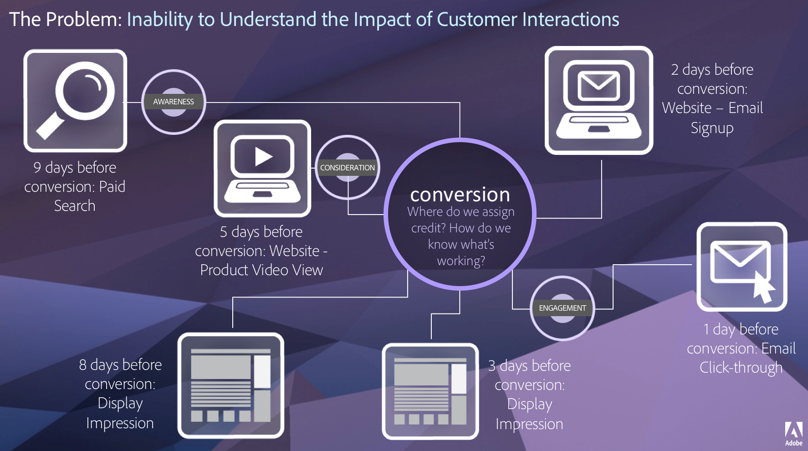

# Attribution overview

Attribution gives analysts the ability to customize how dimension items get credit for success events. For example:

1. A visitor to your site clicks a paid search link to one of your product pages. The add the product to the cart, but do not purchase it.
2. The next day, the see a social media post from one of their friends, click the link, then complete the purchase.

In some reports, you might want the order attributed to Paid search. In other reports, you might want the order attributed to Social. Attribution lets you control this aspect of reporting. It is available to all organizations on Adobe Analytics Ultimate, Prime, Select and Foundation. If you are not sure which type of contract you have with Adobe, contact your organization's Account Manager.

## Value of Attribution IQ

A given customer journey isn't linear and often unpredictable. Each customer proceeds at their own pace; often they double back, stall, restart, or engage in other non-linear behavior. These organic actions make it difficult to know the impact of marketing efforts across the customer journey. It also hampers efforts to tie multiple channels of data together.

Adobe Analytics enhances attribution by letting you:

* Define attribution beyond paid media: Any dimension, metric, channel or event can be applied to models (e.g. internal search), not just marketing campaigns.
* Utilize unlimited attribution model comparison: dynamically compare as many models as you want.
* Avoid implementation changes: With report time processing and context-aware sessions, customer journey context can be built in and applied at run time.
* Construct the session that best matches your attribution scenario.
* Break down attribution by segments: Easily compare the performance of your marketing channels across any important segment (e.g. New vs. Repeat customers, Product X vs. Product Y, Loyalty level or CLV).
* Inspect channel cross-over and multi-touch analysis: Use Venn Diagrams and Histograms, and trend attribution results.
* Analyze key marketing sequences visually: explore paths that led to conversion visually with multi-node flow and fallout visualizations.
* Build calculated metrics: use any number of attribution allocation methods.

## Features

Attribution IQ comprises the following features:

* [Attribution panel](../c-panels/attribution.md): Take any dimension and metric, and quickly compare it with different attribution models.
* [Apply attribution to a metric](../visualizations/freeform-table/column-row-settings/column-settings.md): Use a non-default attribution on any metric in a project.
* [Apply attribution to a breakdown](../components/dimensions/t-breakdown-fa.md): Use a non-default attribution on a breakdown. 
* [Compare attribution models](../components/apply-create-metrics.md): Quickly see how different attribution models compare for any metric.

## Videos

Attribution IQ in Freeform tables:

>[!VIDEO](https://video.tv.adobe.com/v/23136/?quality=12)

Attribution IQ in calculated metrics

>[!VIDEO](https://video.tv.adobe.com/v/23140/?quality=12)

Using the Attribution IQ panel:

>[!VIDEO](https://video.tv.adobe.com/v/23139/?quality=12)

Adding side-by-side comparisons of Attribution IQ models:

>[!VIDEO](https://video.tv.adobe.com/v/23651/?quality=12)

