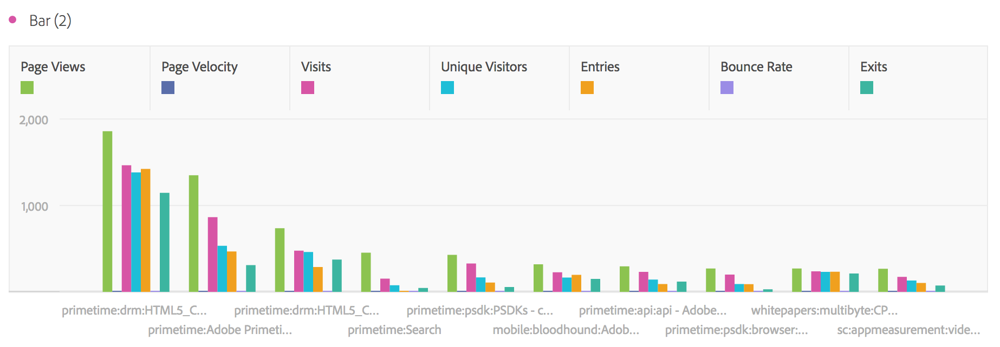

# Bar and bar stacked

## Bar {#section_2E96E55D4E8E488CBCA6A3508DDF3918}

This visualization shows vertical bars representing various values across one or more metrics.

A granularity drop-down in the visualization settings lets you change a trended visualization (e.g. line, bar) from daily to weekly to monthly, etc.

## Bar stacked {#section_9EA83779AE964635907EE5031A785A49}

This visualization is like a bar chart, but with the series bars stacked on top of each other.

A new visualization setting on bar stacked visualizations turns the chart into a "100% stacked" visualization:

