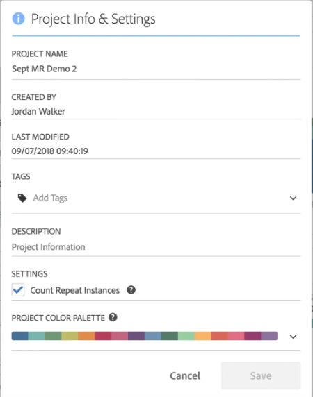
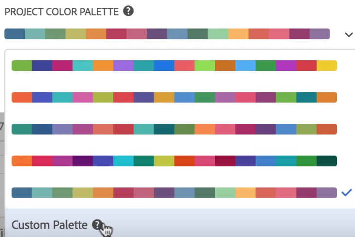

# Visualization Color Palettes

You can change the visualization color palette used in Workspace by choosing a different color palette or by specifying your own palette that could match your company's branding colors. This feature affects most visualizations in Workspace, but it does **not** affect [!UICONTROL Summary Change], conditional formatting in [!UICONTROL Freeform] tables, and the [!UICONTROL Map] visualization.

>[!NOTE]
>
>Color palette support is not enabled for Internet Explorer 11.

Keep in mind:

* There are five pre-set color palettes to choose from. The default palette and the one below have been optimized for optimal contrast and are both more accessible for those who are color blind.
* The third to the fifth color palettes below the top two have been optimized for color harmony.

## Change your [!UICONTROL color palette]:

Here is a video on using custom [!UICONTROL color palettes]:

>[!VIDEO](https://video.tv.adobe.com/v/23876/?quality=12)

1. Navigate to **[!UICONTROL Workspace]** > **[!UICONTROL Project]** > **[!UICONTROL Project Info & Settings]**.
1. From the **[!UICONTROL Project Color Palette]** drop-down list, you can pick one of five pre-set color schemes.

   

1. To specify your own palette, select **[!UICONTROL Custom Palette]** below the pre-set options.
1. Specify up to 16 comma-separated hexadecimal values (for example, #00a4e4) for the colors you intend to use. If, for example, you want to use only four values, these colors will automatically be repeated in visualizations that contain more colors.
