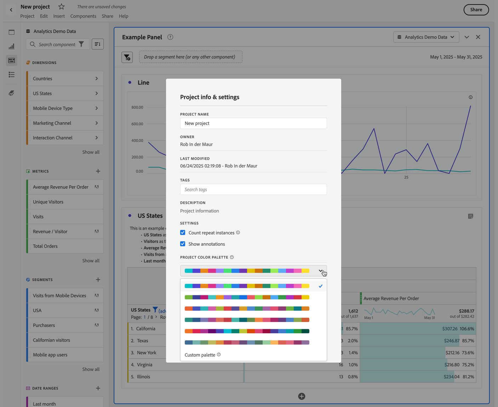

# Visualization color palettes {#visualization-color-palette}

<!-- markdownlint-disable MD034 -->

>[!CONTEXTUALHELP]
>id="workspace_project_colorpalette"
>title="Project color palette"
>abstract="Change the color palette used in this project."

<!-- markdownlint-enable MD034 -->

You can change the visualization color palette used in Workspace. You can select a predefined color palette or specify your own palette that matches your company's branding colors. This feature affects most visualizations in Workspace, but it does **not** affect Summary Change, conditional formatting in Freeform tables, and the Map visualization.

>[!NOTE]
>
>Color palette support is not enabled for Internet Explorer 11.

Keep in mind:

* There are six pre-set color palettes to choose from. The default palette and the second one listed have been optimized for contrast and are both more accessible for users who are color blind.
* TThe other palettes have been optimized for color harmony.

## Change your color palette:

1. Navigate to **[!UICONTROL Workspace]** > **[!UICONTROL Project]** > **[!UICONTROL Project info & settings]**.
1. From the **[!UICONTROL Project color palette]** drop-down menu, you can pick one of the pre-set color schemes.
1. To specify your own palette, select **[!UICONTROL Custom palette]** below the pre-set options.
1. Specify up to 16 comma-delimited hex values (for example, `#00a4e4`) to create your own color palette. If you specify for example only four values, colors are repeated automatically in visualizations that contain more colors.

<!--
# Visualization Color Palettes {#visualization-color-palettes}

>[!CONTEXTUALHELP]
>id="workspace_project_colorpalette"
>title="Project color palette"
>abstract="Change the color palette used in this project."

You can change the visualization color palette used in Workspace by choosing a different color palette or by specifying your own palette that could match your company's branding colors. This feature affects most visualizations in Workspace, but it does **not** affect [!UICONTROL Summary Change], conditional formatting in [!UICONTROL Freeform] tables, and the [!UICONTROL Map] visualization.

>[!NOTE]
>
>Color palette support is not enabled for Internet Explorer 11.

Keep in mind:

* There are five pre-set color palettes to choose from. The default palette and the one below have been optimized for optimal contrast and are both more accessible for those who are color blind.
* The third to the fifth color palettes below the top two have been optimized for color harmony.

## Change your [!UICONTROL color palette]:

>[!BEGINSHADEBOX]

See  [Using a custom color palette](https://video.tv.adobe.com/v/23876?quality=12&learn=on){target="_blank"} for a demo video.

>[!ENDSHADEBOX]

1. Navigate to **[!UICONTROL Workspace]** > **[!UICONTROL Project]** > **[!UICONTROL Project Info & Settings]**.
1. From the **[!UICONTROL Project Color Palette]** drop-down list, you can pick one of five pre-set color schemes.

   

1. To specify your own palette, select **[!UICONTROL Custom Palette]** below the pre-set options.
1. Specify up to 16 comma-separated hexadecimal values (for example, #00a4e4) for the colors you intend to use. If, for example, you want to use only four values, these colors will automatically be repeated in visualizations that contain more colors.
-->