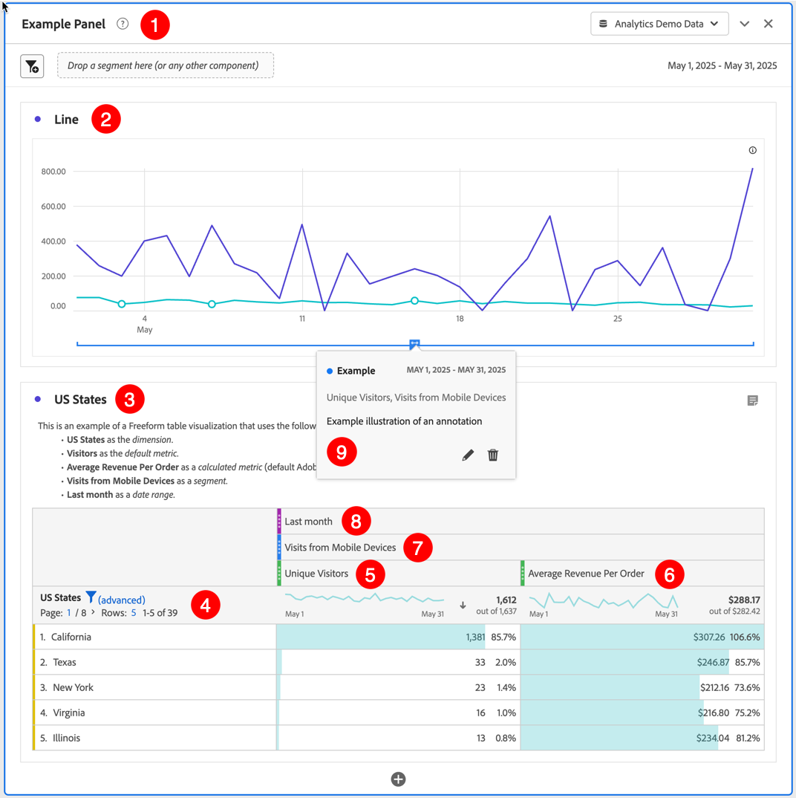
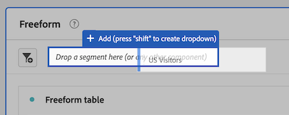

# Create projects {#create-projects}

[Projects](/help/analyze/analysis-workspace/build-workspace-project/freeform-overview.md) in Analysis Workspace allow you to create and view business-critical analyses.  These analyses can be shared with stakeholders inside or outside your organization. 

1. In Adobe Analytics, select **[!UICONTROL Workspace]**.

1. Select **[!UICONTROL Projects]** in the left panel, then select **[!UICONTROL Create project]**.

1. Select **Blank Workspace project** to create your Workspace project using a browser.

   See [Blank mobile scorecard](/help/analyze/mobile-app/curator.md) for more information on how to create a Mobile scorecard project that you can share with other stakeholders using a mobile app.

1. Select [!UICONTROL **Create**].

Now that you have created a Blank Workspace project, ensure you are familiar with the [Analysis Workspace](/help/analyze/analysis-workspace/home.md) user interface. Once you are, you can build your project. To do so:

  

* Add [panels](/help/analyze/analysis-workspace/c-panels/panels.md) to your project. For example, the **[!DNL Example Panel]** ➊.
   
* Add [visualizations](/help/analyze/analysis-workspace/visualizations/freeform-analysis-visualizations.md) to your panels. For example: 
  * **[!DNL Line]** [Line](/help/analyze/analysis-workspace/visualizations/line.md) visualization ➋  
  * **[!DNL US States]** [Freeform table](/help/analyze/analysis-workspace/visualizations/freeform-table/freeform-table.md) visualization ➌
* Add [components](/help/analyze/analysis-workspace/components/analysis-workspace-components.md) to your visualizations. For example:
  * **[!DNL US States]** [dimension](/help/components/dimensions/overview.md) ➍
  * **[!DNL Unique Visitors]** [metric](/help/analyze/analysis-workspace/components/apply-create-metrics.md) ➎ 
  * **[!DNL Average Revenue Per Order]** [calculated metric](/help/components/c-calcmetrics/cm-overview.md) ➏ 
  * **[!DNL Visits from Mobile Devices]** [segment](/help/components/segmentation/seg-overview.md) ➐
  * **[!DNL Last Month]** [date range](/help/analyze/analysis-workspace/components/date-ranges/overview.md) ➑ 
  * **[!DNL Example]** [annotation](/help/analyze/analysis-workspace/components/annotations/overview.md) ➒

## Project Info & Settings {#project-info-settings}

>[!CONTEXTUALHELP]
>id="workspace_project_countrepeatinstances"
>title="Count repeat instances"
>abstract="Specifies whether repeat instances are counted in reports.  Note: this setting does not apply to Flow or Fallout visualizations."

>[!CONTEXTUALHELP]
>id="workspace_project_repeatinstances"
>title="Count repeat instances"
>abstract="Specifies whether repeat instances are counted in reports. Note: this setting does not apply to Flow or Fallout visualizations."

>[!CONTEXTUALHELP]
>id="workspace_project_commenting"
>title="Allow commenting"
>abstract="When enabled, a comments area is available in the right rail of the project in Analysis Workspace."

Project settings provides project-level information on the currently active project.

Settings include:

|  Setting  | Description  |
|---|---|
|  Project name  | The name given to the project. You can double-click the name to edit it.  |
|  Owner  | Project owner name  |
|  Last modified  | Date of last modification to the project.  |
|  Tags  |Lists any tags applied to a project for easier categorization.  |
|  Description  | A description is useful for clarifying the purpose of a project. You can double-click the description to edit it.  |
|  Count repeat instances  | Specify whether repeat instances are counted in reports. Note: this setting does not apply to Flow or Fallout visualizations.  |
| Show annotations | Specify whether annotations are shown for this project or not. |
|  [Project color palette](/help/analyze/analysis-workspace/build-workspace-project/color-palettes.md)  | You can change the categorical color palette used in Workspace, by choosing from out-of-the-box palettes that have been optimized for color blindness, or by specifying your custom palette. This feature affects many things in Workspace, including most visualizations.  |
| [View Density](/help/analyze/analysis-workspace/build-workspace-project/view-density.md) | Lets you see more data on the screen by reducing the vertical padding of the left panel, freeform tables and cohort tables. |

<!--
# Create projects in Analysis Workspace

[Projects](/help/analyze/analysis-workspace/build-workspace-project/freeform-overview.md) in Analysis Workspace allow you to view business-critical analyses that can be shared with stakeholders inside or outside your organization. 

For general information about how to get started using Analysis Workspace, see [Analysis Workspace overview](/help/analyze/analysis-workspace/home.md).

The following sections describe how to create a project and start adding the key building blocks for any Analysis Workspace project: panels, visualizations, and components.

## Create a project from a blank project or a report

1. In Adobe Analytics, select [!UICONTROL **Workspace**].

1. Choose whether to create a blank project or to create a project from a report:

   +++Create a blank project

   1. On the [!UICONTROL **Workspace**] tab, select the [!UICONTROL **Projects**] tab on the left side of the page, then select [!UICONTROL **Create project**].

   1. Choose whether to create a blank project or a blank mobile scorecard

      * **Blank project** if you plan to share your analysis from the browser 
      * [**Blank mobile scorecard**](/help/analyze/mobile-app/curator.md) if you plan to share your analysis from the Adobe Analytics dashboards mobile app.

   1. Select [!UICONTROL **Create**].

   +++

   +++Create a project from a report
   
      1. On the [!UICONTROL **Workspace**] tab, select the [!UICONTROL **Reports**] tab on the left side of the page.

      1. Search for or navigate to the report you want to use, then select it when it appears.

          A set of standard reports is available by default. In addition, your organization might have created custom reports for you to choose from.
          
      1. Select [!UICONTROL **Project**] > [!UICONTROL **Save**] to save the report as a new project.

          For more information about reports, see "Navigate the Reports tab" in [Adobe Analytics landing page](/help/analyze/landing.md).

   +++

1. Next, you need to add panels, visualizations, and components to your project. First, add panels to your project in Analysis Workspace, as described in [Add panels to the project](#add-panels-to-the-project). You can then add visualizations to any panels. Finally, you can add components to any panels or visualizations.

## Add panels to the project {#panels}

[Panels](https://experienceleague.adobe.com/docs/analytics/analyze/analysis-workspace/panels/panels.html) are the foundation to any project in Analysis Workspace. Panels are used to organize the content (visualizations and components) of a project. 

Many of the panels provided in Analysis Workspace generate a full set of analyses based on a few user inputs. 

To add a panel:

1. Select the [!UICONTROL **Panels**] icon in the left rail.

   

1. Search for the panel you want to add. When it appears in the left rail, drag it into your project.

1. Add visualizations to your panel, as described in [Add visualizations to the project](#add-visualizations-to-the-project). 

   Alternatively, you can add components directly to a panel, as described in [Add components to the project](#add-components-to-the-project).

## Add visualizations to the project

[Visualizations](https://experienceleague.adobe.com/docs/analytics/analyze/analysis-workspace/visualizations/freeform-analysis-visualizations.html) (such as a freeform table, a bar chart, or a line chart) can be used to visually bring data to life. 

>[!TIP]
>
>Freeform tables are the most common type of visualization, and are the foundation for interactive data analysis. For more details about how to work with Freeform tables in Analysis Workspace, see [Freeform table](/help/analyze/analysis-workspace/visualizations/freeform-table/freeform-table.md).

To add a visualization:

1. Select the **[!UICONTROL Visualizations]** icon in the left rail.

   

1. Search for the visualization you want to add. When it appears in the left rail, drag it to a panel within your project. 

1. Add components to the visualization, as described in [Add components to the project](#add-components-to-the-project).

## Add components to the project

[Components](/help/analyze/analysis-workspace/components/analysis-workspace-components.md) make up the actual data of any project. You can add components to visualizations or to panels.

>[!TIP]
>
>For information about each component, select the Info icon next to a component's name in the left rail, or see the [Analytics Components Guide](/help/components/home.md).

Following is basic information about how to add a component to a project in Analysis Workspace. For more detailed information about adding the various types of components (dimensions, metrics, segments, and date ranges), see [Use components in Analysis Workspace](/help/analyze/analysis-workspace/components/use-components-in-workspace.md).

To add a component to a project in Analysis Workspace:

1. Select the **[!UICONTROL Components]** icon in the left rail.

   

1. Scroll to or search for the component you want to add, then drag it to a panel or visualization within your project. 

   For example, you can drag a segment to the segment drop zone in a panel header.

   

   For more information about adding components to projects, see [Use components in Analysis Workspace](/help/analyze/analysis-workspace/components/use-components-in-workspace.md).

1. (Optional) Share the project as described in [Save and share the project](#save-and-share-the-project).

## Save and share the project

As you create an analysis in Analysis Workspace, your work is [automatically saved](/help/analyze/analysis-workspace/build-workspace-project/save-projects.md). 

When you finish building out the project and it's gathering actionable insights, the project is ready to be consumed by others. You can share the project with users and groups in your organization, or even with people outside your organization. For information about sharing a project, see [Share projects](/help/analyze/analysis-workspace/curate-share/share-projects.md).
-->