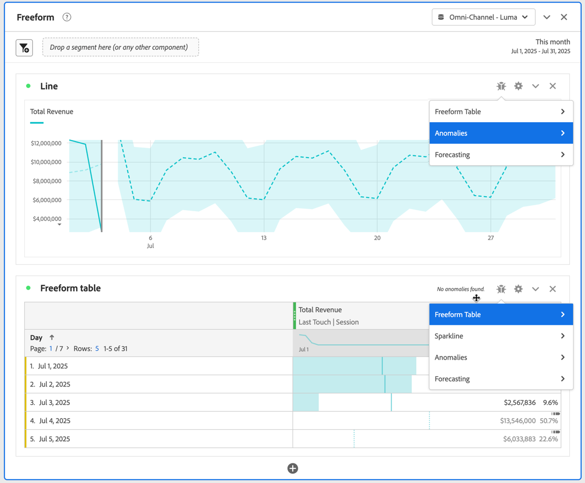
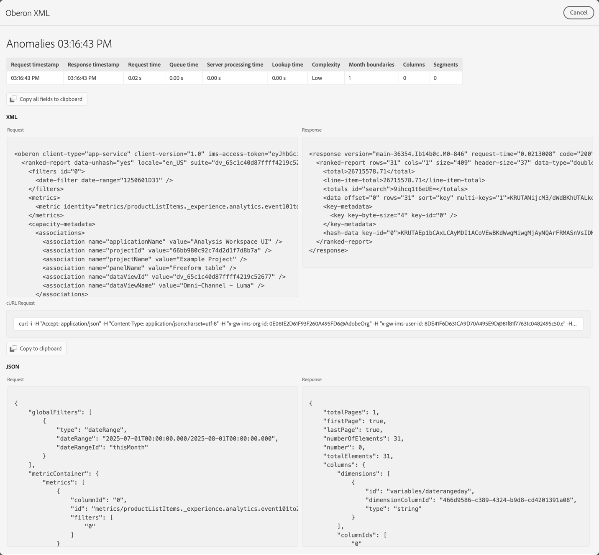

# Project debugger

The project debugger helps you and Adobe Support to troubleshoot issues with your projects in Analysis Workspace. Adobe Support might request you to enable the debugger to troubleshoot tickets you have raised with Adobe Support. Examples of issues are load-time of visualizations or broken components in your visualizations.

>[!NOTE]
>
>To use the debugger, you must have **Edit** or **Copy** access to the project.
>

## Enable debugger

>[!IMPORTANT]
>
>Save your project before you enable the debugger.
>

To enable the debugger:

1. Select **[!UICONTROL Help]** > **[!UICONTROL Enable debugger]** from the Analysis Workspace project menu.
1. Select **[!UICONTROL OK]** in the **[!UICONTROL Enable Debugger]** dialog.
1. Confirm when the browser prompts you to reload the page or site.

## Use debugger

When you have enabled the debugger, all visualizations in your project do have an additional  icon.

To use the debugger for a specific visualization:

1. Select  at the top of the visualization.

   

1. Select the appropriate action from the context menu. The actions available depend on the visualization and indicate the type of debugging you want to perform. For example, if you select **[!UICONTROL Anomalies]**, you want to debug the anomalies functionality in the visualization.
1. From the submenu, select a timestamp.
1. An **[!UICONTROL Oberon XML]** debug window opens with details of the specific functionality performed by the visualization. See below for an example of the output of an anomaly request.

   

   The details are:

   * **[!UICONTROL Request timestamp]**   
   * **[!UICONTROL Response timestamp]** 
   * **[!UICONTROL Request time]**   
   * **[!UICONTROL Queue time]**    
   * **[!UICONTROL Server processing time]**    
   * **[!UICONTROL Lookup time]**    
   * **[!UICONTROL Complexity]**   
   * **[!UICONTROL Month boundaries]**    
   * **[!UICONTROL Columns]**    
   * **[!UICONTROL Segments]**
   * **[!UICONTROL XML]** **[!UICONTROL Request]** and **[!UICONTROL Response]**
   * **[!UICONTROL cURL Request]**
   * **[!UICONTROL JSON]** **[!UICONTROL Request]** and **[!UICONTROL Response]**

1. Use  **[!UICONTROL Copy all field to clipboard]** to copy all debug information to the clipboard. Paste the information in your preferred editor or tool. The information consists of:

   * XML (request)
   * XML (response)
   * JSON (request)
   * JSON (response)
   * Curl request

1. Use  **[!UICONTROL Copy to clipboard]** underneath **[!UICONTROL cURL Request]** to copy the request to the clipboard.
1. Hover over any of the **[!UICONTROL Request]** or **[!UICONTROL Response]** text areas to reveal and select  **[!UICONTROL Copy to clipboard]** to copy the contents of that text area (XML or JSON) to the clipboard.

1. Exchange any of the information you have copied and which Adobe Support requested to troubleshoot the visualizations in your Analysis Workspace project.

1. Select **[!UICONTROL Cancel]** to close the **[!UICONTROL Oberon XML]** debug window and return to your project.

Repeat the above steps for any other visualization that you want to troubleshoot.

## Disable debugger

>[!IMPORTANT]
>
>Before you disable the debugger, save any changes you made to your project and want to keep as part of the debugging exercise.
>

To disable the debugger:

1. Select **[!UICONTROL Help]** > **[!UICONTROL Disable debugger]** from the Analysis Workspace project menu.
1. Select **[!UICONTROL OK]** in the **[!UICONTROL Disable debugger]** dialog.
1. Confirm when the browser prompts you to reload the page or site.

