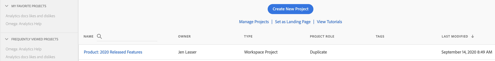
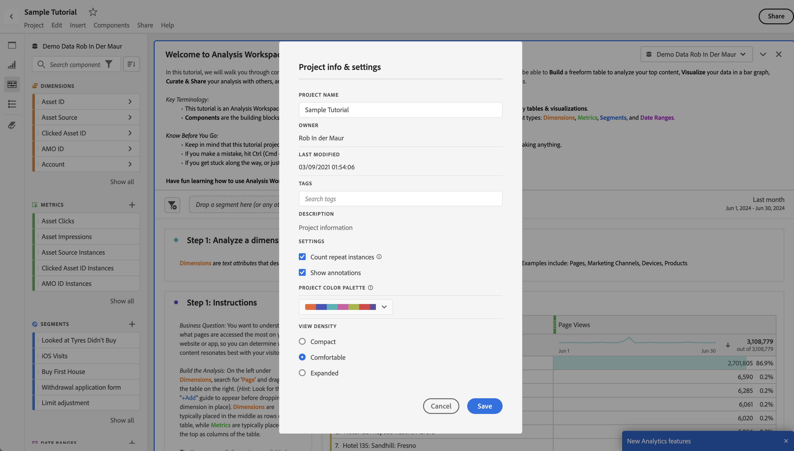
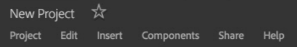
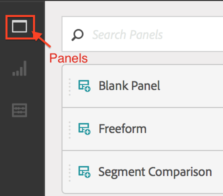

# Create project - overview

 **[!UICONTROL Analytics]** > **[!UICONTROL Workspace]**

You can create a robust Analytics project based on any combination of visualizations, report components, and data tables. It brings many of the table builder features from Ad Hoc Analysis into Analytics.

In Analysis Workspace, you can compare and dissect data in ways not previously possible. For example, configure ranked reports and make immediate iterative changes to the data query, and then access and manipulate the values at the reporting level.

The query goes directly to the reporting engine—you can make changes inline without bringing up other reports to create your analysis. Results return immediately, with no browser refresh.

## Workspace Project List Page {#section_39AA007D7C384F4E869F842F1C7B11F8}

When you first go to **[!UICONTROL Analytics]** > **[!UICONTROL Workspace]**, the page lists all the projects you own or have been granted access to. You can set this page to be your Adobe Analytics landing page by clicking **[!UICONTROL Set as Landing Page]**. (If you don't see this option, as in the screen shot below, it is already your landing page.)

The Workspace project list page contains the following information: 

|  Element  | Description  |
|---|---|
| Project [Templates](../../../analyze/analysis-workspace/build-workspace-project/starter-projects.md#concept_49B9A327C5004DB0A4BE6291435625C5)  | You can use these pre-populated project templates as they are or adapt them to your needs (by adding or replacing metrics or visualizations, for example) and save them under a new name.  |
| [Create New Project](../../../analyze/analysis-workspace/build-workspace-project/t-freeform-project.md#task_C2C698ACC7954062A28E4784911E6CF2)  | Click this link to start a new project from scratch.  |
|  Manage Projects  |Clicking this link takes you to the Projects Component Manager ( **[!UICONTROL Analytics]** > **[!UICONTROL Components]** > **[!UICONTROL Projects]**), which lists all your projects and lets you tag, share, delete, rename, approve, copy, and export projects to CSV.  |
|  View Tutorials  |Takes you to the [Analysis Workspace YouTube videos](https://www.youtube.com/playlist?list=PL2tCx83mn7GuNnQdYGOtlyCu0V5mEZ8sS).  |
|  Name  | Name of the Workspace project.  |
|  Created By  | The person who created this project (either you or someone who shared the project with you.)  |
|  Tags  |Tags that were applied to the project, either in the Projects Component Manager or under **[!UICONTROL Workspace]** > **[!UICONTROL Project]** > **[!UICONTROL Project Info & Settings]**.  |
|  Last Modified  | Date and time when the project was last modified.  |

## Project Info & Settings {#section_63773D0B9E4543E88068ECECB9EEB4C6}

**[!UICONTROL Workspace]** > **[!UICONTROL Project]** > **[!UICONTROL Project Info & Settings]**

**[!UICONTROL Project Info & Settings]** provides project-level information on the currently active project.

|  Setting  | Description  |
|---|---|
|  Project Name  | The name given to the project. You can double-click the name to edit it.  |
|  Created By  | Project owner name  |
|  Last Modified  | Date of last modification to the project.  |
|  Tags  |Lists any tags applied to a project for easier categorization. You can also tag projects while saving them. View a project's tags on the Workspace Landing Page in the [!UICONTROL Tags] column.  |
|  Description  | A description is useful for clarifying the purpose of a project. You can double-click the description to edit it.  |
|  Count repeat instances in project  | Specifies whether repeat instances are counted in reports. If you have multiple sequential values for the same variable, you can count them either as one or as multiple instances of the variable.  |
|  Visualization Color Scheme  | You can change the color scheme used in Workspace, by choosing from a different color palette or by specifying your own palette. This feature affects many things in Workspace, including most visualizations.  |
| View Density | Lets you see more data on the screen by reducing the vertical padding of the left rail, freeform tables and cohort tables. |

## Projects Menu {#section_850CDFCB86A64EB0A0AD5B9E0FCB7013}

The top Projects menu looks like this:

The submenus contain the following options.

> [!NOTE] Options marked by an asterisk (&#42;) display only with **saved** projects.

|  Project  | Edit  | Insert  | Components  | Share  | Help  |
|---|---|---|---|---|---|
|  New  | Undo  | New Panel  | New Segment  | Share Project  | Videos  |
|  Open  | Clear  | New Freeform Panel  | New Metric  | Get Project Link&#42;  | Hotkeys  |
|  Save  | Clear All  | New Segment Comparison Panel  | New Date Range  | Send File Now&#42;  | Help Forum  |
|  Save As&#42;  |  | New Freeform Table  | New Alert  | Send File on Schedule&#42;  |  |
|  Set as Landing Page&#42;  |  | New Line  | Refresh Components  | Curate Project Data  |  |
|  Refresh Project  |  | New Bar  |  |  |  |
|  Download CSV  |  |  |  |  |  |
|  Download PDF&#42;  |  |  |  |  |  |
|  Project Info & Settings  |  |  |  |  |  |

## Left Rail {#section_271295C26EC840ABB2A8E7EC0498B60E}

The left rail has 3 icons, allowing you access to Panels, [Visualizations](../../../analyze/analysis-workspace/visualizations/freeform-analysis-visualizations.md#concept_09242627629147A88A68F1506954C276), and [Components](../../../analyze/analysis-workspace/components/analysis-workspace-components.md#concept_BEBE3A75E072495D9E2F895567BBD462)(Dimensions, Metrics, Segments, Data Ranges) with one click:

  

A **[!UICONTROL Blank Panel]** was added to the list of panels accessible from the left rail. To create a **new Cohort Panel**, drag in a Blank Panel and drag in a Cohort Table visualization.
