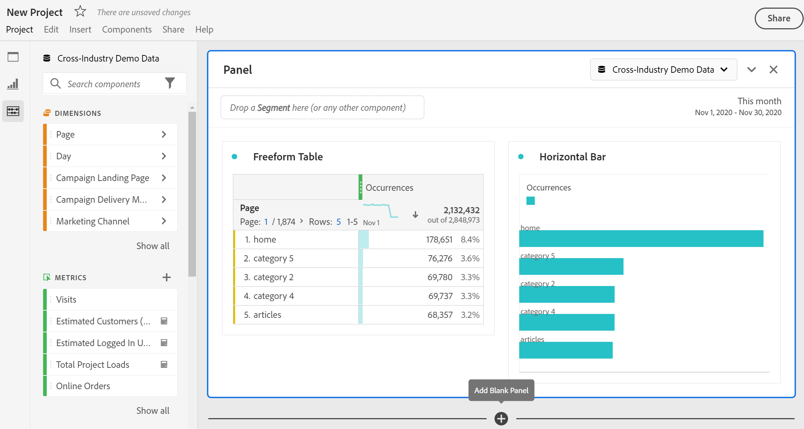

# Projects overview

Workspace projects allow you to combine data components, tables and visualizations to craft your analysis and share with anyone in your organization. Before starting your first project, learn about how to access, navigate and manage your projects. 

Here is a video on how to build a Workspace project:

>[!BEGINSHADEBOX]

See  [Build a Workspace project](https://video.tv.adobe.com/v/334076?quality=12&learn=on){target="_blank"} for a demo video.

>[!ENDSHADEBOX]

## Project list {#project-list}

When you first go to **[!UICONTROL Analytics]** > **[!UICONTROL Workspace]**, the page lists all the projects you own or have been shared to you. This page is also the landing page for Adobe Analytics, unless you have previously set a custom landing page. 

The Projects page contains the following information: 

|  Element  | Description  |
|---|---|
| [Edit preferences](/help/analyze/analysis-workspace/user-preferences.md) | Manage settings for Analysis Workspace and its related components for all new projects or panels that you create.  |
| [Create folder](/help/analyze/analysis-workspace/build-workspace-project/workspace-folders/create-folders.md)  | Add a new folder or subfolder to the list of projects and folders. |
| [Create project](/help/analyze/analysis-workspace/build-workspace-project/create-projects.md)  | Start a new project from scratch or from a report.  |
|  Show more  | This selection reveals options for creating a blank project or mobile scorecard, [viewing training tutorials](https://experienceleague.adobe.com/en/docs/analytics-learn/tutorials/analysis-workspace/analysis-workspace-basics/analysis-workspace-introduction), or [viewing release notes](/help/release-notes/latest.md).  |
|  | To show or hide filters. You can filter on tags, report suite, owners, type (project, folder, mobile scorecard), and other filters. | 
|  | Use the search field to search for folders, Workspace projects or mobile scorecards. |
| Show Folders & Projects| Choose whether to show the folder structure of projects. For more information, see [About Folders in Analytics](/help/analyze/analysis-workspace/build-workspace-project/workspace-folders/about-folders.md). |
|   | This icon allows you to customize the columns you see for each project in the projects list.  |

The list of projects can display the following columns:

|  Column  | Description  |
|---|---|
| [!UICONTROL Name]  | Name of the Workspace project. Select  to show a popup with more details on a project or folder. Select  to show actions available. See [Manage projects](#manage-projects) for more details.  | 
| [!UICONTROL Type] | Indicates whether this entry is a Workspace project, a folder, or a [Mobile scorecard](https://experienceleague.adobe.com/en/docs/analytics/analyze/mobapp/home). |
| [!UICONTROL Tags]  |Tags that were applied to the project.  |
| [!UICONTROL Scheduled] | Indicates whether projects are scheduled to be emailed to recipients. See [Schedule projects](/help/analyze/analysis-workspace/curate-share/t-schedule-report.md). |
| Shared link (anyone) | Projects can be shared with anyone, even with people who don't have access to Analysis Workspace. This column shows whether projects have been shared in this way. See [Share a project with anyone (no login required)](/help/analyze/analysis-workspace/curate-share/share-projects.md#share-public-link) in [Share projects](/help/analyze/analysis-workspace/curate-share/share-projects.md) for more information. |
| [Project Role](https://experienceleague.adobe.com/en/docs/analytics/analyze/analysis-workspace/curate-share/share-projects) | Indicates your role for the project - owners, edit, duplicate, view. |
| [!UICONTROL Report suite] | The report suite that the project is associated with. |
| [!UICONTROL Owner]  | The person who created this project (either you or someone who shared the project with you.)  |
| [!UICONTROL Shared with]  | Users that the project has been shared with.  |
| [!UICONTROL Last Modified]  | Date and time when the project was last modified.  |
| [!UICONTROL Last Opened]  | Date and time when the project was last opened.  |
| [!UICONTROL Last Used] | Date and time when the project was last used. | 
| [!UICONTROL Project ID]  | The ID of the project.  |
| [!UICONTROL Longest Date Range]  | The longest date range of the project.  |
| [!UICONTROL Number of Queries]  | The total number of queries contained in the project.  |
| [!UICONTROL Location]  | The folder where the project resides.  |

### Manage projects

To manage projects, select one or more projects from the project list. 

From the blue action bar, you can select the following actions:

| Action | Description | 
|---|---|
|  Delete | When selected, a confirmation dialog prompts you to confirm the deletion of a Workspace project or Mobile scorecard. Select **[!UICONTROL OK]** to confirm. |
|  Share | This action allows you to share your project. See [Share projects](../curate-share/share-projects.md).|
|  Rename | Opens up a **[!UICONTROL Rename: *name*]** dialog to rename your project. Select **[!UICONTROL Save]** to save the new name for the project. |
|  Copy | Immediately copies the selected project to a new project with name *original name* (Copy).  |
|  Pin | Immediately pins the project to the top of the list. Adds the  indicator. |
|  Tag | Opens up the **[!UICONTROL Tag Project]** dialog. You can select an existing tag or add new tags. Select **[!UICONTROL Save]** to save the tags for the project. |
|  Approve or Unapprove |  Approves or unapproves the project.  |
|  Export CSV | Immediately downloads a file containing a comma-separated value list of the projects. |
|  Move to | This action allows you to move the project to a folder. In the **[!UICONTROL Select Folder]** dialog, select a folder from the **[!UICONTROL Folder]** list, and select **[!UICONTROL Move]**. | 

## Menu bar {#menu-bar}

Within a project, the menu provides options for managing your project, adding components, finding help, and more. You can also access each menu option by keyboard [shortcuts](https://experienceleague.adobe.com/en/docs/analytics/analyze/analysis-workspace/build-workspace-project/fa-shortcut-keys).

|  Menu item  | Description  |
|---|---|
|  Project  | This menu includes common actions for project management, including New, Open, Save, Save as, and [Save as company report](/help/analyze/analysis-workspace/build-workspace-project/starter-projects.md). You can also refresh the entire project to retrieve the most recent data and definitions by clicking Refresh Project. [Download CSV and PDF](https://experienceleague.adobe.com/en/docs/analytics/analyze/analysis-workspace/curate-share/download-send) options enable you to export data from Workspace. [Project Info & Settings](https://experienceleague.adobe.com/en/docs/analytics/analyze/analysis-workspace/build-workspace-project/freeform-overview) offers many options for managing your project.  |
|  Edit  | Undo or redo your last action. Clear All resets your project to a blank starting point. |
|  Insert  | Insert new panels or visualizations from this menu. You can also insert new panels and visualizations from the left rail.  |
|  [Components](https://experienceleague.adobe.com/en/docs/analytics/analyze/analysis-workspace/components/analysis-workspace-components)  | Create new segment, calculated metric, date range, or alert components from your project. You can also create new components from the left rail. If your component definitions have recently changed, Refresh Components retrieves the latest definitions. |
|  [Share](https://experienceleague.adobe.com/en/docs/analytics/analyze/analysis-workspace/curate-share/send-schedule-files)  | Curate, share and schedule PDF/CSV projects to recipients in your organization.  |
|  Help  | Access help documentation, videos, and the Analytics [Experience League community](https://experienceleaguecommunities.adobe.com/t5/adobe-analytics/ct-p/adobe-analytics-community). Manage the visibility of Workspace tips as well as the [debugger](https://developer.adobe.com/analytics-apis/docs/2.0/). Find details about Workspace and factors that impact project [performance](https://experienceleague.adobe.com/en/docs/analytics/analyze/analysis-workspace/workspace-faq/optimizing-performance).  |
|  Share button or Owner  | If you are in an Own or Edit for the project, the Share button in the top-right gives you one-click access to manage your project recipients. If you are in a Duplicate or View role for the project, you see the project owner's name. |

### Project Info & Settings {#info-settings}

**[!UICONTROL Workspace]** > **[!UICONTROL Project]** > **[!UICONTROL Project Info & settings]** provides project-level information on the currently active project.

Settings include:

|  Setting  | Description  |
|---|---|
|  Project Name  | The name given to the project. You can double-click the name to edit it.  |
|  Owner  | Project owner name  |
|  Last Modified  | Date of last modification to the project.  |
|  Tags  |Lists any tags applied to a project for easier categorization.  |
|  Description  | A description is useful for clarifying the purpose of a project. You can double-click the description to edit it.  |
|  Count repeat instances  | Specifies whether repeat instances are counted in reports. For example, this setting (when activated) treats multiple consecutive pages views to the same page as multiple page views. With it off, they count as a single page view (this setting only affects certain metrics, such as Single Page Visits). **Note**: This setting does not apply to Flow or Fallout visualizations.  |
| [Show annotations](/help/analyze/analysis-workspace/components/annotations/overview.md) | Specify whether to show annotations in the project or not. |
|  [Project color palette](https://experienceleague.adobe.com/en/docs/analytics/analyze/analysis-workspace/build-workspace-project/color-palettes)  | You can change the categorical color palette used in Workspace, by choosing from out-of-the-box palettes that have been optimized for color blindness, or by specifying your custom palette. This feature affects many things in Workspace, including most visualizations.  |
| [View Density](https://experienceleague.adobe.com/en/docs/analytics/analyze/analysis-workspace/build-workspace-project/view-density) | Lets you see more data on the screen by reducing the vertical padding of the left rail, freeform tables and cohort tables. |

## Left rail {#left-rail}

Within a project, various icons are available in the left rail, and each represents important tools to build your project:

| Icon | Functionality |
|---|---|
|  | [Panels](/help/analyze/analysis-workspace/c-panels/panels.md) |
|  |[Visualizations](/help/analyze/analysis-workspace/visualizations/freeform-analysis-visualizations.md) |
|  | [Components](/help/analyze/analysis-workspace/components/analysis-workspace-components.md) |
|  | [Data dictionary](/help/analyze/analysis-workspace/components/data-dictionary/data-dictionary-overview.md) |
|  | [Table of contents](/help/analyze/analysis-workspace/build-workspace-project/project-table-of-contents.md) |

Components (dimensions, metrics, segments, date ranges) in the left rail relate to the active panel data view. A blue border identifies the active panel, and the active report suite is listed at the top of the component rail.

## Right-click menu

Here is a video on using the right-click menu in Analysis Workspace:

>[!BEGINSHADEBOX]

See  [Using the context menu](https://video.tv.adobe.com/v/23981?quality=12&learn=on){target="_blank"} for a demo video.

>[!ENDSHADEBOX]

## Project canvas {#canvas}

The project canvas is where you bring together panels, tables, visualizations, and components to build your analysis. A project can contain many panels, and each panel can contain many tables and visualizations.

Panels are helpful when you want to organize your projects according to time periods, report suites, or analysis use case. The active panel has a colored border around it, and determines what components are available in the left rail.

Depending on the starting point you chose for your projects, you either have a [freeform table](https://experienceleague.adobe.com/en/docs/analytics/analyze/analysis-workspace/visualizations/freeform-table/freeform-table) or a [blank panel](https://experienceleague.adobe.com/en/docs/analytics/analyze/analysis-workspace/panels/blank-panel) in the canvas to begin with. The quickest way to start analyzing is to select one or many components and simply drag & drop them into the project canvas. A table of data is rendered automatically for you. [Learn more](https://experienceleague.adobe.com/en/docs/analytics/analyze/analysis-workspace/visualizations/freeform-table/freeform-table) about the different options for building a table, or leverage the available [training tutorial](https://experienceleague.adobe.com/en/docs/analytics/analyze/analysis-workspace/home) for more guidance on building your first project.

