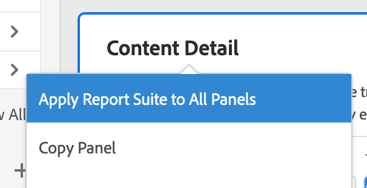
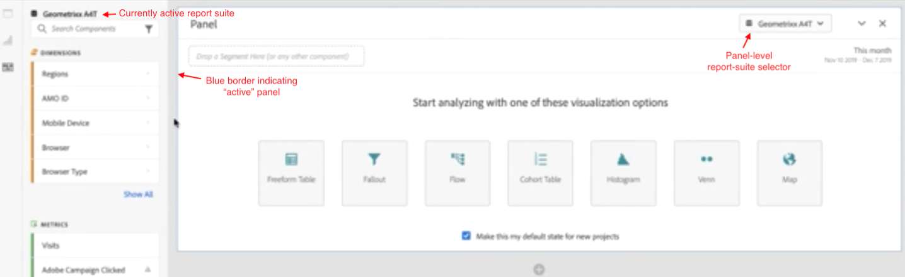
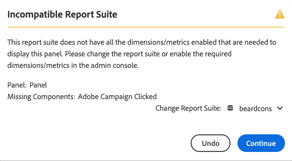

# Multiple report suites

You can create projects in Analysis Workspace with data from more than one report suite. Report suites are chosen at the panel level, so you can choose a different report suite for each panel within the same Workspace project. 

This capability is useful if you want to, for example,

* Compare data from two different regions, and the data resides in two different report suites. You can build tables and visualizations to compare the data side by side.

* Build a dashboard of metrics and visualizations to report out to other organizations. You can pull data from various report suites into in the same project.

Here is a video on the subject:

>[!VIDEO](https://video.tv.adobe.com/v/32843/?quality=12)

## Apply report suite to all panels

You can apply a report suite to all panels at once by right-clicking any panel header and selecting **[!UICONTROL Apply Report Suite to All Panels]**.

## Active panel

We are introducing the concept of "active panel" versus "inactive panel" with this feature. You can recognize the active panel by the light blue border around it. Simply clicking inside a panel turns that panel into the active panel.

>[!TIP]
>You can drag and drop to any panel that is in the same report suite as your active panel. By dragging into an inactive panel of the same report suite, the panel will become active.

| Task | Active panel | Inactive panel |
| --- | --- | --- |
| Change report suite | Yes | No |
| Drag and drop components | Yes | Yes, for any panel that is in the same report suite as your active panel. |
| Drag and drop visualizations | Yes | Yes, for any panel that is in the same report suite as your active panel. |

## Work with multiple report suites

1. Create a new project with 2 or more panels in Workspace.

1. Drag and drop components (metrics, dimensions, segments, date ranges) into the panel. Ensure panels have data and visualizations that are specific to their report suite.

    >[!NOTE]
    >Sometimes, a banner displays when loading a project (or switching to a report suite) where not all of the components included in the project are included in the report suite. The missing components will be listed. Follow [these instructions](/help/admin/admin-console/permissions/product-profile.md) to set permissions to the required metrics/dimensions.

    

    You have 3 options to deal with this incompatibility:
    * Enable the required dimensions/metrics
    * Change the report suite.
    * Continue with some missing components. This will result in no data for those components, and/or blank visualizations.

1. Change the panel to a different report suite and notice how the component label (currently active report suite) and listed components are updating based on the new report suite.

1. Use a keyboard shortcut (`shift` while dragging) to turn an inactive panel to an active panel.

1. (Optional) You can also go to other Analytics component builders and ensure that they now show a report suite label indicating

    * Where a segment will be created: [Segment Builder](https://experienceleague.adobe.com/docs/analytics/components/segmentation/segmentation-workflow/seg-build.html).
    * Where a calculated metric will be created: [Calculated Metric Builder](https://experienceleague.adobe.com/docs/analytics/components/calculated-metrics/calcmetric-workflow/cm-build-metrics.html).
    * Where an alert will be built: [Alert Builder](https://experienceleague.adobe.com/docs/analytics/components/alerts/alert-builder.html).
