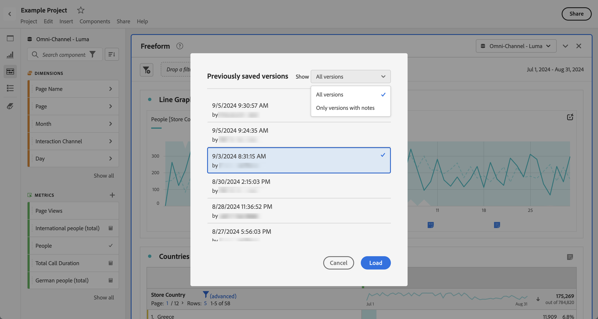

# Open projects

You can open a project directly from the [Projects](/help/analyze/analysis-workspace/build-workspace-project/freeform-overview.md) page. Look for your project in the list. Use [search](/help/analyze/analysis-workspace/build-workspace-project/freeform-overview.md#search) or the [segment panel](/help/analyze/analysis-workspace/build-workspace-project/freeform-overview.md#segment-panel) to narrow down the list.

* Select the title of your project to open the project in Analysis Workspace.

You can also open a project while you are working in another project.

* Select **[!UICONTROL Open]** from the **[!UICONTROL Project]** menu. You see a dialog similar to the [Projects](/help/analyze/analysis-workspace/build-workspace-project/freeform-overview.md) page.  Use [search](/help/analyze/analysis-workspace/build-workspace-project/freeform-overview.md#search) or the [segment panel](/help/analyze/analysis-workspace/build-workspace-project/freeform-overview.md#segment-panel) to narrow down the list.
* Select the title of your project to open the project in Analysis Workspace.

If you cannot find the project and want to start a new project, select **[!UICONTROL Create new]**.

## Open previous version

To open a previously saved version of a project:

1. Select **[!UICONTROL Open previous version]** from the **[!UICONTROL Project]** menu.

   

1. Review the list of previous versions available in the **[!UICONTROL Previously saved versions]** dialog. You can switch between **[!UICONTROL All versions]** and **[!UICONTROL Only versions with notes]**.

   For each version, the list shows a timestamp, the editor and saved notes.

1. Select a previous version and click **[!UICONTROL Load]**.
   The previous version then loads with a notification. The previous version does not become the current saved version of your project until you click **[!UICONTROL Save]**. If you navigate away from the loaded version, you see the last saved version when you once more want to open a previous version.

<!-- 
## Incompatible data view

When you open a project, you might see an **[!UICONTROL Incompatible data view]** warning dialog. This dialog explains that certain components within the project are not enabled in the selected data view for one of the panels in the project. 

To fix this warning, you can:

* **[!UICONTROL Change the data view]**. Select a proper data view from **[!UICONTROL Change data view:]** . If the selected data view is valid, your project opens in Analysis Workspace.
* **[!UICONTROL Return to landing page]**. Your selected project is not opened and you can select another project.
* **[!UICONTROL Continue anyway]**. Your project opens in Analysis Workspace, but shows errors in some of the visualization and the incompatible data views have an alert  before the name of the data view.

-->
