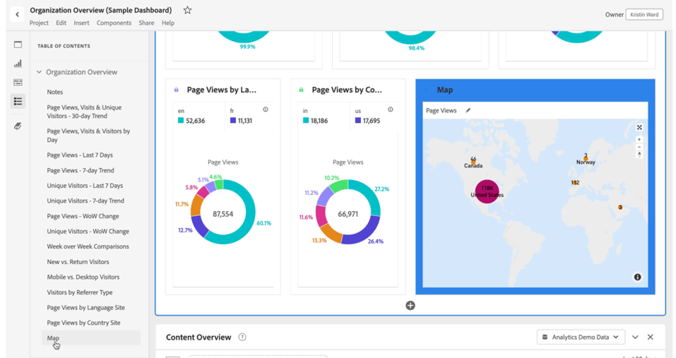

# Table of contents

You can view a table of contents for a project in Analysis Workspace, which allows you to move quickly between any panels and visualizations that exist in the project. The table of contents is especially useful when viewing larger projects that contain many panels and visualizations.

>[!BEGINSHADEBOX]

See  [Create a table of contents](https://video.tv.adobe.com/v/26990/?quality=12&learn=on){target="_blank"} for a demo video.

>[!ENDSHADEBOX]

>[!TIP]
>
>You can use the Section header visualization to identify and articulate a section within a panels that contains many visualizations. These section headers are also shown as entries in the table of contents.
>

To view the table of contents on a project:

1. In Analysis Workspace, go to the project where you want to view the table of contents.

1. In the button panel, select  **[!UICONTROL Table of contents]**. See [Analysis Workspace overview](/help/analyze/analysis-workspace/home.md) for more information. 
   
   The **[!UICONTROL Table of contents]** for the project is displayed, and each panel is expanded by default.

1. In the **[!UICONTROL Table of contents]**, select a visualization. 

   The selected visualization is automatically scrolled to and briefly highlighted.

   

>[!MORELIKETHIS]
>
>* [Simplify Dashboard Navigation with the New Table of Contents Feature in Adobe Analytics](https://experienceleaguecommunities.adobe.com/t5/adobe-analytics-blogs/simplify-dashboard-navigation-with-the-new-table-of-contents/ba-p/731284)

<!--
# Project table of contents

You can view a table of contents within each project in Analysis Workspace, allowing you to quickly move between any panels and visualizations that exist in the project. This is especially useful when viewing larger projects that contain many panels and visualizations.

>[!BEGINSHADEBOX]

See  [Table of contents](https://video.tv.adobe.com/v/26990?quality=12&learn=on){target="_blank"} for a demo video.

>[!ENDSHADEBOX]

To view the table of contents on a project:

1. In Analysis Workspace, go to the project where you want to view the table of contents.

1. In the left nav, select the table of contents icon . 

   The table of contents for the project is displayed, and each panel is expanded by default.

   

1. In the table of contents, select a visualization to go to it within the project.
-->