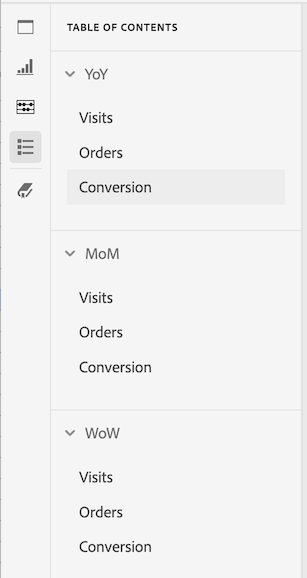

# Project table of contents

You can view a table of contents within each project in Analysis Workspace, allowing you to quickly move between any panels and visualizations that exist in the project. This is especially useful when viewing larger projects that contain many panels and visualizations.

>[!BEGINSHADEBOX]

See  [Table of contents](https://video.tv.adobe.com/v/26990?quality=12&learn=on){target="_blank"} for a demo video.

>[!ENDSHADEBOX]

To view the table of contents on a project:

1. In Analysis Workspace, go to the project where you want to view the table of contents.

1. In the left nav, select the table of contents icon . 

   The table of contents for the project is displayed, and each panel is expanded by default.

   

1. In the table of contents, select a visualization to go to it within the project.
