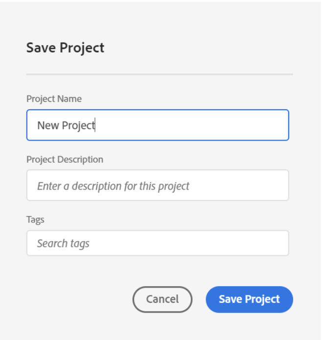
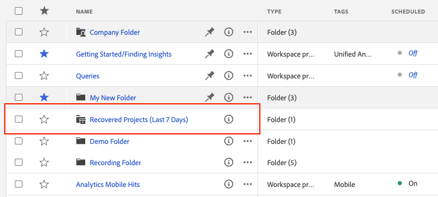
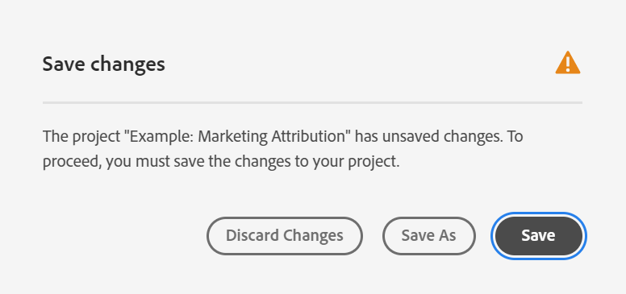
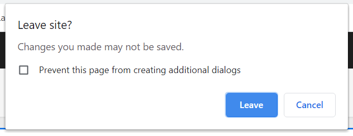
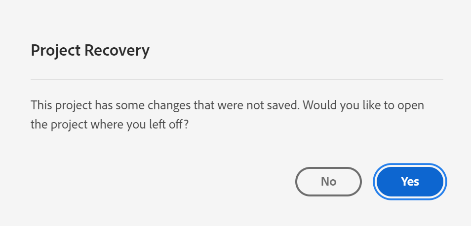
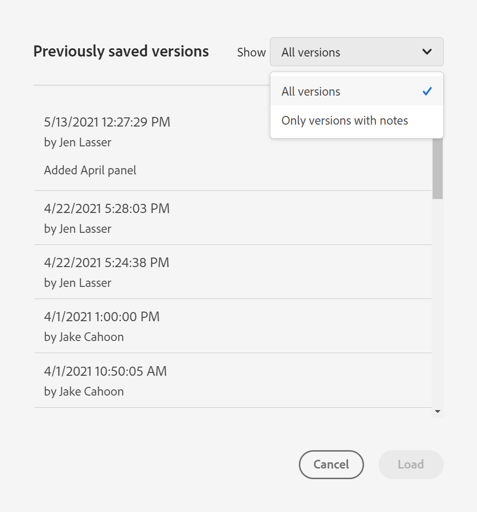

# Save projects

Projects in Analysis Workspace are automatically saved every 2 minutes. 

You can also manually save projects. Additional options such as adding tags or notes are available when you manually save a project.

## Save projects manually {#Save} 

Various options are available when manually saving a project in Analysis Workspace.

To manually save a project:

1. With your project open in Analysis Workspace, select **[!UICONTROL Project]**, then choose from the following options: 

   | Action | Description | 
   |---|---| 
   | **[!UICONTROL Save]** | Save changes to your project. If the project is shared, recipients of the project will also see the changes. When you first save your project, you are prompted to give the project a name, (optional) description and add (optional) tags. | 
   | **[!UICONTROL Save with notes]** | Before your project saves, add notes about what changed in the project. Notes are stored with the project version and are available to all editors under [!UICONTROL Project] > [!UICONTROL Open previous version]. | 
   | **[!UICONTROL Save as]** | Create a duplicate of your project. The original project will not be affected. | 
   | **[!UICONTROL Save as template]** | Save your project as a [custom template](https://experienceleague.adobe.com/docs/analytics/analyze/analysis-workspace/build-workspace-project/starter-projects.html) that becomes available to your organization under **[!UICONTROL Project > New]** | 

   

## Auto-save {#Autosave} 

All projects in Analysis Workspace are automatically saved every 2 minutes to your local machine. This includes newly created projects that are not yet saved manually. 

* **New projects:** Even though new projects are auto-saved, you must save each new project manually the first time. Analysis Workspace prompts you to save new projects manually when switching to another project, closing the browser tab, and so forth. 

  If for any reason you unexpectedly lose access to a newly created project before manually saving it, a recovery version of your project is saved on the Analysis Workspace landing page in a folder called `Recovered Projects (Last 7 Days)`. You must restore the recovered project and manually save it to a desired location. 

  To restore a recovered project:
  
  1. Go to the [!UICONTROL **Recovered Projects**] folder on the Analysis Workspace landing page.

     

  1. Open your project and save it to a desired location. 

* **Existing projects:** If for any reason you leave a project with changes that are not yet auto-saved, Analysis Workspace either prompts you to save your changes or provides a warning message. 

  Following are some common scenarios:

### Open another project 

If you open an additional project while working on a project that contains changes that are not yet auto-saved, Analysis Workspace prompts you to save the current project before leaving.

The following options are available:

* **Save:** Replaces the most recent auto-saved local copy of your project with your latest changes.
* **Save As:** Saves your latest changes as a new project. The original project is saved only with the most recent auto-saved changes.
* **Discard Changes:** Discards your latest changes. The project retains the most recent auto-saved changes.

### Navigate away or close a tab 

If you navigate away from the page or close the browser tab while viewing a project with changes that are not yet auto-saved, the browser warns that your unsaved changes will be lost. You can choose to leave or cancel. 

### Browser crashes or session times out 

If your browser crashes or if your session times out, then the next time you access Analysis Workspace you're prompted to recover any changes to your project that are not yet auto-saved.

Following is the Project Recovery dialog box that displays the first time you access Analysis Workspace after a crash or a timeout.

Select **Yes** to restore the project from the most recent auto-saved copy.

Select **No** to delete the auto-saved copy and open the last user-saved version of the project.

For **new** projects that have never been saved, unsaved changes are not recoverable.

## Open a previous version {#previous-version}

>[!NOTE]
>
>Previous project versions are currently in limited release.

To open a previous version of a project:

1. Go to **[!UICONTROL Project]** > **[!UICONTROL Open previous version]**

   
   
1. Review the list of prior versions available. 
   [!UICONTROL Timestamp] and [!UICONTROL Editor] are shown, in addition to [!UICONTROL Notes] if they were added when the [!UICONTROL Editor] saved. Versions without notes are stored for 90 days; versions with notes are stored for 1 year.
1. Select a previous version and click **[!UICONTROL Load]**.
   The previous version then loads with a notification. The previous version does not become the current saved version of your project until you click **[!UICONTROL Save]**. If you navigate away from the loaded version, when you return, you will see the last saved version of the project. 
