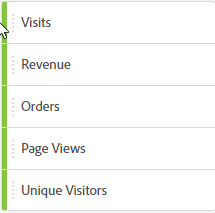
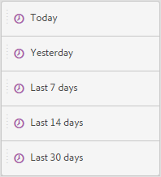
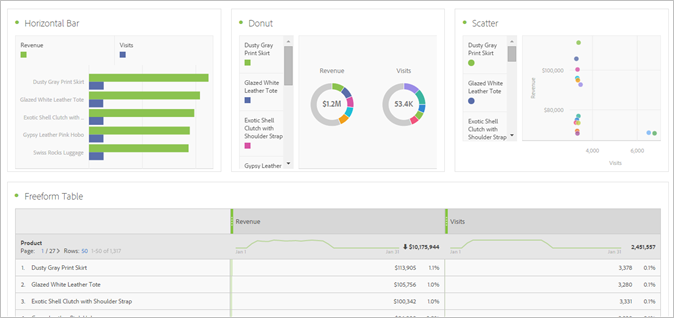
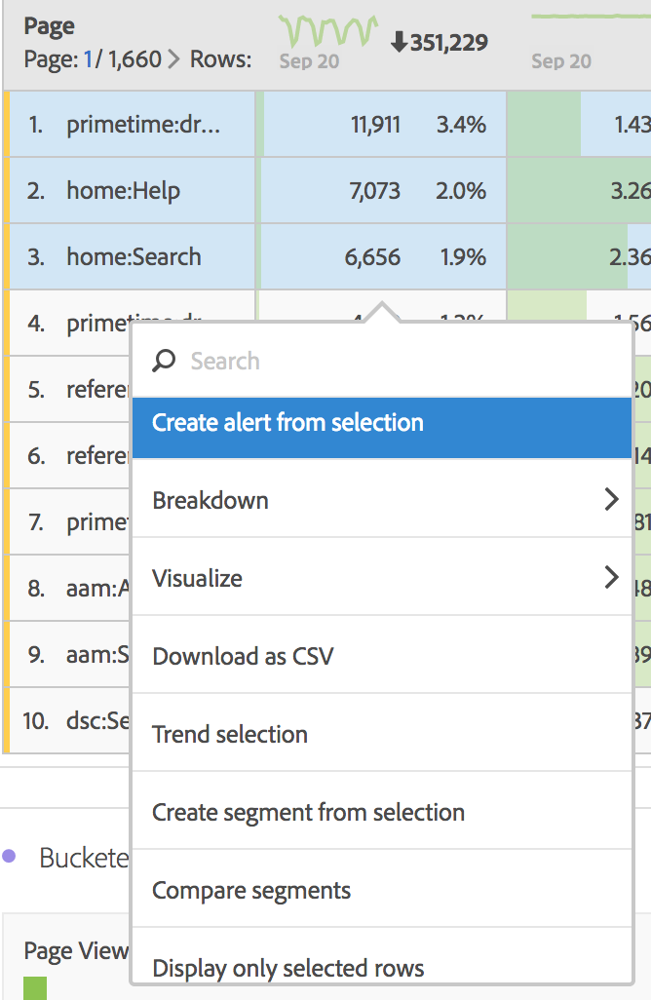

# Create a Workspace project

Create a project and add components (dimensions, metrics, segments, date ranges) to the freeform panel.

This article familiarizes you with the Analysis Workspace interface elements and shows how to create a project.

## Create a project

1. Specify user permission to create and curate projects.

   Before creating or curating an Analysis Workspace project, administrators must add you to a group with the **[!UICONTROL Create / Curate Projects in Analysis Workspace]** permission enabled, or to the **[!UICONTROL All Report Access]** user group. (**[!UICONTROL Admin]** > **[!UICONTROL All admin]** > **[!UICONTROL User management]** > [Groups](https://experienceleague.adobe.com/docs/ analytics/admin/user-product-management/user-groups/groups.html)).

1. In the [!DNL Experience Cloud], click **[!UICONTROL Analytics]** > **[!UICONTROL Workspace]**.

   

   Alternatively, enter a forward slash (/) to open the report search bar, then type *`workspace`*.

   

1. Click **[!UICONTROL Create New Project]**.

   You can choose whether to create a project from

* A blank project (default). For instructions, see below.
* A standard template. These templates are created by Adobe and ship out of the box. For instructions, see [Templates](/help/analyze/analysis-workspace/build-workspace-project/starter-projects.md) 
* A custom template. These templates are created by users with admin rights. For instructions, see [Templates](/help/analyze/analysis-workspace/build-workspace-project/starter-projects.md)

   

1. To create a project from a blank project, click **[!UICONTROL Blank Project]**.

    * Then click **[!UICONTROL Create]**, or 
    * Simply click **[!UICONTROL Enter]**.

   A blank project displays, showing a freeform panel and a data table visualization.

   

   >[!NOTE]
   >
   >Sometimes, an "Incompatible Report Suite" message shows up when loading a project (or switching to a report suite) where not all of the components (metrics/dimensions) included in the project are included in the report suite. You can see a list of the components that are not compatible, so that you know why you are getting the message.

<table id="table_3989E45D9D4241CBB2E58B29DA257B2F"> 
 <thead> 
  <tr> 
   <th colname="col1" class="entry"> Element </th> 
   <th colname="col2" class="entry"> Description </th> 
  </tr> 
 </thead>
 <tbody> 
  <tr> 
   <td colname="col1"><a href="/help/analyze/analysis-workspace/components/analysis-workspace-components.md"  > Components</a> </td> 
   <td colname="col2"> 
Dimensions, metrics, segments, and date ranges that you can drag into projects. 
 </td> 
  </tr> 
  <tr> 
   <td colname="col1"><a href="/help/analyze/analysis-workspace/visualizations/freeform-analysis-visualizations.md"  > Visualizations</a> </td> 
   <td colname="col2"> 
Items you can drag to the panel or project areas of the interface. 
 </td> 
  </tr> 
  <tr> 
   <td colname="col1"><a href="/help/analyze/analysis-workspace/visualizations/freeform-table/freeform-table.md"  > Freeform Panel </a> </td> 
   <td colname="col2"> 
The canvas or workspace with which you interact in Analysis Workspace. 
 </td> 
  </tr> 
 </tbody> 
</table>

1. Save your project. Name the project, provide a description (optional, but useful) and tag the project (optional), then click **[!UICONTROL Save Project]**.

   

1. You can now right-click and copy a visualization or panel, and then paste ("insert") that copied element into another place within the project, or into a different project.

   You can use this capability to create "building blocks" - predefined visualizations/panels - that can be copied into other projects to get started more quickly, with data specific to your business.

   >[!NOTE]
   >
   >After you copy/save-as, the intra-links are now relative to the project they live within, not the original project they were copied from.

## Add Components and Visualizations {#task_CDAC9B3007BE4A3790AFAD3746D669B1}

1. Build your project by dragging *`components`* and *`visualizations`* to the project.

   **Components**

   The Component toolbar displays searchable dimensions, metrics, segments, and date ranges that you use most frequently.

<table id="table_4626163E26DE46CB86391868BBA3AD32"> 
 <thead> 
  <tr> 
   <th colname="col1" class="entry"> Component </th> 
   <th colname="col2" class="entry"> Description </th> 
  </tr> 
 </thead>
 <tbody> 
  <tr> 
   <td colname="col1"> Dimensions (orange) </td> 
   <td colname="col2"> 
Apply at the project level 
 
 
 
Prop#, eVar#, and event# are appended to the dimension names, and you can search on those numbers. Example: "Internal Campaign" shows up in the left rail as "Internal Campaign (evar2)". 
 
 Note that the prop, eVar, and event numbers do not show in the table (to keep the titles short). 
 
There is a default sort order for some out-of-the-box dimensions, when they are dragged into a freeform table or when they are viewed in the left rail. For example, when "Hour of Day" is dropped into a table or viewed in the left rail, it will be sorted from 12AM-11PM. You still have the option to sort by any metric column. 
 </td> 
  </tr> 
  <tr> 
   <td colname="col1"> Metrics (green) </td> 
   <td colname="col2"> 
Apply at the project level. 
 
 
 
  Occurrences is the default metric for the data table. 
 </td> 
  </tr> 
  <tr> 
   <td colname="col1"> Segments (blue) </td> 
   <td colname="col2"> 
Draggable only at the panel level, but you can create inline segments in the data table. 
 
 
 
See <a href="/help/analyze/analysis-workspace/components/t-freeform-project-segment.md"  > Segments </a> for more information. 
 </td> 
  </tr> 
  <tr> 
   <td colname="col1"> Date ranges and granularities (purple) </td> 
   <td colname="col2"> 
Draggable only at the panel level. You can create a project from the Calendar, when configuring a date range. 
 
 
 </td> 
  </tr> 
 </tbody> 
</table>

   **[Visualizations](/help/analyze/analysis-workspace/visualizations/freeform-analysis-visualizations.md)**

   The [!UICONTROL Visualizations] panel provides standard Analytics graphs, charts, donuts, data tables, [cohort](/help/analyze/analysis-workspace/visualizations/cohort-table/cohort-analysis.md) tables, Venn diagrams, and so on. You can drag-and-drop multiple visualizations into your project.

   

   

1. Step

## Use the Right-Click Menu to Customize Your Data {#concept_8117C300F21843B99F4E1B9AB7B11B6F}

The right-click menu lets you perform the following actions, depending on which cell in a table you right-click.

<table id="table_0F84CC5B604D4D41BD0C9668DF525929"> 
 <thead> 
  <tr> 
   <th colname="col1" class="entry"> Action </th> 
   <th colname="col2" class="entry"> Description </th> 
  </tr>
 </thead>
 <tbody> 
  <tr> 
   <td colname="col1"><a href="/help/analyze/analysis-workspace/components/calendar-date-ranges/time-comparison.md"  > Add time period column</a> </td> 
   <td colname="col2"> </td> 
  </tr> 
  <tr> 
   <td colname="col1"><a href="/help/analyze/analysis-workspace/components/calendar-date-ranges/time-comparison.md"  > Compare time periods</a> </td> 
   <td colname="col2"> </td> 
  </tr> 
  <tr> 
   <td colname="col1"> 
Copy to Clipboard 
 </td> 
   <td colname="col2"> </td> 
  </tr> 
  <tr> 
   <td colname="col1"> 
Delete selected 
 </td> 
   <td colname="col2"> </td> 
  </tr> 
  <tr> 
   <td colname="col1"><a href="/help/components/c-alerts/intellligent-alerts.md"  > Create alert from selection</a> </td> 
   <td colname="col2"> </td> 
  </tr> 
  <tr> 
   <td colname="col1"><a href="/help/analyze/analysis-workspace/components/dimensions/t-breakdown-fa.md"  > Breakdown</a> 
    <ul id="ul_18C83B8514AD4C1C86C071AA8402CB5C"> 
     <li id="li_6CA84ED293EA4940A7495DA9D9121264">Dimensions </li> 
     <li id="li_EA16EE017B2E4A6998918706938A21BF">Metrics </li> 
     <li id="li_0405D339CD01405DB508A7D8D1A976B4">Segments </li> 
     <li id="li_819CE81C552F49BB9C1B83ED3B42C5F7">Time </li> 
    </ul> </td> 
   <td colname="col2"> </td> 
  </tr> 
  <tr> 
   <td colname="col1"><a href="/help/analyze/analysis-workspace/visualizations/freeform-analysis-visualizations.md"  > Visualize</a> </td> 
   <td colname="col2"> </td> 
  </tr> 
  <tr> 
   <td colname="col1"><a href="/help/analyze/analysis-workspace/curate-share/download-send.md"  > Download as CSV</a> </td> 
   <td colname="col2"> </td> 
  </tr> 
  <tr> 
   <td colname="col1"><a href="/help/analyze/analysis-workspace/home.md"  > Trend selection</a> </td> 
   <td colname="col2"> </td> 
  </tr> 
  <tr> 
   <td colname="col1"><a href="/help/analyze/analysis-workspace/components/t-freeform-project-segment.md"  > Create segment from selection</a> </td> 
   <td colname="col2"> </td> 
  </tr> 
  <tr> 
   <td colname="col1"><a href="/help/analyze/analysis-workspace/c-panels/c-segment-comparison/segment-comparison.md"  > Run in segment comparison</a> </td> 
   <td colname="col2"> </td> 
  </tr> 
  <tr> 
   <td colname="col1"> Display only selected rows </td> 
   <td colname="col2"> </td> 
  </tr> 
  <tr> 
   <td colname="col1"> Display all rows </td> 
   <td colname="col2"> </td> 
  </tr> 
 </tbody> 
</table>

See [Keyboard and Mouse Interactions Available in Analysis Workspace](/help/analyze/analysis-workspace/build-workspace-project/fa-shortcut-keys.md) for information about copying and selecting rows.
