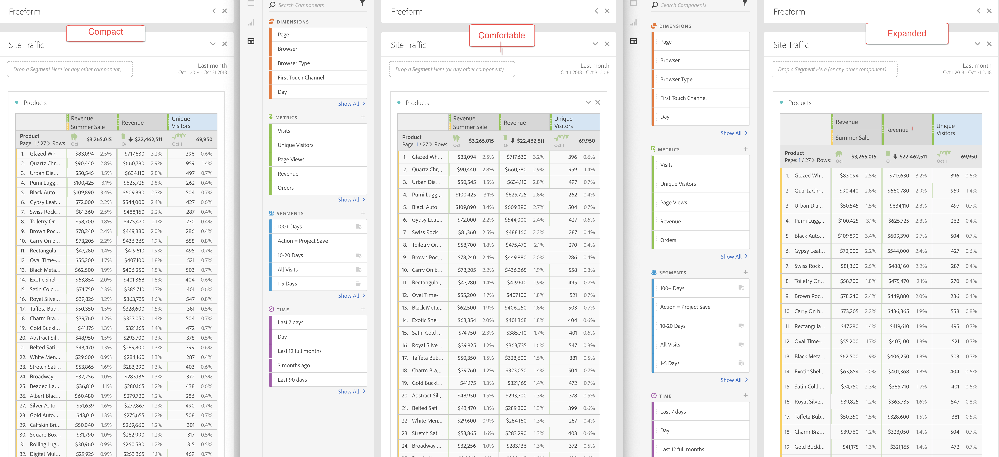

# View Density

Adjusting the view density lets you see more data on the screen by reducing the vertical padding of the left rail, freeform tables and cohort tables.
You have 3 options when toggling the view density via radio buttons:

- **[!UICONTROL Compact]**: This is the version with the most condensed view.
- **[!UICONTROL Comfortable]**: This leaves a little more padding than the Compact version.
- **[!UICONTROL Expanded]** (default): This is the view you are used to in Workspace.

To set the view density:

1. In Workspace, navigate to **[!UICONTROL Projects]** > **[!UICONTROL Project Info and Settings]**.

1. Select among the 3 options outlined above and click **[!UICONTROL Save]**. 
