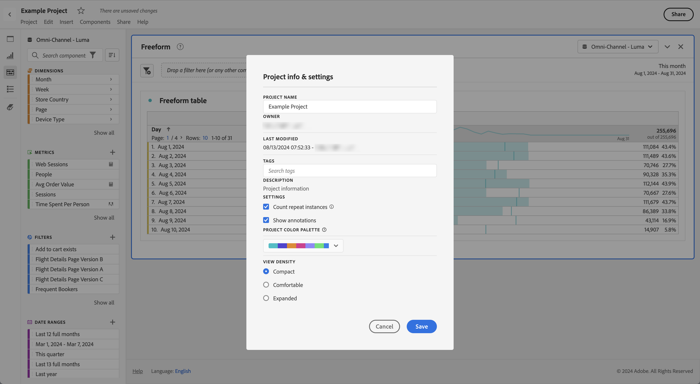
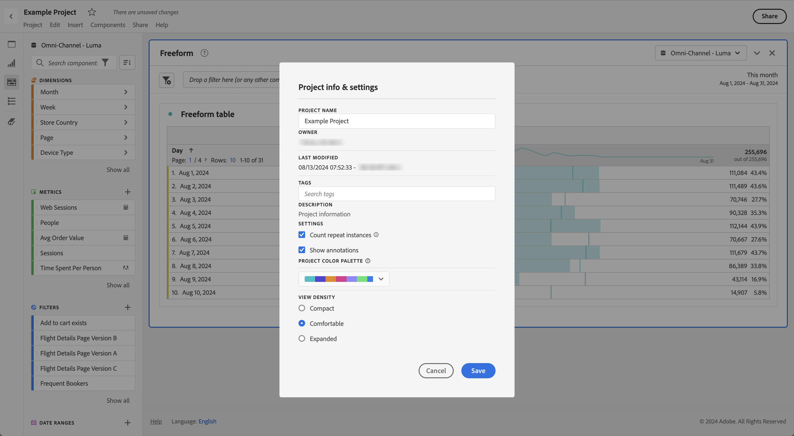
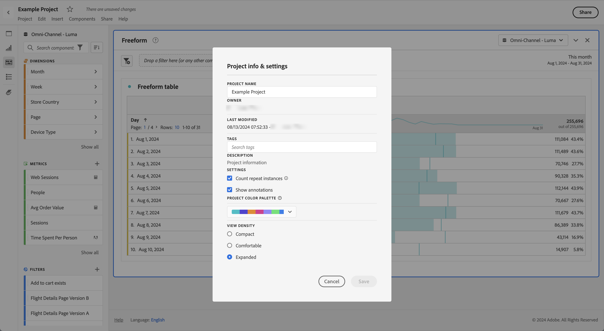

# View Density

Adjusting the view density lets you see more data on the screen by reducing the vertical padding of the left panel, freeform tables and cohort tables. Three options are available:

>[!BEGINTABS]

>[!TAB Compact] 

This is the version with the most condensed view.

>[!TAB Comfortable]

This is the view you are used to in Workspace.
 

>[!TAB Expanded]

This is the version with the mostd expanded view.

>[!ENDTABS]

To set the view density:

1. In Workspace, navigate to **[!UICONTROL Projects]** > **[!UICONTROL Project info and settings]**.

1. Select a **[!UICONTROL View density]** option, and select **[!UICONTROL Save]**.

<!--
# [!UICONTROL View Density]

Adjusting the [!UICONTROL view density] lets you see more data on the screen by reducing the vertical padding of the left rail, freeform tables and cohort tables. You have 3 options when toggling the view density via radio buttons:

- **[!UICONTROL Compact]**: This is the version with the most condensed view.
- **[!UICONTROL Comfortable]**: This leaves a little more padding than the Compact version.
- **[!UICONTROL Expanded]** (default): This is the view you are used to in Workspace.

To set the view density:

1. In Workspace, navigate to **[!UICONTROL Projects]** > **[!UICONTROL Project Info and Settings]**.

1. Select among the 3 options outlined above and click **[!UICONTROL Save]**.

>[!BEGINSHADEBOX]

See  [View density](https://video.tv.adobe.com/v/25963?quality=12&learn=on){target="_blank"} for a demo video.

>[!ENDSHADEBOX]

-->
