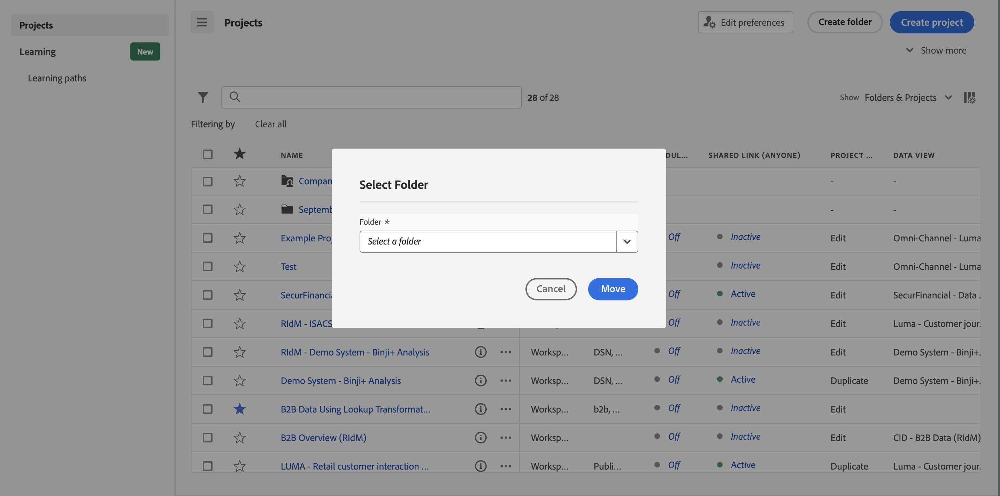
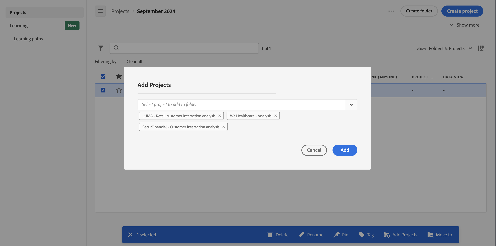

# Add or move projects to folders

You can add or move projects to a folder directly from the [Project list](/help/analyze/analysis-workspace/build-workspace-project/freeform-overview.md#project-list).

## Move projects to a folder

>[!NOTE]
>
>When an administrator moves a project to the Company Folder, the folder is shared with everyone even if the existing shared privileges are restricted. When an administrator moves a project out of the Company Folder, the existing shared privileges are re-applied.
>

To move projects to a folder from the [Project list](/help/analyze/analysis-workspace/build-workspace-project/freeform-overview.md#project-list):

1. Select  one or more projects that you want to move to a folder.

1. Select  **Move to** from the list of possible [actions](/help/analyze/analysis-workspace/build-workspace-project/freeform-overview.md#actions). The **[!UICONTROL Select Folder]** dialog is displayed.

1. Select a folder name from the **[!UICONTROL Folder]** drop-down menu. The drop-down menu lets you traverse the folder hierarchy to select a subfolder at any level.

    

1. Select **[!UICONTROL Move]**.

    The selected projects are added to the folder.

## Add projects to a folder

To add projects to a folder from the [Project list](/help/analyze/analysis-workspace/build-workspace-project/freeform-overview.md#project-list):

1. Select  the folder that you want to add projects to.

1. Select  **Add Projects** from the list of possible [actions](/help/analyze/analysis-workspace/build-workspace-project/freeform-overview.md#actions). The **[!UICONTROL Select Folder]** dialog is displayed.

1. Select one or more projects from the [!UICONTROL *Select projects to add to folder*].

   

1. Select **[!UICONTROL Add]**.

>[!NOTE]
>
>Only Admins can add projects to the Company Folder or create a new project and save it to the Company Folder

<!--
# Add Projects to Folders

You can add projects to a folder in the table view or from within a folder.

>[!NOTE]
>
>Only Analytics administrators can add projects to the Company Folder or create a new project and save it to the Company Folder

## From the table view {#table-view}

Add projects to a folder from the table view on the home page.

1.  Select one or more projects that you want to add to a folder.

    

1.  Select **Move to**. 

    The Select Folder dialogue is displayed.

1.  In the drop-down menu, select the folder where you want to move the selected projects.

    

1.  Select **Move**.

    

    The selected projects are added to the folder.

    

    The Workspace landing page now shows the folder contains (3) projects.

    

## From inside a folder {#inside-folder}

You can also add projects from inside a folder using the ellipses link.

1.  Select and open a folder from the table view.

    

1.  Select the **...** ellipsis icon in the upper-right.
   
    

1.  Select **Add projects** and select the project that you want to add from the drop-down list.

    

    
1.  (Optional) Select additional projects from the drop-down list to add multiple projects.

    

1.  Select **Add** to add the projects to the folder.

    

-->