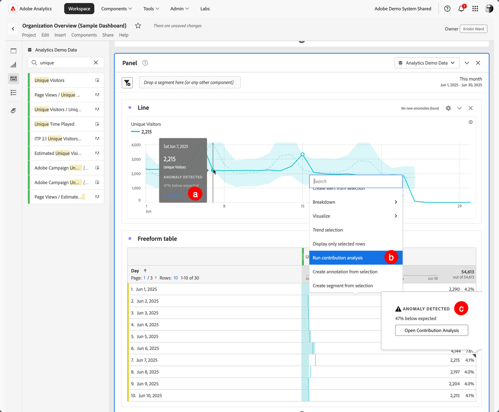
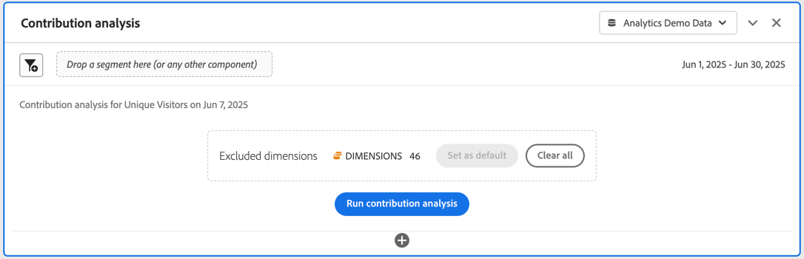
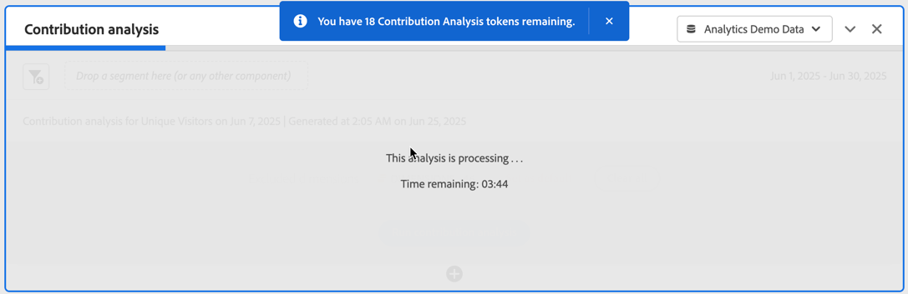
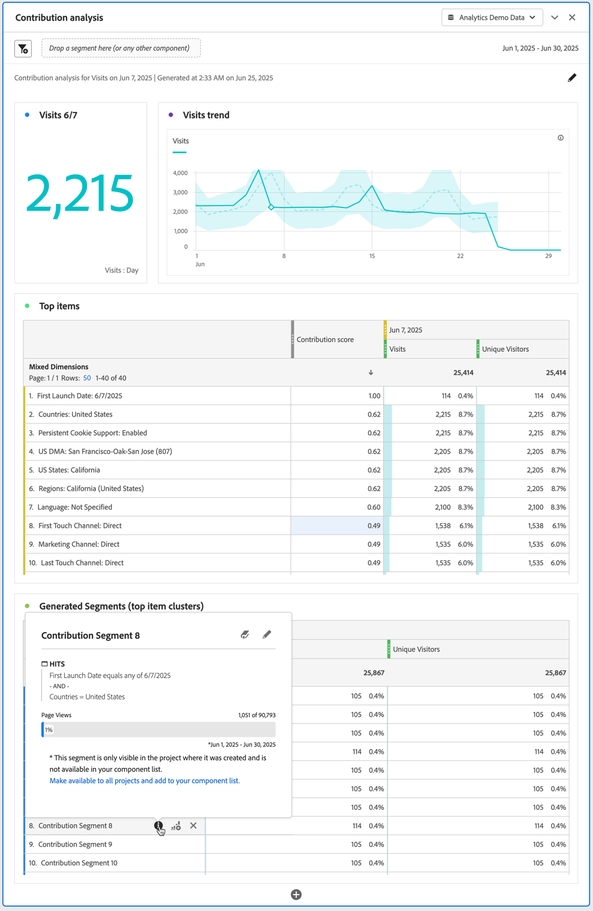
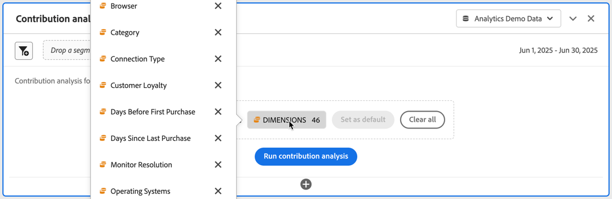

# Run Contribution Analysis

[Contribution Analysis](/help/analyze/analysis-workspace/c-anomaly-detection/anomaly-detection.md#contribution-analysis) is an intensive machine learning process designed to uncover contributors to an observed anomaly in Adobe Analytics. The intent is to assist the user in finding areas of focus or opportunities for additional analysis much more quickly than would otherwise be possible.

>[!NOTE]
>
>Contribution Analysis is only supported for data with daily granularity.

The steps to run Contribution Analysis are:

1. Invoke contribution analysis in a project.

   

   1. In a Line visualization, based on a freeform table with daily granularity, select an anomaly data point. From the popup, select **[!UICONTROL Analyze]**.
   1. In a freeform table with daily granularity, from the context menu on any row, select **[!UICONTROL Run contribution analysis]**. You can even run the analysis on rows that do not display any anomaly.
   1. In a freeform table with daily granularity, on a row that indicates an anomaly:
      1. Select the indicator ◥. 
      1. From the  **[!UICONTROL Anomaly detected]** dialog, select **[!UICONTROL Open Contribution Analysis]**.
    

1. (Optional) You can narrow the scope of (and thus speed up) the analysis by [excluding dimensions](#exclude-dimensions).

   

1. Select **[!UICONTROL Run contribution analysis]**.

1. Wait while the contribution analysis is processed. The processing can take a considerable amount of time, depending on the size of your report suite and the number of dimensions. Contribution analysis performs analysis on the top 50,000 items per dimension. You are also notified about the number of [contribution analysis tokens](anomaly-detection.md#contribution-analysis-tokens) remaining.

   

1. Analysis Workspace loads a new **[!UICONTROL Contribution analysis]** panel directly within this project. 

   

    * A [summary number](/help/analyze/analysis-workspace/visualizations/summary-number-change.md) visualization.
    * A monthly trended [line](/help/analyze/analysis-workspace/visualizations/line.md) visualization.
    * A **[!UICONTROL Top Items]** [freeform table](/help/analyze/analysis-workspace/visualizations/freeform-table/freeform-table.md) that displays which top items contribute to this anomaly, sorted by [Contribution score](/help/analyze/analysis-workspace/c-anomaly-detection/anomaly-detection.md#contribution-analysis). The additional columns show the metric in question, and a **[!UICONTROL Unique Visitors]** metric to provide context.
    
    * The **[!UICONTROL Generated Segments (Top Item Clusters)]** [freeform table](/help/analyze/analysis-workspace/visualizations/freeform-table/freeform-table.md) identifies associations of top items based on the Contribution Score, anomaly occurrences, and overall percentage contributing to the anomalous metric. This association is then captured as an audience segment (Contribution Segment 1, Contribution Segment 2, etc.). Select  to display the segment's definition, including which top items the segments is made up of:

1. Since contribution analysis is now part of Analysis Workspace, you can take advantage of a number of its features from a freeform table context menu to make your analysis even more meaningful, such as:

    * [Break down each dimension item by another dimension](/help/analyze/analysis-workspace/components/dimensions/t-breakdown-fa.md) 
    * [Trending one or more rows](/help/analyze/analysis-workspace/home.md#section_34930C967C104C2B9092BA8DCF2BF81A) 
    * [Add a new visualizations](/help/analyze/analysis-workspace/visualizations/freeform-analysis-visualizations.md) 
    * [Create alerts](/help/components/c-alerts/intellligent-alerts.md) 
    * [Create or compare segments.](/help/analyze/analysis-workspace/c-panels/c-segment-comparison/segment-comparison.md)

>[!NOTE]
>
>The anomaly that is analyzed is highlighted with a blue dot within Contribution Analysis and the Intelligent Alert projects linked to it. This highlight provides a clearer indication of the anomaly being analyzed.

## Exclude dimensions

You might want to exclude some dimensions from Contribution Analysis. For example, you may not care about any browser- or hardware-related dimensions at all, and you want to speed up analysis by removing them.

To manage the excluded dimension:

* Drag any unwanted dimensions into the **[!UICONTROL Excluded Dimensions]** panel, then save the list by clicking **[!UICONTROL Set as Default]**. 
   
* Select **[!UICONTROL Clear All]** to start over.

* Select  to display a context menu and use  to remove any selected excluded dimension from the list.

   

After you have modified dimensions to exclude, select **[!UICONTROL Run contribution analysis]** again.

