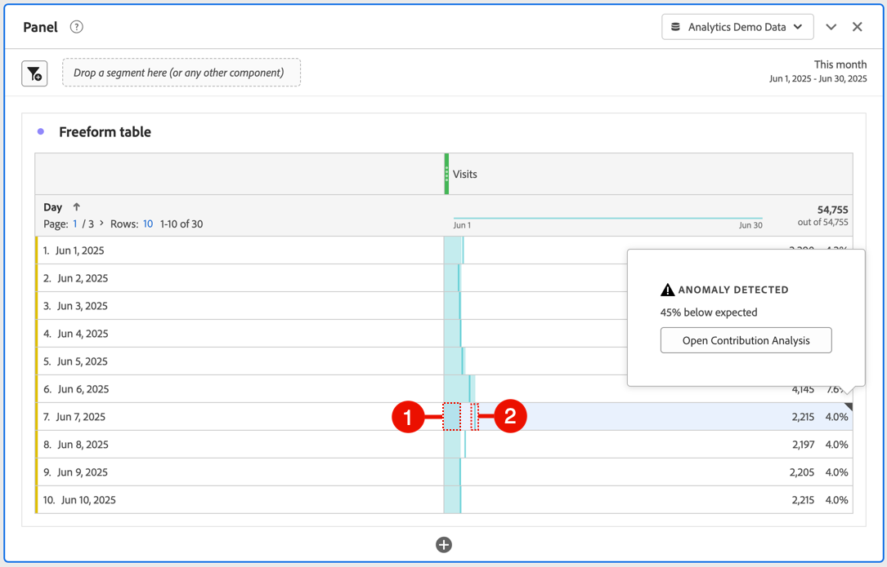
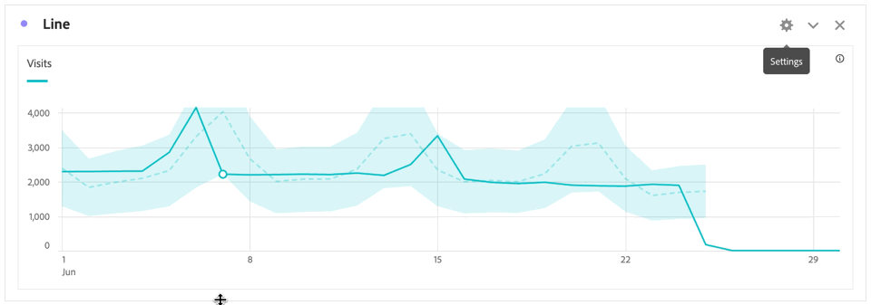

# View anomalies in Analysis Workspace

You can view anomalies in a table or in a line chart.

## View anomalies in a table {#section_869A87B92B574A38B017A980ED8A29C5}

You can view anomalies in a time-series Freeform Table.

1. Select the in the column header, then ensure that the **[!UICONTROL Anomalies]** option is selected in the list of options. For more information, see [Column settings](/help/analyze/analysis-workspace/visualizations/freeform-table/column-row-settings/column-settings.md).

1. Anomalies are shown in the table as follows:

   

   A ◥ appears in the upper-right corner of each row where a data anomaly is detected.

   The **colored vertical line** in each row ➋ indicates the expected value. The **colored shaded area** in each row ➊ indicates the actual value. How the line (expected value) compares with the shaded area (actual value) determines whether there is an anomaly. (An observation is considered anomalous based on the advanced statistical techniques described in [Statistical techniques used in anomaly detection](/help/analyze/analysis-workspace/c-anomaly-detection/statistics-anomaly-detection.md).)

1. Select ◥ in the upper-right corner of a row to view details about the anomaly. This shows the extent (as a percentage) to which the actual value diverges either above or below the expected value.

## View anomalies in a line chart

Line charts are the only visualization that allows you to view anomalies.

To view anomalies in a line chart:

1. Select  in the visualization header, then ensure that the [!UICONTROL **Show anomalies**] option is selected in the list of options. For more information, see [Line](/help/analyze/analysis-workspace/visualizations/line.md).

1. (Optional) To allow the confidence interval to scale the chart, select  in the visualization header, then select the option, **[!UICONTROL Allow anomalies to Scale Y-axis]**. 

   This option is not selected by default because it can sometimes make the chart less legible.
   
   Anomalies are shown in the line chart as follows:

   
   
   A **white dot** appears on the line wherever a data anomaly is detected. (An observation is considered anomalous based on the advanced statistical techniques described in [Statistical techniques used in anomaly detection](/help/analyze/analysis-workspace/c-anomaly-detection/statistics-anomaly-detection.md).)

   The **light shaded area** is the confidence band, or expected range, where values should occur. Any value that falls outside of this expected range is an anomaly. 

   If you have multiple metrics in the line chart, only the anomalies are shown and you have to hover over each anomaly to see the confidence band for that metric. 

   The **dotted line** is the exact expected value.

1. Select an anomaly (white dot) to view the following information:

   * The date the anomaly occurred.
   
   * The raw value of the anomaly. 
   
   * The percentage value above or below the expected value, which is represented by the solid green line.
   
   * The **[!UICONTROL Analyze]** link to start Contribution Analysis 
   

