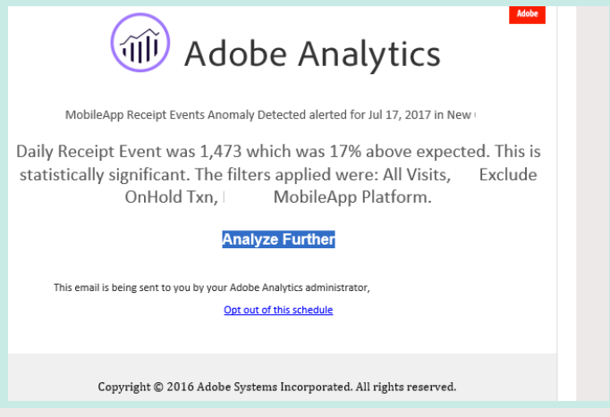

# Alert Builder

>[!IMPORTANT]
>
>Intelligent Alerts are available to Adobe Analytics Prime and Adobe Analytics Ultimate customers only.

## Access Alert Builder

Access the Alert Builder in one of four ways:

* By using the following shortcut in Analysis Workspace:

  `ctrl (or cmd) + shift + a` 
* By going to **[!UICONTROL Workspace]** > **[!UICONTROL Components]** > **[!UICONTROL New Alert]**.
* By selecting one or more freeform table line items, right-clicking and selecting **[!UICONTROL Create Alert from Selection]**.
* From within a Reports & Analytics report, by going to **[!UICONTROL More]** > **[!UICONTROL Add Alert]**.

## Build Alerts

The Alert Builder interface is familiar to those who have built segments or calculated metrics in Analytics:

<!--Meike, I edited this table for validation -->

**Alert Name**

Specify a name for the alert. The alert name might contain the name of the report or the metrics threshold.

**Time Granularity**

Specify when you want the metric to be checked: Hourly, Daily, Weekly, or Monthly.

>[!NOTE]
>
>For report suites with a custom calendar, we do not support monthly granularity in the Alert Builder.

**Recipients**

Specify where the alert can be sent. An alert can be sent to an Analytics user, an Analytics group, a raw email address, or to a phone number.

>[!IMPORTANT]
>
>The phone number must be preceded by a "+" and a [country code](https://countrycode.org/).

The e-mail that a user would receive once an alert has been triggered looks similar to this:

**Expiration Date**

Set the alert's expiration date.

**Send an Alert When...**

*... Any of These Metrics trigger*

* Drag and drop metrics into the canvas that will add triggers.

  An **"incompatible components"** message will appear if not all the components (metrics/dimensions/segments) in the alert are compatible with the currently selected report suite.
* Determine the threshold that the metric must exceed before an alert is set. You can set this value to a threshold and then to one of the following conditions:

  *   anomaly exists
  *   anomaly is above expected
  *   anomaly is below expected
  *   is above or equals
  *   is below or equals
  *   changes by
  *   You can set a threshold of 90%, 95%, 99%, 99.75%, and 99.9%.

  Note that you can also use calculated metrics.

*... With These Filters*

* Drag and drop segments or dimensions to add filters. For example, adding a "Mobile Devices Only" segment would mean that the rule triggers only for mobile devices.
* Additional filters will be added using an AND statement.

**Add a rule**

You can add AND or OR rules by clicking the gear icon.

## Preview Alerts {#section_10D75BA7B77E4C5FAF58A719C082E070}

The interactive alert preview shows you how often, approximately, an alert will fire based on past experience.

For example, if you set the time granularity to daily, the preview can tell you that the alert would have been triggered for a certain metric x times during the last 30 or 31 days.

If you find that too many alerts would have been triggered, you can adjust the threshold in the [Alert Manager](/help/components/c-alerts/alert-manager.md).

